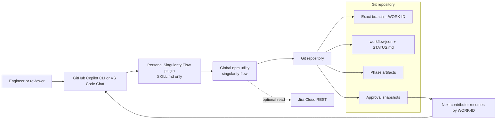
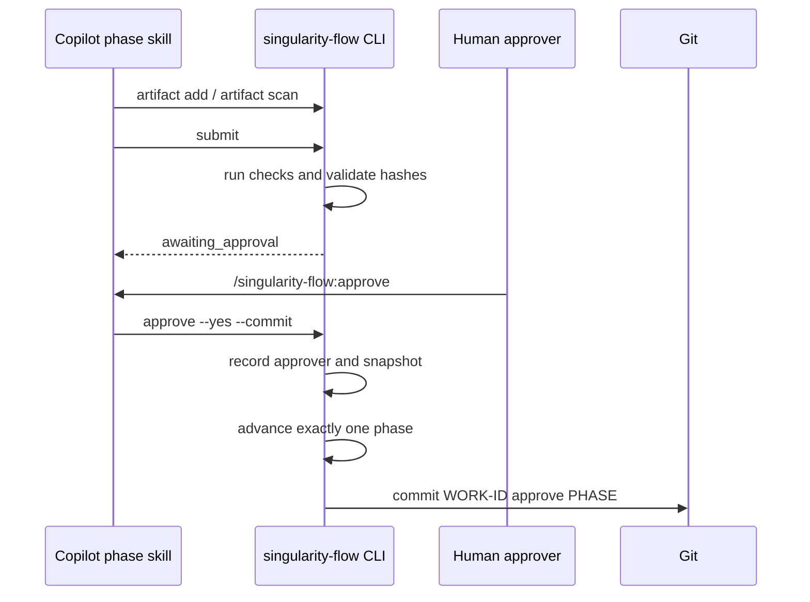

# Singularity Flow architecture

## Executive summary

Singularity Flow separates **probabilistic work generation** from **deterministic workflow control**, and grounds each phase with a selectively loaded repository world model.

Copilot skills tell the agent how to act during each SDLC phase. A small npm command performs operations that must be exact: branch creation, workflow transitions, artifact hashing, quality-command execution, approval recording, and optional Jira retrieval. Git stores all durable state needed for handoff.



## Design decisions

### 1. Skills are the Copilot integration surface

The personal plugin contributes only skill directories. Each skill contains role instructions and invokes the `singularity-flow` command where deterministic state changes are required.

Benefits:

- One plugin works in Copilot CLI and compatible VS Code Copilot Chat versions.
- No JavaScript Copilot extension host API is required.
- No IDE-specific Jira plugin is required.
- Skills are inspectable Markdown and can be governed like policy.
- Phase commands are namespaced as `/singularity-flow:<skill>`.

### 2. The npm utility owns state

The model must not edit `workflow.json`, `STATUS.md`, or approval records directly. The CLI validates invariants before every transition.

This prevents common failures such as:

- Inventing or skipping a phase.
- Approving an incomplete deliverable.
- Losing the phase when a chat session ends.
- Registering a branch that does not match the work ID.
- Advancing despite failed quality checks.

### 3. Git is durable memory

Copilot conversations are not the handoff contract. The branch and `.sdlc/work-items/<ID>/` are.

The durable package includes:

- Original input context.
- Current phase and status.
- Required phase outputs.
- Every registered artifact and hash.
- Quality-check evidence.
- Approval identity and timestamp.
- History of transitions.

### 4. Approval is explicit and separate from submission

The producer of a phase runs `submit`; an authorized human approves locally in lightweight mode or through an authenticated `/approve <phase>` PR comment in governed mode.



The approval skill is manual-only. It cannot authorize push, merge, deployment, or Jira updates.

## Components

### Personal Copilot plugin

```text
plugin/
├── plugin.json
└── skills/
    ├── workflow-rules/
    ├── start/
    ├── resume/
    ├── status/
    ├── jira-work/
    ├── jira-story/
    ├── requirements/
    ├── design/
    ├── implement/
    ├── verify/
    ├── review/
    ├── release/
    ├── submit/
    ├── approve/
    └── reject/
```

`workflow-rules` is background guidance. State-changing and phase-oriented skills require explicit invocation.

### npm package

```text
bin/singularity-flow.mjs          executable entry point
src/cli.mjs                command routing and presentation
src/git.mjs                exact branch, fetch, checkout, commit
src/state.mjs              lifecycle, artifacts, checks, approval
src/jira.mjs               optional direct Jira Cloud REST read
src/plugin.mjs             personal Copilot plugin installation
src/worldmodel.mjs         world-model prompt, build, freshness, and phase-context routing
templates/                 editable world-model builder prompt and routing defaults
```

### World-model grounding

The builder generates `.sdlc/world-model/manifest.json`, a minimal shared core, requested role views, matched domain files, optional task guides, and separate evidence. `wm context <phase>` reads the manifest and returns only the configured levels for that phase. Skills use `--concat` so the selected files enter the active Copilot tool context; verification, review, and release additionally request the evidence ledger. The manifest records the inspected Git commit, allowing `wm check` and phase skills to detect stale grounding.

The package has no runtime dependencies.

### Repository work package

```text
.sdlc/
├── config.json
└── work-items/<WORK-ID>/
    ├── README.md
    ├── STATUS.md
    ├── source.json
    ├── USER-STORY.md          optional human-readable Jira snapshot
    ├── workflow.json
    ├── approvals/<PHASE>.json
    └── artifacts/<PHASE>/...
```

## State machine

### Phase statuses

| Status | Meaning | Allowed next state |
|---|---|---|
| `not_started` | Future phase | `in_progress` after prior approval |
| `in_progress` | Persona is producing artifacts | `awaiting_approval` after submit |
| `awaiting_approval` | Frozen submission under review | `approved` or back to `in_progress` after rejection |
| `approved` | Approval snapshot recorded | terminal for that phase |

Only one phase may be active (`in_progress` or `awaiting_approval`) while the workflow is incomplete.

### Overall statuses

- `in_progress`: one active phase exists.
- `complete`: all phases approved and `currentPhase` is `null`.

### Transition guards

`start` requires:

- A valid Git repository.
- A safe work ID and valid branch name.
- A clean working tree unless deliberately overridden.
- Exact branch name equal to the work ID.
- No existing workflow for that ID.

`submit` requires:

- Active phase status `in_progress`.
- Required artifact exists and meets minimum size.
- Required artifact has no known template placeholders.
- Required artifact is registered.
- Every registered artifact still matches its saved snapshot.
- Every configured quality command passes unless checks were explicitly skipped.

`approve` requires:

- Active phase status `awaiting_approval`.
- Current branch exactly matches the workflow branch.
- Artifact snapshots still match submission.
- Explicit user confirmation, or explicit `--yes` from the manual approval skill.

## Artifact model

Each phase records zero or more artifact objects:

```json
{
  "path": "src/payment/retry.ts",
  "kind": "code",
  "status": "pending",
  "exists": true,
  "size": 4821,
  "sha256": "...",
  "registeredAt": "...",
  "updatedAt": "..."
}
```

Kinds are inferred from path and extension, or supplied explicitly. Examples include `requirements`, `design`, `code`, `test`, `configuration`, `test-evidence`, and `release-plan`.

At approval, the phase's artifact objects become `approved`, and a compact content-addressed approval record is created. The governance gate continuously recomputes artifact hashes; modifying an approved artifact makes that approval stale, while replacing an upstream approval cascade-invalidates downstream approvals.

## Phase artifacts

### Requirements

Captures problem, outcome, scope, acceptance criteria, dependencies, assumptions, risks, and open questions.

### Design

Captures components, interfaces, data flow, alternatives, security, privacy, observability, migration, rollout, rollback, and implementation plan.

### Implementation

Captures changed components, decisions, deviations, tests, limitations, and operational notes. Source code and tests are also registered through artifact scanning.

### Verification

Maps acceptance criteria to observed evidence and records automated, regression, negative, non-functional, and security checks.

### Review

Records independent findings, acceptance coverage, maintainability, architecture alignment, security, operations, and decision.

### Release

Records preconditions, deployment, validation, monitoring, rollback, communication, support, and final readiness.

## Branch and collaboration model

The branch contract is:

```text
WORK-ID == Git branch name == .sdlc/work-items/WORK-ID
```

For `PAY-142`:

```text
branch: PAY-142
state:  .sdlc/work-items/PAY-142/
commit: PAY-142 approve implementation
```

A contributor resumes by fetching and checking out `PAY-142`. `resume --fetch` uses a fast-forward-only pull for a tracked local branch, avoiding implicit merge commits.

Parallel work should use separate unique IDs and branches. A single work ID is treated as one serial lifecycle stream.

## Optional Jira adapter

Jira is not part of the workflow engine. It is an optional source adapter:

```text
singularity-flow start PAY-142 --jira
          │
          ├── GET issue details
          ├── normalize selected standard and configured custom fields
          ├── write source.json and USER-STORY.md
          └── seed the requirements artifact
```

The adapter can also search assigned work with JQL, pull a single story with `singularity-flow jira pull <KEY>`, and discover custom field IDs with `singularity-flow jira fields --query <text>`. It uses environment-supplied base URL, email, and API token. It performs read operations only and does not store credentials.

The workflow remains usable when Jira is unavailable because a unique manual ID and title are sufficient.

## Cross-surface behavior

### Copilot CLI

The npm utility installs the plugin through `copilot plugin install <local-path>`. Copilot caches the plugin in the user profile. Skills are then available in interactive sessions.

### VS Code

Compatible VS Code versions discover plugins installed by Copilot CLI from the user plugin cache. The same skills appear in Copilot Chat, subject to the organization's plugin policy.

### Other IDEs

The deterministic npm command can be run in any IDE terminal. The skills-first plugin portion is intended for Copilot surfaces that support agent plugins. No native IntelliJ plugin is included.

## Configuration

Repository owners can customize:

- Base branch.
- Work-item root.
- Work-ID regular expression.
- Phase order and labels.
- Owner persona labels.
- Required artifact paths and minimum size.
- Shell quality commands.
- Artifact scan exclusions.
- Jira defaults.

Phase IDs should remain stable after work begins because workflow files copy the phase definitions at creation time.

## Security model

### Trust boundaries

- The npm package and skills must be reviewed before installation.
- Copilot still controls terminal permission prompts; skills do not pre-approve shell tools.
- Repository configuration may contain shell quality commands and therefore must be code-reviewed.
- Jira credentials remain in the process environment or an organization-approved secret mechanism.
- Git push, PR creation, merge, release, and deployment remain outside Singularity Flow's automatic actions.

### Explicit non-goals

- Credential collection UI.
- Background service.
- MCP server.
- Automatic Jira write-back.
- Automatic human approval.
- Automatic remote Git mutation.
- Replacement for repository rulesets, CODEOWNERS, CI, or release controls.

## Failure and recovery

| Failure | Recovery |
|---|---|
| Dirty tree at start/resume | Commit/stash, or deliberately use `--allow-dirty`. |
| Required artifact still has placeholders | Complete it, register/scan, and resubmit. |
| Quality command fails | Fix the issue and submit again. |
| Artifact changes after submit | Run artifact scan and resubmit. |
| Approval rejected | Address the reason while the phase is back `in_progress`. |
| Local branch is stale | `singularity-flow resume <ID> --fetch`; only fast-forward is accepted. |
| Plugin version is stale | Upgrade npm package, then `singularity-flow plugin install --force`. |
| Copilot plugin unavailable | Use the same `singularity-flow` CLI commands directly. |

## Extension options

Future increments can remain small npm packages or additional skills:

- Organization OAuth helper for Jira.
- GitHub pull-request helper.
- Policy-specific quality-gate package.
- Evidence uploader.
- Release orchestration package.
- Additional phase skills such as threat modeling or data governance.

The workflow contract should remain in `workflow.json`, allowing those packages to integrate without owning the entire system.
