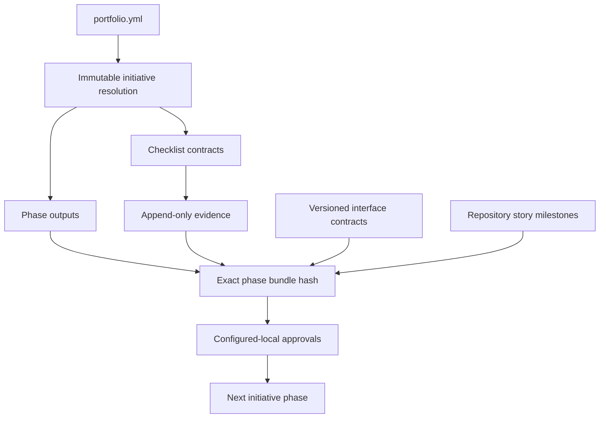
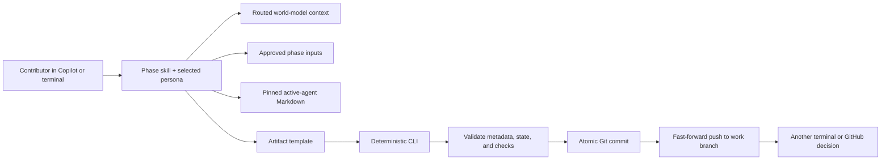

# Singularity Flow Lite 0.8.0 architecture

## Initiative layer

The optional initiative layer uses `.singularity/portfolio.yml` and a lead branch named exactly after the initiative ID. It does not alter the existing `.singularity/work-items` runtime.



Evidence, approvals, and invalidations are canonical JSON named by SHA-256. A justification graph links outputs, checks, evidence, approvals, contracts, and story dependencies. Regeneration, rejection, expired evidence, contract changes, and child regression invalidate only the transitive consumer cone.

Cross-repository materialization uses managed clones under the lead repository’s Git directory, safe branch attachment, committed story seeds, normal fast-forward pushes, and a resumable journal. Jira creation is optional; Git remains canonical.

See [INITIATIVE-ORCHESTRATION.md](INITIATIVE-ORCHESTRATION.md).

## System boundary

Singularity Flow separates probabilistic generation from deterministic lifecycle control:



Skills generate content; the CLI alone owns `workflow.json`, `STATUS.md`, managed metadata, approval records, state transitions, commits, and publication.

## Repository definition and immutable resolution

`.singularity/workflow.yml` is the editable definition for new work. It declares work types, phases, templates, personas, world-model routing, approval policies, Git publication, and protected paths.

At work-item creation the CLI resolves:

1. The selected work type and its phase sequence.
2. Work-type overrides over phase defaults.
3. Every phase artifact/template path.
4. Applicable checks, views, comparison, and approval policy.
5. Configuration and template SHA-256 hashes.
6. `inputsMode`, normalized upstream-input declarations, and producer artifact paths.
7. Any explicitly referenced remote template copied into committed work-item context.

This resolution is copied into `.singularity/work-items/<ID>/workflow.json`. The selected work type and snapshot are immutable. Active work therefore follows the definition committed on its branch even if the base branch later evolves.

## Persona session and prompt composition

`start` first selects Jira or manual intake, captures the story and supporting documents, and then selects a workflow template and persona; `resume` selects a persona. Template and persona selection are never bypassed. The normal path uses an interactive terminal. When Copilot has selectable questions but no persistent stdin bridge, start and approval use short-lived one-time receipts under the Git directory. They record the human's exact YAML-derived choices and are bound to the work ID, repository HEAD, and Copilot session when available. Approval receipts additionally pin the submitted phase, generation, and artifact hashes and carry an exact typed phase confirmation. The session lives at `.git/singularity-flow/session.json` and is intentionally local and uncommitted.

For generation, context is additive:

```text
phase contract/template
+ persona prompt
+ phase-required world-model views
+ persona world-model views
+ rule-selected repository world-model files
+ active-agent remote skill Markdown
+ approved phase-input artifacts
+ evidence ledger for verification/conformance
```

World-model generation runs in a detached analysis worktree with a separate output directory. The CLI rejects source writes, validates manifest coverage and safe regular-file paths, records a source-tree hash, atomically installs the model, and commits/publishes it. Its source hash excludes model output and work-item lifecycle state, so those commits do not create false staleness.

Normal phase skills use one `wm compose` operation. It joins the selected persona, mandatory phase/persona views, the exact task guide, applicable evidence, need-based `worldModel.injection.rules`, and active-agent skills. The next generation commit includes a provenance record plus the exact rendered prompt. The configurable `off|warn|enforce` grounding gate verifies these against the committed model; missing configuration remains `off` for compatibility.

Repository world models never move to remote delivery. Agent Markdown is an additional scoped layer. `.singularity/agents.lock.yml` supplies committed trust-on-first-use hashes; `.git/singularity-flow/agents/` is an uncommitted verified cache. Sync records the active agent beside the persona without changing the lock. Skills are copied and hash-recorded per generation, remote templates are copied once into immutable work-item context, and generated outputs receive per-generation provenance records.

Suggested personas improve discoverability but do not authorize phase access. Any contributor may assume any configured persona. A persona's `mayApprove` list provides decision authority.

## Work-item layout

```text
.singularity/work-items/ENG-142/
├── workflow.json
├── STATUS.md
├── source.json
├── USER-STORY.md
├── documents.json
├── inputs/
│   └── DOC-001/<original-file>
├── context/                 # per-generation grounding records and prompt snapshots
│   ├── design-gen1.json
│   ├── inputs-design-gen1.json
│   ├── agents-design-gen1.json
│   ├── agent-templates/
│   └── remote-output-<agent>-<resource>-design-gen1.json
├── artifacts/
│   ├── intake/intake.md
│   ├── implementation-spec/implementation-spec.md
│   └── conformance/spec-code-comparison.md
└── approvals/
    └── design/
        ├── <timestamp>-approved.json
        └── design.json
```

`workflow.json` is authoritative runtime state. `STATUS.md` is a generated human view. Artifacts contain a machine-managed metadata comment. Approval event files are append-only records; phase summary files are derived snapshots.

## Phase-input dataflow

Input declarations are validated in all modes, including ordering and work-type membership. `off` is inert, `record` records warnings, and `enforce` blocks required missing/unapproved inputs and every present hash mismatch. Collection verifies the producer's active approval, registered approved hash, current artifact hash, and resolved producer path. The marker-delimited input block is replaceable; the accompanying context record captures declarations, status, bytes, truncation, approved hashes, and rendered-block hash. Publication recollects rather than trusting preparation.

## Remote dependency trust boundary

Only links in exact agent dependency tables are executable configuration. Fetching accepts non-empty UTF-8 Markdown over public HTTPS, uses bounded redirects and timeouts, rejects embedded credentials and local/private literal hosts, and enforces a 10 MiB hard ceiling. The lock stores source-agent and resource hashes. First trust and updates are interactive; sync never changes hashes. Cache and audit writes are atomic.

Dynamic URL expansion permits only encoded work item, work type, phase, and generation values. Targets are constrained below the current work item's `artifacts/<phase>/`. Repeated prepare reuses the snapshot. Local edits produce a conflict and require deliberate refresh; overwrite additionally requires `--replace`.

`documents.json` is the stable supporting-input catalog. Local files are copied under `inputs/DOC-nnn/`; external links such as Figma are recorded without being downloaded. Each input is attributed to the active identity/persona and uploaded only during the profile-snapshotted allowed phases. Uploads use the same commit/push recovery protocol as lifecycle events.

`guide` derives a read-only template walkthrough from `workflow.json`. It does not maintain separate state; `/sflow-help` reports the immutable phase sequence and selects its recommended next action from the current phase status and generation history. `nextsteps` reuses that recommendation engine to produce a compact ordered plan with immediate, subsequent, and alternative actions, while also handling pre-initialization, idle repositories, pending publication, and completed workflows. The explicitly invoked `sflow-next`/`singularity-flow next` executor performs one corresponding action at a time. It preserves generation, submission, and approval as separate durable transitions; approval continues through the interactive persona/confirmation path and its atomic commit/push protocol.

Sequence guards are named policy controls resolved from global and work-type `sequenceGates`, then pinned into `workflow.resolution`. An absent policy normalizes every gate to `hard`. A hard violation fails without mutation; a soft violation requires an exact interactive confirmation and reconciles runtime state before continuing. The exception record captures prior state, action, reason, identity, persona, and timestamp, and is propagated through history, artifact metadata, status, reports, and governance warnings. Non-interactive processes cannot confirm soft exceptions, and Copilot agent contracts explicitly prohibit self-confirmation.

`HELP.md` is the canonical product manual. The CLI parses its level-two headings into stable topic IDs for `singularity-flow help [TOPIC]`; `/sflow-help` loads those topics for general questions and uses `guide` for work-item-specific questions. The Electron renderer imports the same Markdown at build time and provides local topic search. This keeps help available offline without granting the renderer new filesystem or IPC capabilities.

## Progress model

Completion is the number of approved phases divided by the immutable total phase count. Awaiting approval and in-progress phases are not assigned guessed fractional credit. The progress view also exposes current position, generations, approval thresholds, document count, and token totals.

`report` is another read-only projection over the same committed `workflow.json`. It sorts lifecycle events, pairs each submission with its next approval/rejection, and derives wall-clock phase duration, approval waiting, rework, exact token usage, optional configured cost, and the largest approval-latency bottleneck. Open submissions accrue waiting time through the report timestamp. Markdown, JSON, and script-free HTML renderers do not introduce report state; `--out` writes an explicitly requested file but never commits it. Cost is computed only for exact usage whose exact model name has a non-negative per-million price in workflow YAML, with incomplete coverage marked partial.

## Desktop control plane

`apps/desktop` is an Electron and React control plane over the CLI. The renderer has no Node integration, runs sandboxed with context isolation, and receives only a narrow preload API. Git, configuration validation, persona sessions, document operations, commits, and pushes are executed through `singularity-flow desktop ...` or existing public CLI commands in a separate process.

The app may visualize repository state and edit workflow, sequence-gate policy, template, persona, and repository-agent source text, but it does not write `workflow.json`, approvals, generated metadata, lock content, or other runtime state directly. Agent locks are displayed read-only and refreshed through the CLI. Desktop configuration saves are atomic: the CLI validates the complete definition and restores the previous file if a change makes any profile, prompt, template, or agent invalid.

## Transaction and publication model

Each generation, submission, approval, rejection, or advancement is one local state transaction followed by one commit and one normal push. Generation subjects use:

```text
[WORK-ID][phase:<id>][generated:<n>]
```

The CLI verifies the expected branch head before mutation and relies on fast-forward push rejection for concurrent writers. It never force-pushes or rewrites work-item history.

If publication fails, the commit remains local and `.git/singularity-flow/publication-pending.json` records the pending branch/commit. Lifecycle mutation is blocked until `sync` pushes that exact history. This local marker is recovery state, not transferred workflow state.

## Approval model

An approval contains both:

- Declared persona, which supplies authority.
- Authenticated actor (GitHub login when available, plus Git identity), which supplies accountability.

Thresholds count distinct authenticated identities, not persona selections or repeated clicks. A contributor may approve their own generated content after switching personas, but matching identity produces `selfApproval: true` in the event, artifact, status, and conformance report.

Rejection validates `rejectTo` against the current phase policy. It reopens the target, invalidates approvals from the target through the downstream graph, and retains all prior artifacts and events in Git history.

## Artifact lifecycle and metadata

Template resolution is override → default → error. A generation validates current-phase write scope and minimum artifact requirements. The managed metadata records:

- Work item/type, phase, and generation.
- Generator identity and persona.
- Source/config/template hashes.
- Generation/publication commit linkage.
- Exact or unavailable token usage.
- Approval history and self-approval flags.
- Conformance source/test tree hash when applicable.

Publication commit information that is not knowable before a commit is represented in workflow state and the following lifecycle snapshot; commit hashes remain independently provable through Git.

## Traceability and final gate

Requirements establish `AC-n` identifiers. Implementation specifications establish `SPEC-nnn` items mapped to acceptance criteria. Verification supplies tests and evidence. Conformance joins these ledgers to exact file/line evidence and one of five verdicts: `matched`, `partial`, `missing`, `deviated`, or `unplanned`.

The final tree hash excludes `.singularity` state and hashes tracked source/test content. A later source/test change invalidates the conformance report. The deterministic gate also validates configuration/template snapshots, final-generation input/agent records, remote template/output provenance, artifacts, approval identities/personas, thresholds, rejection effects, self-approval disclosure, protected paths, and—under required publication—the remote branch head.

## Migration boundary

Legacy `.singularity/config.json` and schema-v1 work items can be read and converted. `migrate-config` adds YAML, starter templates/personas, and schema-v2 state while preserving legacy input and existing commits. Migration never rebases or rewrites Git history.
