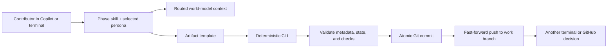

# Singularity Flow Lite architecture

## System boundary

Singularity Flow separates probabilistic generation from deterministic lifecycle control:



Skills generate content; the CLI alone owns `workflow.json`, `STATUS.md`, managed metadata, approval records, state transitions, commits, and publication.

## Repository definition and immutable resolution

`.sdlc/workflow.yml` is the editable definition for new work. It declares work types, phases, templates, personas, world-model routing, approval policies, Git publication, and protected paths.

At work-item creation the CLI resolves:

1. The selected work type and its phase sequence.
2. Work-type overrides over phase defaults.
3. Every phase artifact/template path.
4. Applicable checks, views, comparison, and approval policy.
5. Configuration and template SHA-256 hashes.

This resolution is copied into `.sdlc/work-items/<ID>/workflow.json`. The selected work type and snapshot are immutable. Active work therefore follows the definition committed on its branch even if the base branch later evolves.

## Persona session and prompt composition

`start` selects a work type and persona; `resume` selects a persona. Selection requires an interactive terminal. The session lives at `.git/singularity-flow/session.json` and is intentionally local and uncommitted.

For generation, context is additive:

```text
phase instructions
+ persona prompt
+ phase-required world-model views
+ persona world-model views
+ evidence ledger for verification/conformance
```

Suggested personas improve discoverability but do not authorize phase access. Any contributor may assume any configured persona. A persona's `mayApprove` list provides decision authority.

## Work-item layout

```text
.sdlc/work-items/ENG-142/
├── workflow.json
├── STATUS.md
├── source.json
├── artifacts/
│   ├── intake/intake.md
│   ├── implementation-spec/implementation-spec.md
│   └── conformance/spec-code-comparison.md
└── approvals/
    └── design/
        ├── <timestamp>-approved.json
        └── design.json
```

`workflow.json` is authoritative runtime state. `STATUS.md` is a generated human view. Artifacts contain a machine-managed metadata comment. Approval event files are append-only records; phase summary files are derived snapshots.

## Transaction and publication model

Each generation, submission, approval, rejection, or advancement is one local state transaction followed by one commit and one normal push. Generation subjects use:

```text
[WORK-ID][phase:<id>][generated:<n>]
```

The CLI verifies the expected branch head before mutation and relies on fast-forward push rejection for concurrent writers. It never force-pushes or rewrites work-item history.

If publication fails, the commit remains local and `.git/singularity-flow/publication-pending.json` records the pending branch/commit. Lifecycle mutation is blocked until `sync` pushes that exact history. This local marker is recovery state, not transferred workflow state.

## Approval model

An approval contains both:

- Declared persona, which supplies authority.
- Authenticated actor (GitHub login when available, plus Git identity), which supplies accountability.

Thresholds count distinct authenticated identities, not persona selections or repeated clicks. A contributor may approve their own generated content after switching personas, but matching identity produces `selfApproval: true` in the event, artifact, status, and conformance report.

Rejection validates `rejectTo` against the current phase policy. It reopens the target, invalidates approvals from the target through the downstream graph, and retains all prior artifacts and events in Git history.

## Artifact lifecycle and metadata

Template resolution is override → default → error. A generation validates current-phase write scope and minimum artifact requirements. The managed metadata records:

- Work item/type, phase, and generation.
- Generator identity and persona.
- Source/config/template hashes.
- Generation/publication commit linkage.
- Exact or unavailable token usage.
- Approval history and self-approval flags.
- Conformance source/test tree hash when applicable.

Publication commit information that is not knowable before a commit is represented in workflow state and the following lifecycle snapshot; commit hashes remain independently provable through Git.

## Traceability and final gate

Requirements establish `AC-n` identifiers. Implementation specifications establish `SPEC-nnn` items mapped to acceptance criteria. Verification supplies tests and evidence. Conformance joins these ledgers to exact file/line evidence and one of five verdicts: `matched`, `partial`, `missing`, `deviated`, or `unplanned`.

The final tree hash excludes `.sdlc` state and hashes tracked source/test content. A later source/test change invalidates the conformance report. The deterministic gate also validates configuration/template snapshots, artifacts, approval identities/personas, thresholds, rejection effects, self-approval disclosure, protected paths, and—under required publication—the remote branch head.

## Migration boundary

Legacy `.sdlc/config.json` and schema-v1 work items can be read and converted. `migrate-config` adds YAML, starter templates/personas, and schema-v2 state while preserving legacy input and existing commits. Migration never rebases or rewrites Git history.
