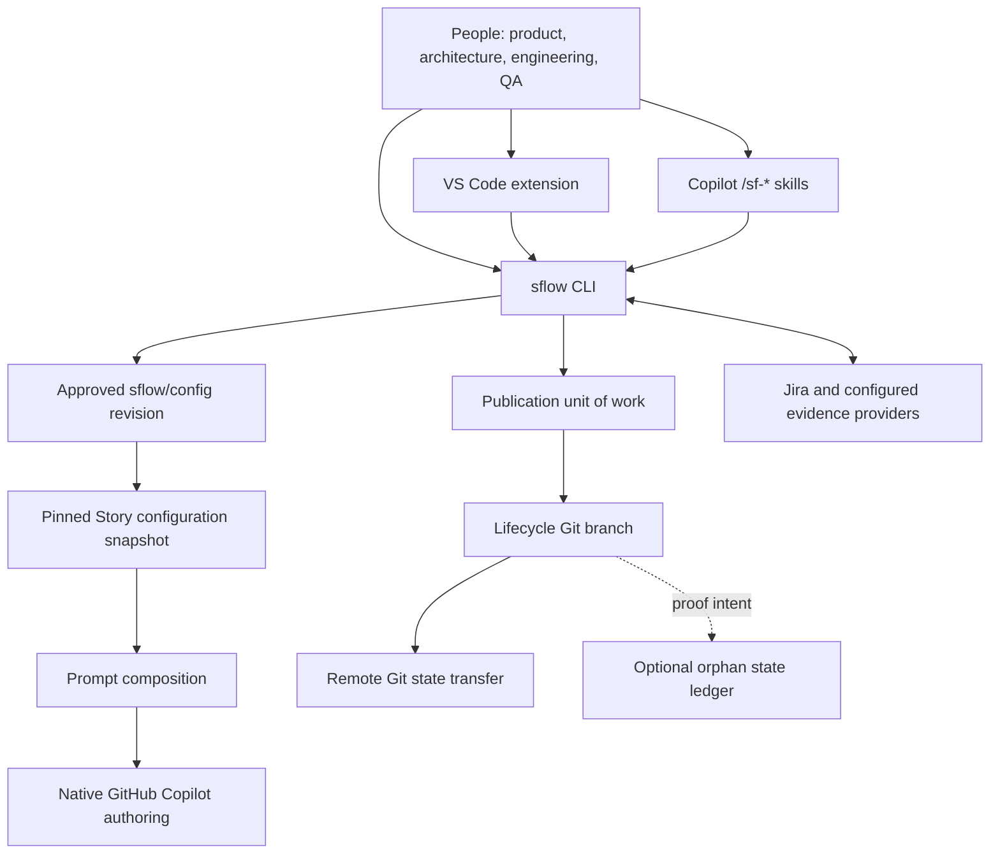
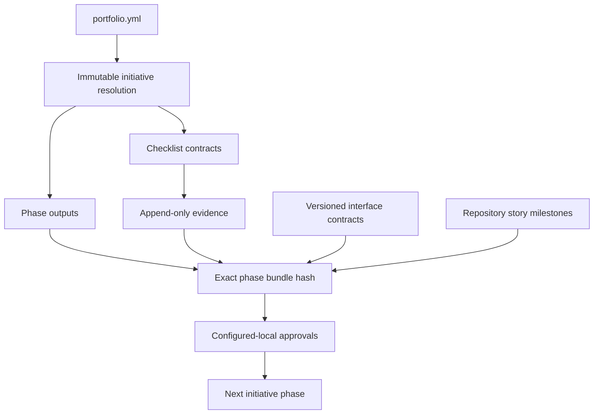
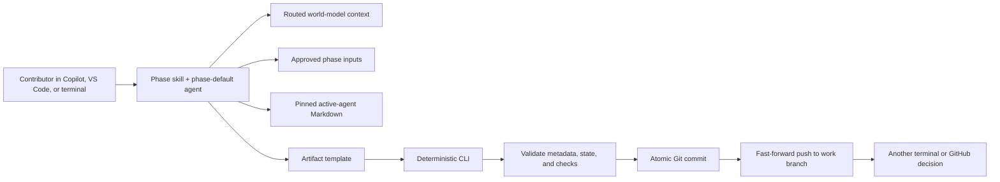
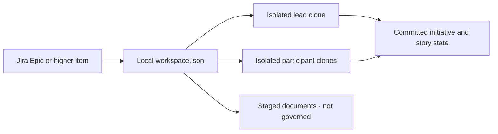

# Singularity Flow 0.9.0 architecture

> **State model:** The lifecycle branch owns operational state; local context selects it; the state branch proves and mirrors it; every mutation passes through one deterministic publication transaction.

The authority and recovery rules behind that sentence are normative in
[State authority](docs/STATE-AUTHORITY.md).

The approved phased design for addressable specification clauses, deterministic
indexes, claim maps, executable acceptance, scoped rework, and offline trace is
defined in [Clause-driven specifications](docs/CLAUSE-DRIVEN-SPECIFICATIONS.md).

Prompt composition may use an exact, content-addressed local cache under
`.git/singularity-flow/composition-cache/`. The key includes the rendered prompt
hash and all declared composition inputs. This preserves byte-identical prompts and
provider-cache eligibility; it does not claim that a provider cached those tokens.
The cache is local acceleration only and never lifecycle authority.

Harness Imports applies the same boundary to large outputs. Approved artifact bytes
remain authoritative on the lifecycle branch; a committed, content-addressed
reference record binds those bytes to an opaque `sfref:v1:` handle. Copilot receives
only a deterministic bounded preview and may request an explicit section, JSON
Pointer, or range through the CLI. Engine observations are content-addressed local
evidence, host observations are recorded only when supplied exactly, and reusable
knowledge requires approved artifact provenance plus explicit scope. See
[Harness Imports](docs/HARNESS-IMPORTS.md).

## Product boundary

Singularity Flow has one deterministic engine and two supported user surfaces.


```mermaid
flowchart TB
  H["People: product, architecture, engineering, QA"] --> V["VS Code extension"]
  H --> C["Copilot /sf-* skills"]
  H --> T["sflow CLI"]
  V --> T
  C --> T
  T --> X["Approved sflow/config revision"]
  X --> Y["Pinned Story configuration snapshot"]
  Y --> P["Prompt composition"]
  P --> AI["Native GitHub Copilot authoring"]
  T --> U["Publication unit of work"]
  U --> G["Lifecycle Git branch"]
  G --> R["Remote Git state transfer"]
  T <--> J["Jira and configured evidence providers"]
  G -. proof intent .-> L["Optional orphan state ledger"]
```

The VS Code extension is the primary visual surface. It communicates only through
`sflow` snapshots and commands; it never imports lifecycle internals or stores a
second copy of workflow state. Copilot is the probabilistic authoring surface. The
CLI is the sole lifecycle controller. The Electron application was retired by
[ADR 0004](docs/adr/0004-retire-electron-desktop.md).

## Concept separation

| Concept | Responsibility | Must not be used as |
|---|---|---|
| Human identity | Attribution and approval authority | A prompt/execution configuration |
| Governed agent | Phase-specific Copilot behavior, tools, and views | A human approver or authorization role |
| Skill | Named `/sf-*` interaction and CLI playbook | Workflow state |
| Prompt / prompt pack | Reusable instructions assembled into context | Repository facts |
| World model | Hash-bound repository facts and topology | Policy or human instructions |
| Workflow | Phase order, artifacts, inputs, checks, and gates | Generated content |
| Workspace | Local project/capability selection | Shared lifecycle authority |
| Capability | Organisational ownership and inherited policy | A local clone or user role |

See the [glossary](docs/GLOSSARY.md) for the full vocabulary.

## Capability ledger plane

The opt-in capability ledger is a separate orphan Git history. Story and Initiative
state remain their operational source while durable ledger intents feed a shared
append-only sink after normal publication. The local outbox is a cache, never the
recovery authority. See [CAPABILITY-LEDGER.md](./CAPABILITY-LEDGER.md).
Portable deployment checks and their honest trust boundary are documented in
[Ledger deployment validation](docs/LEDGER-DEPLOYMENT.md).

## Initiative layer

The optional initiative layer uses `singularity/portfolio.yml` and a lead branch named exactly after the initiative ID. It does not alter the existing `singularity/work-items` runtime.


```mermaid
flowchart TB
  P["portfolio.yml"] --> R["Immutable initiative resolution"]
  R --> O["Phase outputs"]
  R --> C["Checklist contracts"]
  O --> B["Exact phase bundle hash"]
  C --> E["Append-only evidence"]
  E --> B
  K["Versioned interface contracts"] --> B
  S["Repository story milestones"] --> B
  B --> A["Configured-local approvals"]
  A --> N["Next initiative phase"]
```

Evidence, approvals, and invalidations are canonical JSON named by SHA-256. A justification graph links outputs, checks, evidence, approvals, contracts, and story dependencies. Regeneration, rejection, expired evidence, contract changes, and child regression invalidate only the transitive consumer cone.

Cross-repository materialization uses managed clones under the lead repository’s Git directory, safe branch attachment, committed story seeds, normal fast-forward pushes, and a resumable journal. Jira creation is optional; Git remains canonical.

Story branch ancestry is decided per repository. In the initiative’s own repository a story is cut from the initiative branch, because that is the only branch on which the approved artifacts its seed cites by hash exist; elsewhere it is cut from that repository’s configured default branch, and no initiative branch is created there. The seed records `parentBranch` and `baseCommit`, so the choice is reproducible from a fresh clone rather than inferred. The merge order over those branches is derived from the `dependsOn` graph already committed in `breakdown.yml` — proven acyclic at authoring time — so ordering introduces no new mutable state.

See [INITIATIVE-ORCHESTRATION.md](INITIATIVE-ORCHESTRATION.md).

## System boundary

### Model invocation boundary

The lifecycle kernel is model-independent. The command registry assigns every
operation `never`, `optional`, or `required` before loading its implementation.
Only `model-runner.mjs` may cross the bounded provider interface; nested calls
inherit the strictest active policy. Audit intent is written under `.git/` before
provider startup and completed with output and usage hashes afterward. Interactive
Copilot sessions are host-owned and explicitly outside this guarantee.

Human, governed-agent, deterministic, and external-tool authorship share the same
artifact contracts and Git publication transaction. Provenance records who
published, through which channel, whether the kernel invoked a model, and any
self-reported external AI assistance. See
[`docs/MODEL-INDEPENDENCE.md`](docs/MODEL-INDEPENDENCE.md).

Singularity Flow separates probabilistic generation from deterministic lifecycle
control:


```mermaid
flowchart LR
  U["Contributor in Copilot, VS Code, or terminal"] --> S["Phase skill + phase-default agent"]
  S --> W["Routed world-model context"]
  S --> I["Approved phase inputs"]
  S --> D["Pinned active-agent Markdown"]
  S --> A["Artifact template"]
  A --> C["Deterministic CLI"]
  C --> V["Validate metadata, state, and checks"]
  V --> G["Atomic Git commit"]
  G --> R["Fast-forward push to work branch"]
  R --> O["Another terminal or GitHub decision"]
```

Skills and native Copilot generate content; the CLI alone owns `workflow.json`,
`STATUS.md`, managed metadata, approval records, state transitions, commits, and
publication.

## State planes and authority

| Plane | Examples | Authority |
|---|---|---|
| Configuration authority | `sflow/config`: `workflow.yml`, `portfolio.yml`, `capabilities.yml`, `.github/agents/`, prompts, skills, templates | Approved definition for future work; independent of application history |
| Lifecycle configuration snapshot | Copied configuration plus `configuration-source.json` on the Story branch | Immutable definition for that Story, pinned to one full configuration commit and per-file hashes |
| Lifecycle branch | Story `workflow.json`; Initiative `state.json`; artifacts and approvals | Operational source of truth for active work |
| Local context | workspace registry, session, locks, caches, pending-publication marker | Selects or protects work; never shared authority |
| External observation | Jira, GitHub checks/PRs, storage providers | Timestamped evidence; Git records what was observed |
| Proof ledger | Optional orphan `state` branch | Append-only proof/mirror; never operational read/write path |

Every mutating command resolves the subject, obtains a subject-local lock, verifies
the expected revision and pending-publication state, applies a deterministic
transition, validates projections, stages an allowlist, creates one commit, and
performs a normal fast-forward push. A failed push retains the local commit and
writes recovery state below `.git/singularity-flow/pending-publication/`.

Application integration branches are never implicit publication targets. The
default branch is resolved from configuration or the local remote-HEAD symbolic
reference. Initial governance is committed to a review branch; shared configuration
and proof live on the orphan `sflow/config` and `state` branches; Story and Initiative
transactions publish only their registered lifecycle branches. World-model,
configuration-editor, and Story-branch attachment publishers fail before staging or
committing when invoked on the application branch. The final integration action is
an explicit, human-merged `singularity-flow epic pr` after the Story stack is ready.

## Repository definition and immutable resolution

`singularity/workflow.yml` on `sflow/config` is the editable definition for new
work. It declares work types, phases, templates, world-model routing, approval
policies, Git publication, and protected paths. Governed agents live in
`.github/agents/*.agent.md` on the same branch. Capability edits are reviewed
against `sflow/config`; application branches are not configuration authorities.

At Story creation the engine copies the approved configuration revision into the
new lifecycle branch and writes `singularity/configuration-source.json`. That
provenance record contains the configuration remote, branch, full commit SHA, and
SHA-256 for every copied configuration asset. The Story remains reproducible even
after `sflow/config` changes.

At work-item creation the CLI resolves:

1. The selected work type and its phase sequence.
2. Work-type overrides over phase defaults.
3. Every phase artifact/template path.
4. Applicable checks, views, comparison, and approval policy.
5. Configuration and template SHA-256 hashes.
6. `inputsMode`, normalized upstream-input declarations, and producer artifact paths.
7. Any explicitly referenced remote template copied into committed work-item context.

This resolution is copied into `singularity/work-items/<ID>/workflow.json`. The selected work type and snapshot are immutable. Active work therefore follows the definition committed on its branch even if the base branch later evolves.

## Agent session and prompt composition

`start` first selects Jira or manual intake, captures the Story and supporting documents, and then selects a workflow template. Each phase resolves exactly one default agent from Agent Markdown metadata. `resume` activates the current phase's agent automatically. `/sf-agent` is an explicit local override for exceptional work; it never grants approval authority. When Copilot has selectable questions but no persistent stdin bridge, start and approval use short-lived one-time receipts under the Git directory. Receipts record only durable human choices and are bound to the work ID, repository HEAD, and Copilot session when available. Approval receipts additionally pin the submitted phase, generation, artifact hashes, and exact typed confirmation. The active work item and agent live at `.git/singularity-flow/session.json`; this state is intentionally local and uncommitted.

For generation, context is additive:

```text
phase contract/template
+ governed Agent Markdown
+ phase-required world-model views
+ agent-added world-model views
+ rule-selected repository world-model files
+ active-agent remote skill Markdown
+ governed host-MCP policy (agent, phase, and tool allowlist)
+ approved phase-input artifacts
+ evidence ledger for verification/conformance
```

World-model generation runs in a detached analysis worktree with a separate output directory. The CLI rejects source writes, validates manifest coverage and safe regular-file paths, records a source-tree hash, atomically installs the model, and commits/publishes it. Its source hash excludes model output and work-item lifecycle state, so those commits do not create false staleness.

Normal phase skills use one `wm compose` operation. It joins the phase-default agent, mandatory phase/agent views, the exact task guide, applicable evidence, need-based `worldModel.injection.rules`, and locked remote Agent Markdown dependencies. The next generation commit includes a provenance record plus the exact rendered prompt. The configurable `off|warn|enforce` grounding gate verifies these against the committed model.

Repository world models never move to remote delivery. Agent Markdown is the governed execution-role layer. `singularity/agents.lock.yml` supplies committed trust-on-first-use hashes; `.git/singularity-flow/agents/` is an uncommitted verified cache. Sync records the active agent without changing the lock. Remote Markdown dependencies are copied and hash-recorded per generation, remote templates are copied once into immutable work-item context, and generated outputs receive per-generation provenance records.

MCP is a separate host boundary. VS Code or Copilot CLI owns MCP server processes,
transports, trust, and credentials. The committed workflow owns only server-name,
agent, phase, and tool policy. Prompt composition exposes that allowlist to the
active governed agent. Material results become governed only when copied below the
work item and recorded under `context/mcp/`; the gate revalidates their hashes.

Agents define prompt behavior, allowed tools, phase scope, automatic phase ownership, and added world-model views. Agents are software execution contracts, not people. Human identity and organizational role are recorded separately, and approval authority comes only from configured identity groups.

Approval authority comes only from the real Git/GitHub identity matching a configured `approvalAuthorities` group. Each phase's `approval.authorities` names the groups that may approve it and `approval.minimum` how many distinct identities are required; the same identity cannot satisfy a threshold twice. The authority registry is pinned into the work item when it starts, so later configuration edits cannot retroactively grant authority over in-flight work. Matching records an `identityAssurance` of `configured-local` or `github-authenticated` — an honest label for how the identity was established, not a claim of cryptographic authentication. Self-approval is permitted but always recorded and warned, and is never presented as independent review.

## Work-item layout

```text
singularity/work-items/ENG-142/
├── workflow.json
├── STATUS.md
├── source.json
├── USER-STORY.md
├── documents.json
├── inputs/
│   └── DOC-001/<original-file>
├── context/                 # per-generation grounding records and prompt snapshots
│   ├── design-gen1.json
│   ├── inputs-design-gen1.json
│   ├── agents-design-gen1.json
│   ├── agent-templates/
│   └── remote-output-<agent>-<resource>-design-gen1.json
├── artifacts/
│   ├── intake/intake.md
│   ├── implementation-spec/implementation-spec.md
│   └── conformance/spec-code-comparison.md
└── approvals/
    └── design/
        ├── <timestamp>-approved.json
        └── design.json
```

`workflow.json` is authoritative runtime state. `STATUS.md` is a generated human view. Artifacts contain a machine-managed metadata comment. Approval event files are append-only records; phase summary files are derived snapshots.

## Phase-input dataflow

Input declarations are validated in all modes, including ordering and work-type membership. `off` is inert, `record` records warnings, and `enforce` blocks required missing/unapproved inputs and every present hash mismatch. Collection verifies the producer's active approval, registered approved hash, current artifact hash, and resolved producer path. The marker-delimited input block is replaceable; the accompanying context record captures declarations, status, bytes, truncation, approved hashes, and rendered-block hash. Publication recollects rather than trusting preparation.

## Remote dependency trust boundary

Only links in exact agent dependency tables are executable configuration. Fetching accepts non-empty UTF-8 Markdown over public HTTPS, uses bounded redirects and timeouts, rejects embedded credentials and local/private literal hosts, and enforces a 10 MiB hard ceiling. The lock stores source-agent and resource hashes. First trust and updates are interactive; sync never changes hashes. Cache and audit writes are atomic.

Dynamic URL expansion permits only encoded work item, work type, phase, and generation values. Targets are constrained below the current work item's `artifacts/<phase>/`. Repeated prepare reuses the snapshot. Local edits produce a conflict and require deliberate refresh; overwrite additionally requires `--replace`.

`documents.json` is the stable supporting-input catalog. Local files are copied under `inputs/DOC-nnn/`; external links such as Figma are recorded without being downloaded. When `workflow.yml` declares `storage.providers`, a document can also be fetched from a configured provider (OneDrive/SharePoint via Microsoft Graph, Artifactory, S3): the bytes are downloaded, hashed, written under `inputs/DOC-nnn/`, and recorded with provider provenance — reusing the Epic-source storage adapters, so the file stays Git-transferable rather than becoming a bare link. Each input is attributed to the active human identity and governed agent and uploaded only during the profile-snapshotted allowed phases. Uploads use the same commit/push recovery protocol as lifecycle events.

`guide` derives a read-only template walkthrough from `workflow.json`. It does not maintain separate state; `/sflow-help` reports the immutable phase sequence and selects its recommended next action from the current phase status and generation history. `nextsteps` reuses that recommendation engine to produce a compact ordered plan with immediate, subsequent, and alternative actions, while also handling pre-initialization, idle repositories, pending publication, and completed workflows. The explicitly invoked `sflow-next`/`singularity-flow next` executor performs one corresponding action at a time. It preserves generation, submission, and approval as separate durable transitions; approval records the phase-default agent as audit context and uses the human Git identity for authority.

Sequence guards are named policy controls resolved from global and work-type `sequenceGates`, then pinned into `workflow.resolution`. An absent policy normalizes every gate to `hard`. A hard violation fails without mutation; a soft violation requires an exact interactive confirmation and reconciles runtime state before continuing. The exception record captures prior state, action, reason, identity, agent, and timestamp, and is propagated through history, artifact metadata, status, reports, and governance warnings. Non-interactive processes cannot confirm soft exceptions, and Copilot agent contracts explicitly prohibit self-confirmation.

`HELP.md` is the canonical product manual. The CLI parses its level-two headings into stable topic IDs for `singularity-flow help [TOPIC]`; Copilot skills and the VS Code extension use the same repository-owned guidance.

## Progress model

Completion is the number of approved phases divided by the immutable total phase count. Awaiting approval and in-progress phases are not assigned guessed fractional credit. The progress view also exposes current position, generations, approval thresholds, document count, and token totals.

`report` is another read-only projection over the same committed `workflow.json`. It sorts lifecycle events, pairs each submission with its next approval/rejection, and derives wall-clock phase duration, approval waiting, rework, exact token usage, optional configured cost, and the largest approval-latency bottleneck. Open submissions accrue waiting time through the report timestamp. Markdown, JSON, and script-free HTML renderers do not introduce report state; `--out` writes an explicitly requested file but never commits it. Cost is computed only for exact usage whose exact model name has a non-negative per-million price in workflow YAML, with incomplete coverage marked partial.

## VS Code control plane

`apps/vscode` is the supported visual surface over the CLI. It imports no engine
modules: every read and mutation runs through `sflow`, so Git remains the only
governed state store.

- Workspaces selects local scope and shows repository/capability health.
- Lifecycle handles intake, workflow selection, phases, generated artifacts,
  progress, and decisions.
- Inbox aggregates artifacts, review packets, approvals, and capability-level
  portfolio progress.
- Configuration provides visual designers for workflows, artifact templates,
  agents, prompts, skills, prompt packs, capabilities, integrations, and
  world-model policy.

Revisioned scoped snapshots prevent an older asynchronous response from replacing
newer UI state. File watching refreshes visual projections when work is performed
from a terminal or another process. Jira and provider tokens use VS Code
`SecretStorage` and are injected only into CLI child processes. Native Copilot
receives context produced by `sflow wm show-prompt`; the extension never owns a
competing model backend. See [VS Code guide](docs/VS-CODE.md).

## Local project workspace boundary

The optional workspace layer is intentionally outside the governed
domain model:


```mermaid
flowchart LR
    J["Jira Epic or higher item"] --> W["Local workspace.json"]
    W --> L["Isolated lead clone"]
    W --> R["Isolated participant clones"]
    W --> D["Staged documents · not governed"]
    L --> G["Committed initiative and story state"]
    R --> G
```

The manifest and recent-workspace registry are local conveniences. They contain
no credential, approval, lifecycle, evidence, or authoritative artifact state.
Every selected repository lives below the workspace `repos/` boundary. Jira
tokens entered in VS Code remain in `SecretStorage`; headless CLI users supply them through the environment. The clone journal supports retry without overwriting an
unrelated directory, while fetch refuses to alter dirty clones.

Jira issue type names are never hard-coded. Workspace anchors are selected by
Jira `hierarchyLevel >= 1`, allowing an Epic on default Jira hierarchy or a
configured higher-level item. Child traversal uses `parent`, with legacy Epic
Link lookup restricted to the Epic compatibility path.

Copilot is keyed to the active lead-repository path. Switching repositories or workspaces rebinds the CLI client and refreshes the Git-derived read model, preventing planning-session context from carrying
across local projects.

## Transaction and publication model

Each generation, submission, approval, rejection, or advancement is one local state transaction followed by one commit and one normal push. Generation subjects use:

```text
[WORK-ID][phase:<id>][generated:<n>]
```

The CLI verifies the expected branch head before mutation and relies on fast-forward push rejection for concurrent writers. It never force-pushes or rewrites work-item history.

If publication fails, the commit remains local and `.git/singularity-flow/pending-publication/<kind>--<ID>.json` records the pending branch/commit. Lifecycle mutation is blocked until `sync` pushes that exact history. This local marker is recovery state, not transferred workflow state.

## Approval model

An approval contains both:

- Governed phase agent, recorded only as execution context.
- Authenticated actor (GitHub login when available, plus Git identity), which supplies accountability.

Thresholds count distinct authenticated identities, not agent selections or repeated clicks. A contributor may approve their own generated content, but matching identity produces `selfApproval: true` in the event, artifact, status, and conformance report.

Rejection validates `rejectTo` against the current phase policy. It reopens the target, invalidates approvals from the target through the downstream graph, and retains all prior artifacts and events in Git history.

## Artifact lifecycle and metadata

Template resolution is override → default → error. A generation validates current-phase write scope and minimum artifact requirements. The managed metadata records:

- Work item/type, phase, and generation.
- Generator identity and governed agent.
- Source/config/template hashes.
- Generation/publication commit linkage.
- Exact or unavailable token usage.
- Approval history and self-approval flags.
- Conformance source/test tree hash when applicable.

Publication commit information that is not knowable before a commit is represented in workflow state and the following lifecycle snapshot; commit hashes remain independently provable through Git.

## Traceability and final gate

Requirements establish `AC-n` identifiers. Implementation specifications establish `SPEC-nnn` items mapped to acceptance criteria. Verification supplies tests and evidence. Conformance joins these ledgers to exact file/line evidence and one of five verdicts: `matched`, `partial`, `missing`, `deviated`, or `unplanned`.

The final tree hash excludes `singularity` state and hashes tracked source/test content. A later source/test change invalidates the conformance report. The deterministic gate also validates configuration/template snapshots, final-generation input/agent records, remote template/output provenance, artifacts, approval identities and agents, thresholds, rejection effects, self-approval disclosure, protected paths, and—under required publication—the remote branch head.

## Security and trust boundaries

- Git publication uses normal fast-forward pushes; no lifecycle command
  force-pushes or rewrites history.
- Credentials remain in VS Code `SecretStorage` or process environment and are
  redacted from logs, prompts, state, and Git.
- Remote Markdown is inert unless declared in exact dependency tables, explicitly
  locked, hash-verified, HTTPS-fetched, size-bounded, and materialized inside its
  allowed target.
- Artifact and evidence paths are constrained below their governed roots and must
  be regular files rather than symlink escapes.
- Approval authority is tied to real configured identities. A governed agent never
  grants authority.
- Repository world-model generation occurs in a detached analysis worktree; source
  modifications from the model process are rejected.
- Worktree locks prevent local read-modify-write races, while Git fast-forward
  rejection remains the cross-machine concurrency arbiter.

## Migration boundary

This development release intentionally accepts only agent-only workflow schema version 2. Legacy role-bearing definitions and work-item state fail with a guarded factory-reset instruction; no automatic migration path is provided. Machine-local workspace registrations whose lead explicitly declares a non-v2 workflow are discarded on registry access, while their directories and repository clones remain untouched.
