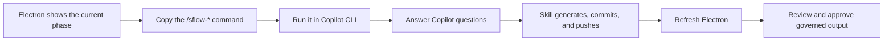

# Copilot CLI Handoff

Singularity Flow no longer starts or embeds a GitHub Copilot planning session
inside Electron. The desktop is the durable surface for workspace
configuration, pinned evidence, generated documents, progress, governance,
review, and approval. Model interaction stays in the user’s normal,
authenticated Copilot CLI.

## Operating model



Each applicable Electron phase page shows:

- the repository directory from which the command must run;
- the primary phase skill and its shell equivalent;
- `/sflow-upload` for adding files, folders, images, notes, Figma exports, or
  HTTPS references;
- `/sflow-nextsteps` for sequence-aware recovery; and
- the committed sources, expected outputs, generated documents, and current
  governance state.

The skill running in Copilot CLI composes:

```text
phase contract and artifact template
+ phase-default governed Agent Markdown
+ required repository world-model views
+ rule-selected repository world-model files
+ locked remote Agent Markdown dependencies
+ approved upstream artifacts
+ pinned Epic or Story evidence
```

The normal Singularity Flow lifecycle remains authoritative. A skill cannot
bypass phase ordering, required evidence, template validation, approval rules,
or Git publication guarantees. Refreshing Electron reconstructs the result from
the committed branch; no chat transcript is treated as workflow state.

## Uploading evidence

Use the dedicated command from Copilot CLI:

```text
/sflow-upload ./requirements.pdf --epic MOB-100
/sflow-upload ./figma-export --work-id MOB-123
/sflow-upload --url https://example.com/design --label "Approved design"
```

Epic evidence is registered through `singularity-flow epic sources`. Story
evidence is registered through `singularity-flow documents`. The skill reports
stable IDs, hashes, paths or providers, commits, and push results.

## World-model exception

Repository world-model generation remains available in Electron. It is a
repository-wide grounding operation rather than a phase conversation, can take
several minutes, and needs visible progress. Electron displays the exact builder
prompt, requested views, activity, completion time, and commit/push result.

No other Electron action starts Copilot, opens an ACP session, selects a model,
or sends a phase prompt.
