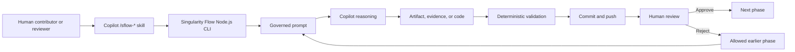

# How Singularity Flow works

Singularity Flow is a Git-native SDLC control plane around GitHub Copilot. Copilot
helps people reason, author artifacts, and implement code. Deterministic Node.js
code owns workflow state, validation, commits, pushes, approvals, lineage, and
reports.

This separation is the central design rule:

> AI creates proposed content. Singularity Flow decides whether that content may
> move through the lifecycle.



## 1. Responsibilities

| Component | Responsibility |
|---|---|
| Human | Selects work and workflow, confirms exceptions, and approves or rejects with a real identity |
| Copilot | Uses governed context to generate or review content |
| `SKILL.md` | Tells Copilot which deterministic commands and behavioral rules to follow |
| Node.js CLI | Loads configuration, composes prompts, validates state, and performs lifecycle operations |
| Git | Durable, distributed workflow state shared across people and terminals |
| VS Code extension | Workspaces, lifecycle, configuration, documents, progress, and review |
| Jira | External issue identity, assignment, status, and Epic/Story relationships |

Copilot does not directly mark a phase approved or complete. The CLI performs
that transition only after its deterministic checks succeed.

## 2. Shared and local storage

Repository-owned, reviewable state lives in the visible `singularity/` folder:

```text
singularity/
├── workflow.yml
├── portfolio.yml
├── prompts/
├── templates/
├── world-model/
├── work-items/
│   └── WORK-123/
├── initiatives/
│   └── EPIC-123/
├── seeds/
└── agents.lock.yml
.github/
└── agents/
    └── <agent-id>.agent.md
```

The important entries are:

- `workflow.yml`: Story workflow definition.
- `portfolio.yml`: optional multi-repository Epic and initiative definition.
- `.github/agents/`: governed execution-role Markdown with phase defaults, tools, instructions, and world-model views.
- `templates/`: configurable artifact templates.
- `world-model/`: generated repository understanding.
- `work-items/`: Story workflow state, artifacts, approvals, and telemetry.
- `initiatives/`: Epic requirements, plans, evidence, and Story lineage.
- `seeds/`: approved Epic context passed into generated Story branches.
- `agents.lock.yml`: trusted hashes for optional remote Agent Markdown dependencies.

Machine-local state is deliberately kept out of commits:

```text
.git/singularity-flow/
├── session.json
├── logs/
├── cache/
├── receipts/
└── pending-publication state
```

The local session records the active work item and current governed agent. Caches, raw
telemetry traces, and short-lived selection receipts also stay under `.git/`.
Workspace selection lives in the CLI workspace registry; local profile preferences live in VS Code settings
directory; credentials use the operating-system protected credential store.

## 3. Installation and initialization

The package supplies:

- The `singularity-flow` and `sflow` Node.js CLI.
- The VS Code extension.
- GitHub Copilot `/sflow-*` skills.
- Starter workflows, templates, governed agents, and prompts.

Initialize from the application repository:

```bash
singularity-flow init --work-id WORK-123 --base main --fetch
```

This command fetches the base, creates or reuses `WORK-123`, switches to that
branch, and installs the process files there. It does not write to or push
`main`.

Publish the initialization normally:

```bash
git add singularity
git commit -m "[WORK-123][bootstrap] Initialize Singularity Flow"
git push -u origin WORK-123
```

Initialization is repeatable:

```bash
singularity-flow init --check
singularity-flow init --repair
```

`--check` is read-only. `--repair` restores only missing packaged files and does
not overwrite repository customizations.

## 4. Starting a Story

A Story can start from Jira or from a manual description and documents:

```text
/sflow-start WORK-123
```

```bash
singularity-flow start WORK-123
```

The contributor selects:

1. Intake source: Jira or manual.
2. Work type: feature, bugfix, chore, Figma-mobile, or another configured type.
3. No role picker: the first phase's default governed agent activates automatically.

Manual intake may be explicit:

```bash
singularity-flow start WORK-123 \
  --title "Add invoice export" \
  --description "Finance needs filtered invoice exports." \
  --acceptance-criteria "Authorized users can export the filtered result." \
  --document ./requirements.pdf
```

At creation, the CLI resolves and snapshots:

- Work type and phase sequence.
- Configuration hash.
- Template paths and hashes.
- Input policy.
- Sequence-gate policy.
- Approval policy and authority registry.
- Protected paths.
- World-model grounding requirements.

An active item therefore follows its pinned contract even if the base branch
configuration changes later.

## 5. Work types and phases

Starter profiles include:

```text
Feature
intake → requirements → design → implementation-spec
       → implementation → verification → conformance

Bugfix
intake → reproduction → fix-design → fix-spec
       → implementation → verification → conformance

Chore
intake → implementation → verification → conformance
```

Every phase may define:

- Artifact template and required artifact.
- Approved upstream inputs.
- Required world-model views.
- Quality commands.
- Write scope.
- Approval authority groups and threshold.
- Allowed rejection targets.
- Hard or soft lifecycle gates.

These definitions are editable in `singularity/workflow.yml`.

## 6. Governed agents and human identity

A governed agent is Agent Markdown under `.github/agents/`. Its frontmatter
declares phase scope, automatic phase defaults, tools, and world-model views;
its body supplies the execution instructions. Every configured phase must have
exactly one default agent.

Agents are not people. The human's Git/GitHub identity is recorded separately
and matched against approval-authority groups. Changing agents cannot grant
approval permission or create an independent review.

The current phase agent is stored locally:

```text
.git/singularity-flow/session.json
```

Inspect or explicitly override it without committing workflow state:

```text
/sf-agent
```

`start`, `resume`, and phase advancement set it automatically from the immutable
workflow resolution. Approval identity is evaluated from Git identity and, when
available, authenticated GitHub identity.

## 7. What a Copilot skill does

A Copilot skill is a Markdown contract such as:

```text
plugin/skills/sflow-phase/SKILL.md
```

When a person invokes `/sflow-phase`, Copilot loads the complete `SKILL.md`.
That file instructs Copilot to:

1. Inspect deterministic status.
2. Compose the governed prompt.
3. Read relevant documents.
4. Prepare the current phase artifact.
5. Author only within the configured scope.
6. Publish the generation.
7. display the complete published artifact.
8. Stop before submission or approval.

The skill does not implement the lifecycle itself. It calls the Node.js CLI,
which reads files, runs validation, and performs Git operations.

The bundled plugin's only hook is a nonblocking startup prompt. It can remind
the contributor to invoke `/sflow-session` or `/sflow-start`, but it does not
invoke skills automatically or deny Copilot tools. Lifecycle enforcement remains
inside the deterministic CLI. The source retains optional command-hook handlers
for organizations that deliberately add a stricter custom policy.

## 8. Repository world model

The world model is a repository-owned, generated description of the codebase:

```text
singularity/world-model/
├── manifest.json
├── core/
│   └── summary.md
├── views/
│   ├── business.md
│   ├── architecture.md
│   ├── development.md
│   ├── testing.md
│   ├── security.md
│   └── operations.md
├── domains/
├── tasks/
└── evidence/
```

Build it for an exact phase and task:

```bash
singularity-flow wm build \
  --phase design \
  --task "Design invoice export" \
  --local
```

Generation records:

- Repository commit and source-tree hash.
- Generation timestamp.
- Builder prompt hash and version.
- View, domain, task-guide, and evidence paths.
- SHA-256 and size of each registered file.

Views can be generated in parallel. The installed result is still validated
against one manifest before it becomes governed context.

## 9. How the world model reaches Copilot

The phase skill requests:

```bash
singularity-flow wm compose \
  --phase design \
  --task "Design invoice export"
```

The composer combines:

```text
Phase contract and artifact template
+ governed Agent Markdown
+ repository core summary
+ mandatory phase views
+ agent-added world-model views
+ relevant domain files
+ exact task guide
+ rule-selected world-model files
+ locked remote Agent Markdown dependencies
+ approved upstream artifacts
+ evidence ledger when required
```

`singularity-flow wm compose` is implemented in JavaScript modules executed by
Node.js. The selected Markdown is printed as one complete governed prompt, and
the skill instructs Copilot to use all of it. World-model Markdown is data; it is
not executed as JavaScript.

Inspect the exact effective context without changing state:

```text
/sflow-show-prompt
```

```bash
singularity-flow wm show-prompt \
  --phase design \
  --work-id WORK-123 \
  --skill sflow-design
```

The output contains both the complete `SKILL.md` contract and the complete
governed phase prompt.

## 10. Prompt provenance

A non-dry-run composition records:

```text
singularity/work-items/WORK-123/context/
├── design-gen1.json
└── prompts/
    └── design-gen1.md
```

The record includes:

- Phase, generation, work item, governed agent, and human identity.
- World-model commit and manifest hash.
- Model source-tree and current source-tree hashes.
- Required views and every selected file.
- Per-file SHA-256, size, injected bytes, and truncation.
- Complete rendered-prompt hash.
- Freshness and task information.

In enforced mode, publication fails if the composition is missing, stale, built
for the wrong lens, omits a required view, or differs from the recorded prompt
or manifest.

## 11. Approved phase inputs

Later phases may consume approved earlier artifacts:

```yaml
inputsMode: enforce

phases:
  design:
    inputs:
      - requirements
      - phase: intake
        optional: true
        maxBytes: 16384
```

Modes are:

- `off`: declarations are validated but not injected.
- `record`: available approved inputs are injected and audited; problems warn.
- `enforce`: missing, unapproved, or tampered inputs block the operation.

The current bytes must match the approved SHA-256. Input provenance is written
to `context/inputs-<phase>-gen<N>.json`.

## 12. The phase lifecycle

Every phase follows:

```text
compose → prepare → author → publish → submit → approve or reject
```

### Compose

```bash
singularity-flow wm compose --phase design --task "..."
```

Builds and audits the effective prompt.

### Prepare

```bash
singularity-flow prepare design
```

Creates or refreshes the configured artifact template and managed input block.

### Author

Copilot or a person completes the configured artifact:

```text
singularity/work-items/WORK-123/artifacts/design/design.md
```

### Publish

```bash
singularity-flow phase publish design
```

Publication validates:

- Active phase and lifecycle status.
- Required artifact and minimum content.
- Placeholder removal.
- Allowed write scope.
- Configuration and template hashes.
- Grounding composition and approved inputs.
- Protected files and traceability.

It then creates and pushes a generation commit such as:

```text
[WORK-123][phase:design][generated:1]
```

### Submit

```bash
singularity-flow submit --phase design
```

Submission reruns checks, displays the complete artifact, changes the phase to
`awaiting_approval`, and creates and pushes an atomic request commit.

### Approve or reject

```bash
singularity-flow approve WORK-123 --fetch
```

```bash
singularity-flow reject WORK-123 \
  --fetch \
  --to requirements \
  --reason "Failure behavior is missing"
```

Every approval or rejection creates and pushes its own decision commit.

## 13. Sequence gates

Lifecycle operations cannot silently run out of order. Examples include:

- Submitting before a generation is published.
- Approving before submission.
- Acting on a phase other than the active phase.
- Continuing while a prior push is pending.
- Submitting a generation that is not present on the remote.

A gate may be:

- `hard`: stop without changing state.
- `soft`: display the consequences and require a person to type `continue`.

Copilot must never confirm a soft warning on the user's behalf.

Read the ordered valid actions without changing anything:

```bash
singularity-flow nextsteps WORK-123
```

```text
/sflow-nextsteps
```

`/sflow-next` executes exactly one valid next action.

## 14. Approval authority

Approval authority comes from configured human groups:

```yaml
approvalAuthorities:
  architecture-reviewers:
    allowAnyGitIdentity: false
    members:
      - name: Lead Architect
        email: architect@example.com
```

Approval validates:

- Submitted phase and generation.
- Exact artifact hashes.
- Branch head.
- Reviewer Git or GitHub identity.
- Authority-group membership.
- Distinct-identity threshold.
- Exact phase confirmation.

Switching governed agents does not create a new identity. Self-approval can be
allowed, but it is recorded as `selfApproval: true`, shown in status and reports,
and never described as independent review.

## 15. Rejection and regeneration

Rejection reopens an allowed earlier phase, invalidates that phase and its
downstream approvals, records the reason, and requires a fresh generation.
Previous artifacts and decisions remain available in Git history.

No lifecycle content is destructively erased.

## 16. Git state transfer

Git is the shared workflow database. Meaningful operations create commits:

- Initialization and work creation.
- Document upload.
- Artifact publication.
- Submission.
- Approval or rejection.
- Evidence registration.
- Advancement and finalization.

Resume on another terminal:

```bash
singularity-flow resume WORK-123 --fetch
```

The CLI fetches the remote, locates the exact branch, permits only safe
fast-forward synchronization, verifies the remote head, reconstructs state from
committed files, and activates that phase's default governed agent locally.

It does not silently merge, rebase, reset, stash, force-checkout, or discard
work.

If push fails, the local commit is retained and publication is marked pending.
Further lifecycle mutations stop until:

```bash
singularity-flow sync
```

## 17. Documents and evidence

Documents may be uploaded during configured phases:

```bash
singularity-flow documents upload ./brief.pdf
singularity-flow documents upload ./figma-export
singularity-flow documents upload --url https://example.com/design
```

Each document receives a stable ID, path, MIME type, size, SHA-256, actor,
governed agent, human identity, and timestamp. Directory packages retain deterministic relative
paths and reject symbolic links.

Inspect documents with:

```bash
singularity-flow documents list WORK-123
singularity-flow documents view DOC-001 --work-id WORK-123
```

The desktop renders Markdown, JSON, images, and PDFs while rechecking recorded
hashes.

## 18. Final conformance

The final conformance phase connects:

```text
Source → requirement → AC-nnn → SPEC-nnn → code → test → evidence
```

Each requirement or specification receives one of:

- `matched`
- `partial`
- `missing`
- `deviated`
- `unplanned`

Evidence cites exact files and lines. A source/test-tree hash makes the report
stale if code or tests later change.

Run the deterministic terminal gate:

```bash
singularity-flow gate --terminal
```

The gate recalculates configuration, template, artifact, approval, grounding,
input, traceability, publication, protected-path, and conformance integrity
instead of trusting a status label.

## 19. Telemetry, models, and cost

Sanitized per-generation telemetry is committed under:

```text
singularity/work-items/WORK-123/telemetry/
```

When the provider exposes it, a record can include:

- Provider and model.
- Input, cached-input, output, and total tokens.
- Provider-reported cost.
- Start and end timestamps.
- Collection source.

If exact values are unavailable, they remain explicitly `unavailable`;
Singularity Flow does not invent estimates. Optional pricing can be configured
for exact model names.

Read the workflow report:

```bash
singularity-flow report WORK-123
```

It includes phase duration, approval waiting, rework, generations, model-wise
token totals, cost coverage, self-approvals, and bottlenecks.

## 20. Epic-to-Story planning

The optional Epic layer sits above normal Story workflows:

```mermaid
flowchart LR
  Epic["Jira or local Epic"] --> Sources["Pinned sources"]
  Sources --> Requirements["Requirements and impact"]
  Requirements --> Plan["Story plan and parent specification"]
  Plan --> Stories["Jira or local Stories"]
  Stories --> Branches["Canonical Story branches"]
  Branches --> Delivery["Developer Story workflows"]
  Delivery --> Packets["Finalized review packets"]
  Packets --> Reconcile["Product Owner reconciliation"]
```



The lead repository carries Epic-level artifacts. Planning produces:

- `SRC-*` source records.
- `REQ-nnn` requirements.
- `AC-nnn` acceptance criteria.
- Immutable `STORY-nnn` plan IDs.
- Parent and per-Story specifications.
- Repository routing and dependencies.
- Jira and Git receipts.

When Stories are published:

1. A Jira Story is created or an existing Story is attached.
2. The Jira key becomes the canonical Work ID when Jira is used.
3. A canonical Story branch is created.
4. Approved Epic context is copied into a governed Story seed.
5. Branch and receipt commits are pushed.
6. The developer runs the normal Story workflow.

The Product Owner later reconciles finalized Stories with the parent
specification. A standalone Story does not require the Epic layer.

## 21. Local multi-repository workspaces

A workspace is a local project context around one or more repository clones:

```text
Workspace
├── one lead repository
├── participating repository clones
├── per-repository Jira routing
├── App IDs and metadata
├── local document staging
└── caches
```

The workspace is the containing project context, not an individual clone.
Exactly one lead repository owns Epic-level artifacts.

Copilot:

```text
/sflow-workspaces
/sflow-workspace
```

Terminal:

```bash
singularity-flow workspace list
singularity-flow workspace use PAYMENTS --repository api
singularity-flow workspace current
```

## 22. VS Code extension

The extension is the supported visual surface. Workspaces owns local scope and capabilities; Lifecycle owns intake, workflow choice, active phases, artifacts and approvals; Configuration owns workflows, phases, gates, agents, prompts, skills, templates, integrations and world-model rules. Secure integration tokens use VS Code `SecretStorage`. Governed generation is handed to native Copilot with the complete rendered prompt.

## 23. Jira

Jira supplies external issue information and permissions. Git remains
authoritative for approved artifacts and lineage.

Useful commands include:

```bash
singularity-flow jira status
singularity-flow jira doctor
singularity-flow jira projects
singularity-flow jira epics
singularity-flow jira assigned
singularity-flow jira board
singularity-flow jira transitions
singularity-flow jira transition
singularity-flow jira comment
```

Credentials stay in the operating-system credential store. Jira observations
are timestamped snapshots. External drift is reported and never silently
overwrites approved Git state.

## 24. Remote Agent Markdown dependencies

Teams may add public HTTPS Markdown resources for prompt context, templates, or
generated outputs. Trust and activation are explicit:

```bash
singularity-flow agents lock architecture
singularity-flow agents sync architecture
```

Trusted hashes are committed in `singularity/agents.lock.yml`; verified bytes
are cached under `.git/singularity-flow/`. Remote content cannot silently change
an active generation. Remote agent skills are scoped context resources, not
global slash commands or human identities.

Copilot custom agents map automatically through
`singularity/agent-mappings.yml`. Each key is the Copilot custom-agent ID and
each value is a discovered governed agent ID. If no explicit entry exists,
the exact same-name match remains the fallback. Run
`singularity-flow agents mappings` to inspect the effective table.

The plugin's nonblocking `subagentStart` hook records the resolved agent in the
machine-local session while preserving the work item.
Local-only agents and already locked, verified cache entries can be activated
automatically. First trust, hash updates, and network synchronization remain
explicit contributor actions; unmatched agents are ignored. Mapping never
changes human identity or approval authority.

## 25. Security and integrity

The framework enforces these boundaries:

- Governed paths must remain inside their configured directories.
- Protected inputs reject symbolic links and path traversal.
- Configuration, templates, prompts, and world-model files are hash-recorded.
- Approvals bind to exact submitted artifact hashes.
- Git publication uses optimistic head checks and never force-pushes.
- Soft gates require explicit human confirmation.
- Approval is never automatic.
- Token values are never guessed.
- Secrets remain outside Git.
- Remote Markdown requires explicit trust.
- Final gates independently recalculate workflow integrity.

## 26. End-to-end Story example

```bash
# Create or repair the process definition on the Story branch.
singularity-flow init --work-id WORK-123 --base main --fetch
git add singularity
git commit -m "[WORK-123][bootstrap] Initialize Singularity Flow"
git push -u origin WORK-123

# Start and bind the Story workflow.
singularity-flow start WORK-123

# For each active phase.
singularity-flow wm build --phase intake --task "Add invoice export" --local
singularity-flow wm compose --phase intake --task "Add invoice export"
singularity-flow prepare intake
# Author the artifact.
singularity-flow phase publish intake
singularity-flow submit --phase intake
singularity-flow approve WORK-123 --fetch

# Orientation and final verification.
singularity-flow nextsteps WORK-123
singularity-flow progress WORK-123
singularity-flow report WORK-123
singularity-flow gate --terminal
```

Use the same exact `--task` text for `wm build` and `wm compose`; task guides are
matched exactly rather than guessed.

## Summary

Singularity Flow turns Copilot from a free-form coding assistant into a
Git-backed, configurable SDLC participant:

- Copilot creates and reviews content.
- Skills define how Copilot must interact with the framework.
- Node.js deterministically composes context and controls transitions.
- Git carries the complete shared state.
- Human identity controls approvals.
- Jira supplies optional external issue lineage.
- VS Code provides the supported visual surface.
- World-model and input hashes make every generation reproducible and auditable.

For the executable call chain, prompt vocabulary, Copilot question/receipt
bridge, and module map, see
[Singularity Flow under the hood](docs/UNDER-THE-HOOD.md). For architectural
invariants, see [ARCHITECTURE.md](ARCHITECTURE.md). For a visual tutorial, see
[HOW-TO.md](HOW-TO.md). For the complete command reference, see
[HELP.md](HELP.md).
