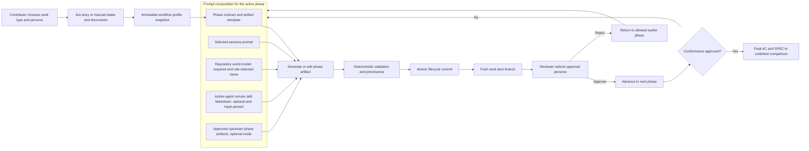
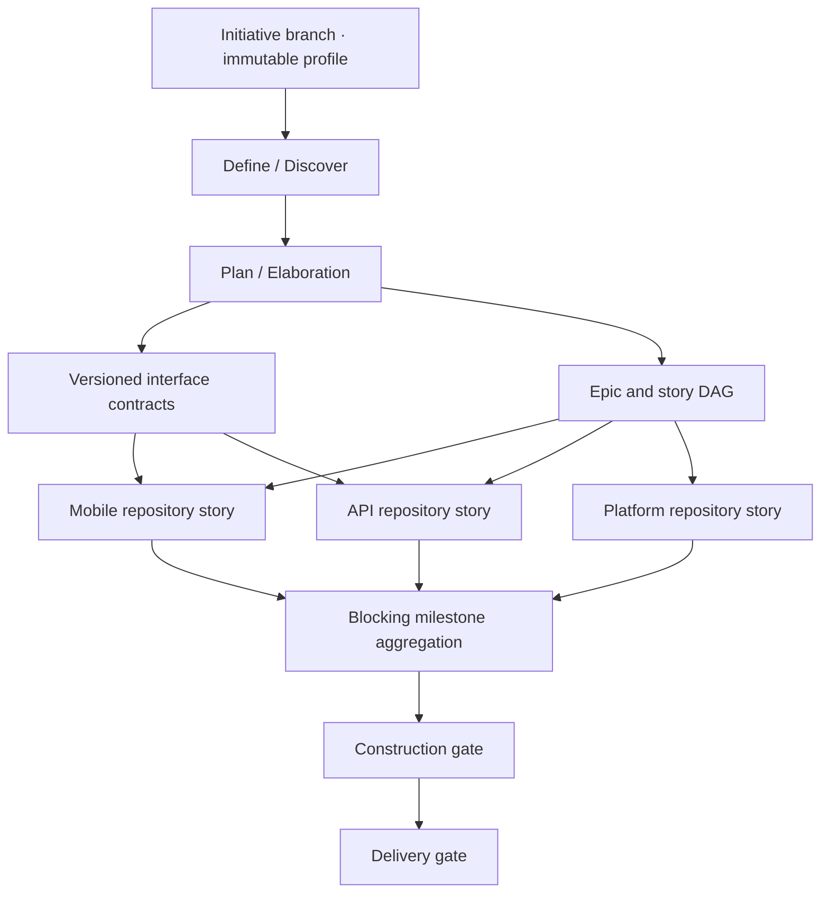
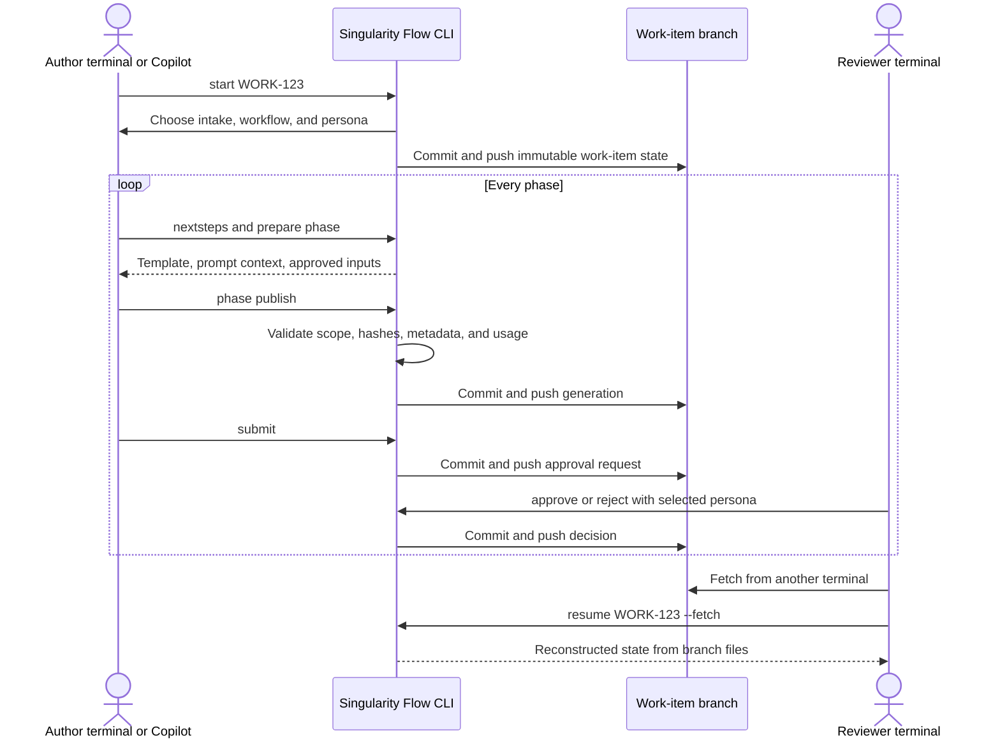
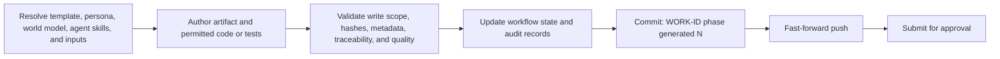
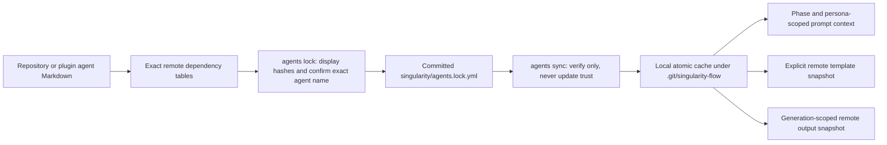

# Singularity Flow 0.8.0 — Visual How-To Guide

This guide shows how Singularity Flow turns a Jira story or manual request into approved, Git-transferable artifacts, implementation evidence, and a final specification-to-code comparison.

## The system at a glance



The core rule is simple: AI helps create content, while the CLI owns workflow state, metadata, validation, commits, pushes, approvals, and recovery.

## Initiative-to-story orchestration

For delivery spanning multiple repositories, an opt-in lead-repository initiative sits above the unchanged story workflow:



Run `/sflow-initiative-start <INIT-ID>` in GitHub Copilot, then use `/sflow-initiative-next` for deterministic guidance. Before repository changes, `/sflow-initiative-materialize` shows the full dry-run and requires exact initiative-ID confirmation. Flow Studio’s **Initiatives** workspace displays the four- or seven-phase flow, three discipline lanes, evidence assurance/freshness, repository stories, contracts, time, models, tokens, and cost.

The complete guide is [INITIATIVE-ORCHESTRATION.md](INITIATIVE-ORCHESTRATION.md).

## Lifecycle and Git state transfer



No workflow database is required. The branch contains the transferable state; `.git/singularity-flow/session.json` contains only the current terminal's persona and optional active agent.

## 1. Install from a clone

The single supported local installer pulls, builds, tests, packages, globally installs, removes old Copilot plugin copies, and installs the current marketplace plugin:

```bash
git clone https://github.com/ashokraj2011/singularityflow.git
cd singularityflow
./install.sh
```

For a company registry or Artifactory:

```bash
./install.sh \
  --registry https://artifacts.company.com/artifactory/api/npm/npm-virtual/
```

Keep credentials in `.npmrc`; never put credentials in the registry URL. Verify installation:

```bash
singularity-flow --version
copilot plugin list
copilot skill list
```

Expected version: `0.8.0`. Start a new Copilot session after plugin installation so the refreshed skills and bundled agent are discovered.

## 2. Initialize an application repository

Run this inside the repository where the team will do the actual feature or bugfix work:

```bash
cd your-application-repository
singularity-flow init
git add singularity
git commit -m "Initialize Singularity Flow"
git push
```

Initialization creates editable workflow YAML, artifact templates, persona prompts, and the repository world-model builder prompt.

```text
singularity/
├── workflow.yml
├── personas/
├── prompts/
└── templates/
```

Review `singularity/workflow.yml` before starting production work, especially `git.remote`, `git.publish`, work-type phases, personas, approvals, and protected paths.

## 3. Start a work item

From Copilot:

```text
/sflow-start WORK-123
```

Or from a terminal:

```bash
singularity-flow start WORK-123
```

The interactive sequence is always:

1. Choose Jira intake or manual description/documents.
2. Choose a workflow profile: feature, bugfix, chore, or Figma export to mobile app.
3. Choose a persona for the current terminal.

When Copilot can ask questions but its shell cannot accept later stdin, `/sflow-start` uses an equivalent one-time receipt instead of sending you to another terminal:

```bash
singularity-flow choices begin start WORK-123 --json
singularity-flow choices answer <TOKEN> intake-source manual --json
singularity-flow choices answer <TOKEN> workflow-template feature --json
singularity-flow choices answer <TOKEN> persona developer --json
singularity-flow start WORK-123 --story-file /absolute/story.yml \
  --selection-receipt <TOKEN>
```

Copilot must obtain each value from the contributor through its selectable question UI. Receipts expire after 15 minutes, are bound to the repository HEAD and work item, and are consumed once.

Manual intake can also be supplied explicitly:

```bash
singularity-flow start WORK-123 \
  --title "Add invoice export" \
  --description "Finance needs a filtered invoice export." \
  --acceptance-criteria "Authorized users can export the filtered result." \
  --document ./brief.pdf \
  --document-url https://www.figma.com/design/example
```

The selected work type, resolved phases, input mode, configuration hash, and template hashes are copied into the work item. Later base-branch configuration edits cannot silently change it.

### Figma export to mobile app

Choose the `figma-mobile` profile when the design team supplies a directory export instead of a live integration. Start the work item, select the Product designer persona, and import the complete package during `design-intake`:

```bash
singularity-flow documents upload ./figma-export --kind figma-export
```

Directories are traversed recursively in deterministic relative-path order. Every regular file receives a stable document ID and hash, retains its package-relative source path, and is committed and pushed in the same upload transaction. Symbolic links are rejected. The workflow then advances through design inventory, mobile component mapping, mobile specification, implementation, visual verification, and two-person final conformance approval.

## 4. Ask what to do next

At any time:

```text
/sflow-nextsteps WORK-123
```

```bash
singularity-flow nextsteps WORK-123
```

The result labels actions as:

- `NOW`: safe current action.
- `THEN`: action after the current transition succeeds.
- `ALTERNATIVE`: valid rejection or recovery path.

It also reports pending publication, enforced input work, stale agent locks, required agent synchronization, and remote-output conflicts.

To execute the single next valid action instead of only viewing it:

```text
/sflow-next
```

```bash
sflow-next --task "Current objective"
```

Run it again only when you deliberately want the following lifecycle action.
It does not silently combine generation, submission, and approval.

## 5. Generate and publish a phase

The normal Copilot command is:

```text
/sflow-phase
```

The equivalent terminal loop is:

```bash
singularity-flow prepare <phase>
# Complete the returned artifact and any permitted source/test changes.
singularity-flow phase publish <phase>
singularity-flow submit --phase <phase>
```

Publishing performs the following transaction:



Artifacts are stored under:

```text
singularity/work-items/<WORK-ID>/artifacts/<phase>/
```

Do not manually edit `workflow.json`, `STATUS.md`, approval records, or the managed metadata comment.

## 6. Use approved phase inputs

The workflow controls whether approved upstream artifacts enter later phases:

```yaml
inputsMode: record  # off | record | enforce

phases:
  design:
    inputs:
      - requirements
      - phase: intake
        optional: true
        maxBytes: 16384
```

Behavior by mode:

| Mode | Missing required input | Tampered present input | Runtime behavior |
|---|---|---|---|
| `off` | Ignored | Ignored | Declarations validate; no injection or record |
| `record` | Warning | Warning | Inject available approved content and record provenance |
| `enforce` | Error | Error | Block generation until the problem is resolved |

Preview without writing:

```bash
singularity-flow inputs design --dry-run
```

Render the managed input block and audit record:

```text
/sflow-inputs design
```

```bash
singularity-flow inputs design
```

Publication recollects and verifies the producer artifact, so changing the rendered block cannot bypass enforcement.

## 7. Use optional remote agent Markdown

Repository world models stay generated and stored in the application repository. Remote delivery is only for optional agent skills, artifact templates, and generated artifacts represented as public HTTPS Markdown.



Only links inside these exact tables are processed; normal prose links are inert:

```markdown
## Remote skills

| ID | URL | Phases | Personas | Optional | Max bytes |
|---|---|---|---|---|---|
| security-review | https://example.com/security.md | design, verification | architect | false | 65536 |

## Remote artifact templates

| ID | URL | Phases | Optional | Max bytes |
|---|---|---|---|---|
| design-template | https://example.com/design.md | design | false | 65536 |

## Remote generated artifacts

| ID | URL template | Phase | Target | Optional | Max bytes |
|---|---|---|---|---|---|
| threat-model | https://example.com/{workId}/{generation}.md | design | artifacts/design/threat-model.md | false | 65536 |
```

Trust and activate the agent:

```bash
singularity-flow agents list
singularity-flow agents lock architecture
singularity-flow agents sync architecture
singularity-flow agents status architecture
```

Rules:

- First trust and every update require typing the exact agent name.
- Sync never changes lock hashes.
- Remote skills do not become slash commands.
- A remote template replaces a workflow template only through an explicit reference such as `agent:architecture/design-template`.
- Generated output must stay under the configured phase artifact directory.
- Locally edited output is never overwritten automatically.

To deliberately fetch a changed generated result:

```bash
singularity-flow agents refresh-output threat-model
# Add --replace only after deciding to discard local edits.
```

## 8. Approve or reject

Approve from another terminal:

```bash
singularity-flow approve WORK-123 --fetch
```

The command fetches the branch, asks for a persona, shows hashes/checks/usage/prior approvals, warns about self-approval, and requires typing the exact phase name.

In Copilot, `/sflow-approve` performs the same review without sending you to another terminal. If its shell has no persistent stdin, it fetches the branch with `choices begin approve`, asks you for an approval-capable persona, requires you to type the exact phase ID, and invokes `approve` with a 15-minute one-time receipt. The receipt is pinned to the branch HEAD, submitted generation, and artifact hashes; it is consumed once and the decision is still committed and pushed atomically.

Reject to an allowed earlier phase:

```bash
singularity-flow reject WORK-123 --fetch \
  --to requirements \
  --reason "Failure behavior is missing"
```

Approval authority comes from the selected persona. Accountability comes from the authenticated GitHub/Git identity. Multi-approval thresholds require distinct authenticated identities.

## 9. Resume from another terminal

```bash
git clone <application-repository-url>
cd <application-repository>
singularity-flow resume WORK-123 --fetch
```

Resume performs fetch plus fast-forward-only checkout and asks for a persona. It reconstructs the work item from committed branch state.

If a push previously failed:

```bash
singularity-flow sync
```

The existing local commit is retried; history is not rebased or rewritten.

## 10. Finish with verification and conformance

The final conformance artifact compares approved `AC-n` and `SPEC-nnn` identifiers with exact source and test evidence. Verdicts are `matched`, `partial`, `missing`, `deviated`, or `unplanned`.

```bash
singularity-flow progress WORK-123
singularity-flow report WORK-123
singularity-flow gate --terminal
```

The terminal gate verifies all phases, publication, artifact and approval hashes, input/agent provenance, traceability, conformance freshness, and remote branch state.

## Command map

| Goal | Copilot | Terminal |
|---|---|---|
| About the product | `/sflow-about` | `sflow-about` |
| Open cockpit | `/sflow-home` | `singularity-flow cockpit` |
| Diagnose setup | `/sflow-doctor` | `singularity-flow doctor` |
| Guided phase execution | `/sflow-run` | `singularity-flow run` |
| Simulate a workflow | `/sflow-workflows simulate figma-mobile` | `singularity-flow workflow simulate figma-mobile` |
| Build a reviewer handoff | `/sflow-review` | `singularity-flow review <phase>` |
| Assign coordination | — | `singularity-flow assign <phase> <assignee>` |
| Watch branch state | — | `singularity-flow watch <WORK-ID> --once` |
| Plan safe recovery | — | `singularity-flow recover <WORK-ID> --fetch` |
| Start work | `/sflow-start WORK-123` | `singularity-flow start WORK-123` |
| Resume work | `/sflow-resume WORK-123` | `singularity-flow resume WORK-123 --fetch` |
| Change session persona | `/sflow-persona` | `sflow-persona` |
| Select and synchronize session work | `/sflow-session` | `singularity-flow session candidates` then `singularity-flow session attach <ID>` |
| Inspect Copilot session readiness | `/sflow-session` | `singularity-flow session status` |
| Review the team approval queue | `/sflow-inbox` | `singularity-flow inbox` |
| Get next actions | `/sflow-nextsteps` | `singularity-flow nextsteps` |
| Execute next action | `/sflow-next` | `sflow-next` |
| Generate current phase | `/sflow-phase` | `singularity-flow prepare <phase>` |
| Inspect phase inputs | `/sflow-inputs <phase>` | `singularity-flow inputs <phase> --dry-run` |
| Publish generation | `/sflow-phase` | `singularity-flow phase publish <phase>` |
| Submit | `/sflow-submit` | `singularity-flow submit` |
| Review generated documents | `/sflow-submit` or `/sflow-approve` | `singularity-flow phase show <phase>` |
| Browse all documents | `/documents` (experimental canvas) | `singularity-flow documents list` |
| Approve | `/sflow-approve` | `singularity-flow approve WORK-123 --fetch` |
| Reject | `/sflow-reject` | `singularity-flow reject WORK-123 --fetch --to <phase> --reason <reason>` |
| Check completion | `/sflow-progress` | `singularity-flow progress WORK-123` |
| View performance | `/sflow-report` | `singularity-flow report WORK-123` |
| Read full help | `/sflow-help` | `singularity-flow help` |

## Operational checklist

Before starting:

- The application repository has committed `singularity/` configuration.
- Git identity and the configured remote work.
- The Copilot plugin was reinstalled and the Copilot session restarted.
- The intended workflow profile and persona policies were reviewed.

Before approval:

- The generation commit is present on the remote work-item branch.
- Required quality checks passed.
- Input and remote-agent provenance warnings were reviewed.
- The reviewer selected an approval-capable persona.
- Any self-approval is understood to be non-independent review.

Before completion:

- Every phase is approved.
- Verification maps acceptance criteria to tests and source evidence.
- Conformance covers every `AC-n` and `SPEC-nnn`.
- `singularity-flow gate --terminal` passes.

## Where to get help

```bash
singularity-flow help
singularity-flow help approved-phase-inputs
singularity-flow help remote-agent-markdown
singularity-flow guide WORK-123
singularity-flow nextsteps WORK-123
```

The same manual is available through `/sflow-help` and the desktop **Help** page.
