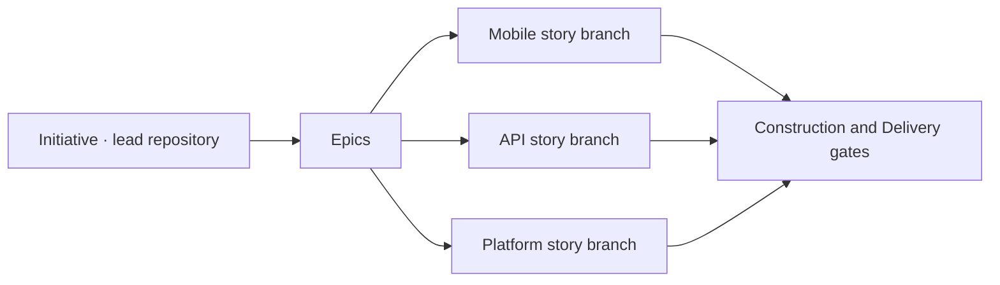

# Initiative orchestration

Singularity Flow can govern a delivery initiative above the existing repository story workflow. The initiative lives in a lead repository on a branch named exactly after the initiative ID. It decomposes into Epics and repository-specific stories, then aggregates approved story milestones back into Construction and Delivery gates.



This feature is opt-in. Repositories without `singularity/portfolio.yml` do no initiative processing and make no additional network calls. Existing `singularity/work-items` behavior is unchanged.

## Configure the portfolio

`singularity-flow init` installs an editable `singularity/portfolio.yml` with:

- `initiative-lite`: Define → Plan → Build → Release.
- `enterprise-delivery`: Discover & Define → Design & Iterate → Pre-Inception → Inception → Elaboration → Construction → Delivery.
- A repository registry and local Git identity authority groups.
- Phase-specific outputs, inputs, checklists, evidence assurance, freshness, approval rules, and gates.

Add stable repository aliases and authority members before starting:

```yaml
repositories:
  mobile:
    url: git@github.com:example/mobile.git
    defaultBranch: main
    required: true
  api:
    url: git@github.com:example/api.git
    defaultBranch: main
    required: true

approvalAuthorities:
  product-approvers:
    members:
      - name: Product Owner
        email: product.owner@example.com
  architecture-reviewers:
    members:
      - name: Lead Architect
        email: architect@example.com
```

Approval authority is separate from personas. Personas affect GitHub Copilot prompt composition; initiative authorization matches the normalized local `git user.email`. Reports label this `configured-local` because local Git identity is configurable and is not cryptographic authentication.

Use Flow Studio’s **Initiatives → Portfolio designer** to inspect profiles, repositories, authorities, and edit validated portfolio YAML.

## Start from GitHub Copilot

Install the plugin, open Copilot in the lead repository, and run:

```text
/sflow-initiative-start INIT-2026-001
```

Copilot displays selectable profile and persona options. A one-time selection receipt keeps this flow inside Copilot even when its shell does not provide persistent terminal input. There are no public profile/persona bypass flags.

The start operation checks the ID and authority groups, creates the exact initiative branch, snapshots all governed configuration and templates, creates `singularity/initiatives/<INIT-ID>/`, then commits and pushes initial state. The selected persona remains local in `.git/singularity-flow/session.json`; it is recorded with the next mutation but never treated as approval authority.

### Why the default branch is used

Starting an initiative does **not** merge anything into `main`. When the initiative branch does not yet exist, Singularity Flow creates it from the lead repository's configured default branch so it inherits the current source baseline and committed `singularity/` configuration. All initiative artifacts, evidence, approvals, and state then remain on the initiative branch.

Story materialization follows the same rule in every participating repository: each story branch starts from that repository's configured `defaultBranch`. It does not merge the initiative branch into the repository default branch, and completing a workflow does not merge code automatically. Teams continue to use their normal pull-request, release, and branch-protection process for any eventual merge.

## Author and approve a phase

```text
/sflow-initiative-next
/sflow-initiative-phase
/sflow-initiative-documents
/sflow-initiative-checklist
/sflow-initiative-evidence
/sflow-initiative-approve
```

Equivalent terminal commands:

```bash
singularity-flow initiative phase
singularity-flow initiative context
singularity-flow initiative documents
singularity-flow initiative checklist
singularity-flow initiative evidence add business-case-approved \
  --assurance human-approved \
  --path ./approved-business-case.md
singularity-flow initiative phase publish
singularity-flow initiative approve business-case
singularity-flow initiative approve phase
```

Phase preparation records a complete Copilot prompt under `context/prompts/` plus a hash audit under `context/prompt-context-<phase>-gen<N>.json`. Prompt composition is deterministic:

```text
phase contract
+ selected persona prompt
+ required repository world-model views
+ active-agent remote skill Markdown
+ approved upstream initiative artifacts
```

The world model remains repository-owned. Initiative profile views are validated against `singularity/workflow.yml`, and each generation records the exact world-model commit and file hashes. With `worldModel.grounding: enforce`, a missing, stale, uncommitted, or changed model blocks generation/publication. Build it using the exact `singularity-flow wm build --views ... --focus ...` command shown by the CLI.

Every prepare, publication, evidence record, approval, rejection, materialization, synchronization, and lifecycle transition creates a commit and pushes it. A failed push retains the local commit, records pending publication, and blocks later mutations until `singularity-flow initiative sync` succeeds.

Approvals bind to exact output or phase-bundle hashes. The bundle includes sorted output hashes, checklist evidence, contracts, child-story snapshots, and invalidation records. Multi-approval thresholds count distinct normalized Git emails. Self-approval may be valid when allowed, but it is visibly marked and never reported as independent review.

## Evidence assurance and freshness

Checklist evidence is append-only canonical JSON with a content-addressed filename:

```text
singularity/initiatives/<INIT-ID>/evidence/records/<sha256>.json
```

| Assurance | Meaning |
|---|---|
| `machine-verified` | Deterministically derived from Git, tests, CI, scanners, or hashes |
| `system-verified` | Observed through a configured external system |
| `human-approved` | Exact evidence hash accepted by an authorized local Git identity |
| `presence-only` | A file or link exists; it proves no semantic review |

Must items do not accept `presence-only` unless the profile explicitly allows it. Freshness rules can expire evidence or require reverification at later phases. Conditional checks require qualifying evidence or an approved `not_applicable`/`waived` decision.

Uploaded file evidence is copied into the initiative branch and hashed so another terminal can reconstruct it. Status/report operations are read-only and report stale observations without silently refreshing them.

## Break down and materialize repository stories

Edit committed `breakdown.yml` after the planning or elaboration phase. See `examples/initiative-breakdown.yml`.

```yaml
version: 1
initiativeId: INIT-2026-001
epics:
  - id: EPIC-001
    stories:
      - id: API-201
        repository: api
        blocking: true
        suggestedWorkType: feature
      - id: MOB-101
        repository: mobile
        blocking: true
        suggestedWorkType: figma-mobile
        dependsOn:
          - story: API-201
            requiredPhase: implementation-spec
        consumesContracts:
          - id: customer-api
            version: 2
```

Review before mutation:

```bash
singularity-flow initiative breakdown --probe
singularity-flow initiative materialize --dry-run
```

Materialization requires the exact initiative ID. It safely creates or attaches one branch per story, commits `singularity/seeds/<STORY-ID>.yml`, pushes it, and records repository/branch/commit receipts in a resumable journal. It never force-pushes or overwrites an unrelated branch.

When Jira write configuration exists, deterministic labels make Epic/story creation retryable. Without Jira writes, committed Git records remain the source of truth. A story contributor still selects a work type and persona; its seed recommends values and supplies approved inputs/contracts without bypassing selection.

## Version interface contracts

Register OpenAPI, AsyncAPI, JSON Schema, protobuf, or Markdown contracts:

```bash
singularity-flow initiative contracts add \
  --id customer-api \
  --version 2 \
  --format openapi \
  --path ./openapi/customer-api-v2.yml \
  --producer API-201 \
  --consumer MOB-101
```

Contracts are copied into `contracts/<id>/<version>/`, hashed, and mapped to producers/consumers. Existing versions are immutable. A new version invalidates only its downstream consumer cone and marks child context stale until synchronization/regeneration.

## Synchronize and report

```bash
singularity-flow initiative sync
singularity-flow initiative status
singularity-flow initiative report
singularity-flow initiative gate
```

Synchronization reads each story branch’s committed state and aggregates implementation-spec, verification, and conformance milestones. Construction and Delivery use an all-blocking policy by default. Nonblocking stories remain visible without preventing the gate.

Reports show phase progress/duration, evidence assurance/freshness, invalidations, local identity assurance, self-approval, story milestones, contracts, and captured Copilot models/tokens/provider cost. Unavailable values remain unavailable; Singularity Flow never guesses them.

## Flow Studio

Open the Electron app with `npm run desktop:dev`, choose the lead repository, and open **Initiatives**. It provides four- or seven-phase flow, three delivery lanes, checklist assurance/freshness, next actions, story milestones, contract routing, governed documents, duration, and Copilot usage/cost. Its Portfolio designer edits validated YAML.

Initiative state, evidence, approvals, contracts, and repository world-model files are read-only in the designer. Runtime mutations continue through the CLI or GitHub Copilot skills so they retain exact confirmations and atomic commit/push behavior.

## Durable branch layout

```text
singularity/initiatives/<INIT-ID>/
├── state.json
├── definition.yml
├── breakdown.yml
├── repositories.lock.yml
├── artifacts/<phase>/
├── context/
├── contracts/<contract-id>/<version>/
├── evidence/files/
├── evidence/records/<sha256>.json
├── approvals/records/<sha256>.json
├── invalidations/records/<sha256>.json
├── telemetry/
└── STATUS.md
```

Git is the handoff protocol. A fresh terminal fetches and fast-forwards initiative/story branches; no separate web service or mutable database is required.
