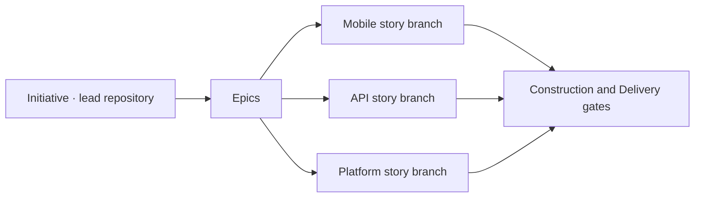

# Initiative orchestration

Singularity Flow can govern a delivery initiative above the existing repository story workflow. The initiative lives in a lead repository on a branch named exactly after the initiative ID. It decomposes into Epics and repository-specific stories, then aggregates approved story milestones back into Construction and Delivery gates.


```mermaid
flowchart LR
  I["Initiative · lead repository"] --> E["Epics"]
  E --> M["Mobile story branch"]
  E --> A["API story branch"]
  E --> P["Platform story branch"]
  M --> G["Construction and Delivery gates"]
  A --> G
  P --> G
```

This feature is opt-in. Repositories without `singularity/portfolio.yml` do no initiative processing and make no additional network calls. Existing `singularity/work-items` behavior is unchanged.

In the Electron app, a missing portfolio file is configurable in place: open **Initiatives** or **Jira workspace**, supply the initial approval identity, optional first repository, and optional Jira policy, then select **Create & validate portfolio**. The app copies the complete editable starter profiles into `singularity/portfolio.yml`; it stores no Jira token and does not commit automatically. Review it in Portfolio designer and use **Commit & push** when it is ready to become shared repository policy.

## Configure the portfolio

`singularity-flow init` installs an editable `singularity/portfolio.yml` with:

- `initiative-lite`: Define → Plan → Build → Release.
- `enterprise-delivery`: Discover & Define → Design & Iterate → Pre-Inception → Inception → Elaboration → Construction → Delivery.
- A repository registry and local Git identity authority groups.
- Phase-specific outputs, inputs, checklists, evidence assurance, freshness, approval rules, and gates.

Add stable repository aliases and authority members before starting:

```yaml
repositories:
  mobile:
    url: git@github.com:example/mobile.git
    defaultBranch: main
    required: true
  api:
    url: git@github.com:example/api.git
    defaultBranch: main
    required: true

approvalAuthorities:
  product-approvers:
    members:
      - name: Product Owner
        email: product.owner@example.com
  architecture-reviewers:
    members:
      - name: Lead Architect
        email: architect@example.com
```

Approval authority is separate from personas. Personas affect GitHub Copilot prompt composition; initiative authorization matches the normalized local `git user.email`. Reports label this `configured-local` because local Git identity is configurable and is not cryptographic authentication.

Use Flow Studio’s **Initiatives → Portfolio designer** to inspect profiles, repositories, authorities, and edit validated portfolio YAML.

## Start from GitHub Copilot

Install the plugin, open Copilot in the lead repository, and run:

```text
/sflow-initiative-start INIT-2026-001
```

Copilot displays selectable profile and persona options. A one-time selection receipt keeps this flow inside Copilot even when its shell does not provide persistent terminal input. There are no public profile/persona bypass flags.

The start operation checks the ID and authority groups, creates the exact initiative branch, snapshots all governed configuration and templates, creates `singularity/initiatives/<INIT-ID>/`, then commits and pushes initial state. The selected persona remains local in `.git/singularity-flow/session.json`; it is recorded with the next mutation but never treated as approval authority.

### The world model at start

Impact analysis is only as good as the repository world model it reads. After the initiative branch is created and its scaffold committed, Singularity Flow checks whether that model is missing, uncommitted, or stale for the current source tree, and reports the reason rather than blocking the start. Flow Studio then offers to build it:

```bash
singularity-flow wm build --local     # commit to this branch without pushing
```

Building on the initiative branch means the model is committed there and pushed with that branch, instead of landing on the default branch. Skipping is allowed; the model can be built later from the **World model** page or the CLI.

### Which branch a story starts from

Starting an initiative does **not** merge anything into `main`. When the initiative branch does not yet exist, Singularity Flow creates it from the lead repository's configured default branch so it inherits the current source baseline and committed `singularity/` configuration. All initiative artifacts, evidence, approvals, and state then remain on the initiative branch.

Story materialization then picks the base branch per repository:

| Story's repository | Base branch | Pull request target |
|---|---|---|
| The initiative's own (lead) repository | `origin/<INIT-ID>` — the initiative branch | the initiative branch |
| Any other participating repository | `origin/<defaultBranch>` — unchanged | that repository's default branch |

A story in the lead repository descends from the initiative branch because that is the only branch carrying the approved epic artifacts. Its seed records `approvedArtifacts[]` as paths under `singularity/initiatives/<INIT-ID>/artifacts/`; based on the default branch those paths would not exist, so the approved specification would be neither readable nor hash-verifiable from the story. Basing on the initiative branch also gives every story in that repository a shared ancestor, so conflicts surface during the epic's own integration rather than at N separate pull requests.

An initiative branch is **never fabricated** in a repository that does not already have one. In other repositories it would be an empty branch identical to `main`, forcing a two-stage pull request and drifting from CI that is configured for the default branch. Those repositories keep the existing rule unchanged.

The seed records the decision so a fresh clone reproduces it: `story.parentBranch` and `story.baseCommit`. `singularity-flow start <STORY-ID>` prefers `parentBranch` over the configured default base branch, and an explicit `--base` still wins.

Materialization does not merge the initiative branch into any default branch, and completing a workflow does not merge code automatically. Teams continue to use their normal pull-request, release, and branch-protection process.

## Author and approve a phase

```text
/sflow-initiative-next
/sflow-initiative-phase
/sflow-initiative-documents
/sflow-initiative-checklist
/sflow-initiative-evidence
/sflow-initiative-approve
```

Equivalent terminal commands:

```bash
singularity-flow initiative phase
singularity-flow initiative context
singularity-flow initiative documents
singularity-flow initiative checklist
singularity-flow initiative evidence add business-case-approved \
  --assurance human-approved \
  --path ./approved-business-case.md
singularity-flow initiative phase publish
singularity-flow initiative approve business-case
singularity-flow initiative approve phase
```

Phase preparation records a complete Copilot prompt under `context/prompts/` plus a hash audit under `context/prompt-context-<phase>-gen<N>.json`. Prompt composition is deterministic:

```text
phase contract
+ selected persona prompt
+ required repository world-model views
+ active-agent remote skill Markdown
+ approved upstream initiative artifacts
```

The world model remains repository-owned. Initiative profile views are validated against `singularity/workflow.yml`, and each generation records the exact world-model commit and file hashes. With `worldModel.grounding: enforce`, a missing, stale, uncommitted, or changed model blocks generation/publication. Build it using the exact `singularity-flow wm build --views ... --focus ...` command shown by the CLI.

Every prepare, publication, evidence record, approval, rejection, materialization, synchronization, and lifecycle transition creates a commit and pushes it. A failed push retains the local commit, records pending publication, and blocks later mutations until `singularity-flow initiative sync` succeeds.

Approvals bind to exact output or phase-bundle hashes, and the gate rechecks the
exact current bundle before treating an approved phase as valid. The bundle
includes sorted output hashes, checklist evidence, relevant contracts,
phase-specific blocking-story milestones, and invalidation records. Build and
Construction pin `verification`; Release and Delivery pin `conformance`.
Later child progress does not churn an earlier milestone bundle, while a
regression or stale contract changes the hash and requires fresh approval.
Multi-approval thresholds count distinct normalized Git emails. Self-approval
may be valid when allowed, but it is visibly marked and never reported as
independent review.

## Evidence assurance and freshness

Checklist evidence is append-only canonical JSON with a content-addressed filename:

```text
singularity/initiatives/<INIT-ID>/evidence/records/<sha256>.json
```

| Assurance | Meaning |
|---|---|
| `machine-verified` | Deterministically derived from Git, tests, CI, scanners, or hashes |
| `system-verified` | Observed through a configured external system |
| `human-approved` | Exact evidence hash accepted by an authorized local Git identity |
| `presence-only` | A file or link exists; it proves no semantic review |

Must items do not accept `presence-only` unless the profile explicitly allows it. Freshness rules can expire evidence or require reverification at later phases. Conditional checks require qualifying evidence or an approved `not_applicable`/`waived` decision.

Uploaded file evidence is copied into the initiative branch and hashed so another terminal can reconstruct it. Status/report operations are read-only and report stale observations without silently refreshing them.

## Break down and materialize repository stories

Edit committed `breakdown.yml` after the planning or elaboration phase. See `examples/initiative-breakdown.yml`.

```yaml
version: 1
initiativeId: INIT-2026-001
epics:
  - id: EPIC-001
    title: Customer experience
    description: Deliver the approved cross-channel customer outcome.
    acceptanceCriteria:
      - Every blocking story is conformant before delivery
    stories:
      - id: API-201
        title: Publish customer API
        description: Provide the contract required by the mobile experience.
        repository: api
        blocking: true
        suggestedWorkType: feature
        acceptanceCriteria:
          - Contract tests pass for the approved customer-api version
      - id: MOB-101
        repository: mobile
        blocking: true
        suggestedWorkType: figma-mobile
        dependsOn:
          - story: API-201
            requiredPhase: implementation-spec
        consumesContracts:
          - id: customer-api
            version: 2
```

Review before mutation:

```bash
singularity-flow initiative breakdown --probe
singularity-flow initiative materialize --dry-run
```

Materialization requires the exact initiative ID. It safely creates or attaches one branch per story, commits `singularity/seeds/<STORY-ID>.yml`, pushes it, and records repository/branch/commit receipts in a resumable journal. It never force-pushes or overwrites an unrelated branch.

The identifiers have distinct jobs:

- Epic ID: stable planning identity in the lead initiative, such as `EPIC-001`.
- Story Work ID: stable child identity, Git branch, seed filename, and later Singularity work-item ID, such as `MOB-101`.
- Jira ID: external `jiraKey` returned by Jira, such as `MOB-4821`. It is recorded separately and is never invented by Copilot.

The Jira connector can adopt an existing hierarchy or create a reviewed outbound plan. In **Jira workspace**, connect with an API token/PAT stored through the operating-system keychain, browse Project → Epic → child stories, map each child to a configured repository, select an existing initiative, preview, and adopt. Adoption commits a hash-pinned Jira source snapshot and preserves the separate IDs above.

Enable and constrain the connector in `singularity/portfolio.yml` before starting the initiative; the resolved policy is immutable for that initiative:

```yaml
jira:
  enabled: true
  connection: corporate-jira
  deployment: cloud
  allowedHosts: [company.atlassian.net]
  allowedProjects: [PORT]
  authentication:
    permitted: [user-token, service-account]
  read:
    epics: true
    stories: true
    attachmentPolicy: metadata-only
    cacheMinutes: 10
  writeMode: approved
  writeOperations: [create-epic, create-story, update-owned-fields]
  allowedFields: [summary, description, parent, labels, components]
  projectKey: PORT
  epicIssueType: Epic
  storyIssueType: Story
```

Use `writeMode: off` for read-only operation, `preview` to create committed plans without applying them, or `approved` to permit the guarded apply path. Status, assignee, sprint, priority, and resolution cannot be added to `allowedFields`.

CLI users provide `JIRA_BASE_URL`, `JIRA_EMAIL`, and `JIRA_API_TOKEN` for Cloud. Data Center users set `JIRA_DEPLOYMENT=data-center` and `JIRA_PAT`. Credentials are never written to Git.

```bash
singularity-flow initiative jira-adopt APP-100 \
  --repository APP-101=api \
  --repository APP-102=mobile \
  --dry-run
singularity-flow initiative jira-adopt APP-100 \
  --repository APP-101=api \
  --repository APP-102=mobile

singularity-flow initiative jira-plan
singularity-flow initiative jira-apply --plan <exact-sha256>
```

The write plan is committed and pushed before application. Apply requires an approved Plan/Elaboration phase, exact plan hash, exact initiative-ID confirmation, effective Jira create/edit permission, and unchanged source issue timestamps. Each completed operation receives a committed receipt. The earlier `jira.write: true` materializer remains compatible for existing configurations, but new profiles should use the reviewed plan path.

## Ground the impact map

The planning phase produces a repository map naming the repositories an initiative touches and the world-model views that justify each one:

```yaml
repositories:
  api:
    worldModelViews: [architecture, development]
  mobile:
    worldModelViews: [architecture]
```

Publishing that phase validates the map against committed state: every named repository must exist in `portfolio.repositories`, and every referenced view must exist in the committed world-model manifest. This is what stops an impact analysis from naming a repository that is not configured, or citing a view that was never built.

The `impact-grounded` checklist item carries the result. Under `grounding: enforce` an unresolvable reference blocks publication; otherwise it warns. With no world model committed the view half cannot be checked, so it warns rather than failing closed on absent evidence.

## Merge stories in dependency order

The merge order is not new state — it is derived from the `dependsOn` graph already committed in `breakdown.yml`, which `initiative breakdown --probe` has already proven acyclic. Ask for the current sequence at any time:

```bash
singularity-flow epic merge-plan [--epic INIT-ID] [--json]
```

```text
Merge sequence for INIT-2026-001 into INIT-2026-001

#  STORY   REPOSITORY  BLOCKING  STATUS
1  API-201 api         yes       merged
2  MOB-101 mobile      yes       ready
3  WEB-301 web         no        blocked by MOB-101

Next to merge: MOB-101 → INIT-2026-001
INIT-2026-001 is not ready: MOB-101, WEB-301 still outstanding.
After each merge, sync the remaining story branches from the epic branch before continuing.
```

Each story reports one status:

- `merged` — its branch is already an ancestor of the initiative branch.
- `ready` — every dependency has merged; it may open or land its pull request.
- `blocked` — a dependency has not merged yet, and the blockers are named.
- `in-progress` — its own workflow has not reached conformance.

The command reads Git; it does not mutate anything. Stories whose dependencies can never be satisfied are listed as `Unreachable` rather than silently dropped.

The initiative branch lands on the default branch only when every **blocking** story shows `merged`. Non-blocking stories are reported but do not gate. After each merge the remaining story branches are behind the initiative branch, so sync them from it before continuing — that is the standard integration-branch cost of landing the epic atomically.

## Open story pull requests

```bash
singularity-flow pr [WORK-ID] [--json]           # preview, the default
singularity-flow pr [WORK-ID] --create           # open it, after typed confirmation
```

The pull request targets `story.parentBranch` from the seed, so a lead-repository story targets the initiative branch and a story elsewhere targets that repository's default branch. The body is assembled entirely from committed governed state — epic and story identity, the branch it was cut from, acceptance criteria, every approved epic artifact with the exact hash it was approved at, required checks, and the story's position in the merge sequence. Nothing in it is invented.

Opening a pull request is an outward action, so preview is the default and `--create` additionally requires typing the exact work ID. A story whose dependencies have not merged is refused, naming the blockers. An existing pull request for the same head and base is reported instead of opening a duplicate. The repository's `branchCompletionPolicy` is honoured: `direct` repositories do not use pull requests at all. When the GitHub CLI is unavailable the generated body is printed for manual use rather than failing.

## Version interface contracts

Register OpenAPI, AsyncAPI, JSON Schema, protobuf, or Markdown contracts:

```bash
singularity-flow initiative contracts add \
  --id customer-api \
  --version 2 \
  --format openapi \
  --path ./openapi/customer-api-v2.yml \
  --producer API-201 \
  --consumer MOB-101
```

Contracts are copied into `contracts/<id>/<version>/`, hashed, and mapped to producers/consumers. Existing versions are immutable. A new version invalidates only its downstream consumer cone and marks child context stale until synchronization/regeneration.

When invalidation reaches an already approved earlier phase, the initiative
automatically rewinds to the earliest affected phase. Later affected phases
return to `not_started`; unrelated approved phases and artifacts remain intact.
Reapproval resumes at the next non-approved phase, so preserved approvals are
not silently discarded.

## Synchronize and report

```bash
singularity-flow initiative sync
singularity-flow initiative status
singularity-flow initiative report
singularity-flow initiative gate
```

Synchronization reads each story branch at the exact fetched commit and
aggregates its current phase, approved phase count, completion percentage,
implementation-spec, verification, and conformance milestones. Malformed,
unsupported, or identity-mismatched child workflow state is isolated to that
story, marked stale and blocked, and reported without aborting synchronization
of the other repositories. Build/Construction require every blocking story to
reach verification; Release/Delivery require conformance. Nonblocking stories
remain visible without preventing the gate.

Reports group every planned story under its epic even before branch materialization, then show Work ID, Jira ID, repository, status, current phase, and percentage progress. They also show phase progress/duration, evidence assurance/freshness, invalidations, local identity assurance, self-approval, contracts, and captured Copilot models/tokens/provider cost. Initiative-level and child-story telemetry are combined; cost is `exact` only when every observed telemetry source has provider cost, otherwise it is `partial` or `unavailable`. Unavailable values remain unavailable; Singularity Flow never guesses them.

## Flow Studio

Open the Electron app with `npm run desktop:dev`, choose the lead repository, and open **Initiatives**. It provides four- or seven-phase flow, three delivery lanes, checklist assurance/freshness, next actions, epic-grouped story progress, Work ID/Jira ID mapping, contract routing, governed documents, duration, and Copilot usage/cost. Its Portfolio designer edits validated YAML. Open **Jira workspace** for secure sign-in, hierarchy browsing, repository mapping, adoption, and reviewed write plans.

After the planning/elaboration phase is approved, **Create Jira & Git stories** previews repositories and story operations, requires the exact Initiative ID, and runs the same resumable materializer as the CLI. **Sync story branches** refreshes the epic dashboard and commits/pushes the aggregate snapshot. Other initiative state, evidence, approvals, contracts, and repository world-model files remain read-only in the designer.

## Durable branch layout

In the lead repository, stories descend from the initiative branch and land through it:

```text
main
└── INIT-2026-001              initiative branch: requirements, story plan, specification
      ├── API-201              story branches, cut from the initiative branch
      ├── MOB-101
      └── WEB-301
```

Story pull requests target `INIT-2026-001`, merging in dependency order. One final pull request `INIT-2026-001 → main` lands the whole initiative once every blocking story has merged. In any other participating repository the story branch is cut from that repository's own default branch and targets it directly.

Initiative state lives under a single durable path:

```text
singularity/initiatives/<INIT-ID>/
├── state.json
├── definition.yml
├── breakdown.yml
├── repositories.lock.yml
├── artifacts/<phase>/
├── context/
├── contracts/<contract-id>/<version>/
├── evidence/files/
├── evidence/records/<sha256>.json
├── approvals/records/<sha256>.json
├── invalidations/records/<sha256>.json
├── telemetry/
└── STATUS.md
```

Git is the handoff protocol. A fresh terminal fetches and fast-forwards initiative/story branches; no separate web service or mutable database is required.
