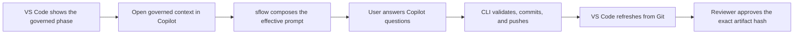

# Native Copilot handoff

Singularity Flow uses the authenticated Copilot surface already available in VS Code or the
terminal. The product does not host a second model session or treat chat history as workflow
state. Native chat is a governed-context handoff, but it is not metered by Singularity Flow.
For qualified metadata-only usage capture, start the launch-owned CLI surface with
`singularity-flow copilot` or VS Code **Continue with Copilot CLI**. Manual `copilot` and
**Open Native Copilot Chat** intentionally remain unmetered.

Run `sflow explain copilot-and-surfaces` for the current boundary between CLI, Copilot, and VS Code. `/sf-home` reads current choices, asks for one explicit selection, follows that guided flow, and refreshes home afterward.

## Operating model



The extension obtains the effective context from:

```bash
sflow wm show-prompt --phase <PHASE>
```

That context combines the phase contract and artifact template, the selected governed agent,
configured prompts/prompt packs, required repository world-model views,
rule-selected repository files, pinned remote Markdown, approved upstream
artifacts, and current evidence. The extension passes the composed text to
native Copilot Chat. The equivalent `/sf-*` and `/sflow-*` skills work in Copilot CLI.

The Node.js CLI remains authoritative. It validates ordering, inputs, templates, approvals, and
Git publication. A Copilot response alone never advances the workflow.

## Evidence and world model

Use `/sf-upload` or `/sflow-upload` to register files, directories, screenshots, exported designs,
or HTTPS references. The command reports the stable ID, hash, provider/path, commit, and push.

World-model generation is a repository operation and can run without an Epic or Story:

```bash
sflow wm build --branch <BRANCH>
sflow wm status
```

The generated manifest and views are committed repository context. VS Code can start the same CLI
operation and display its progress, but it does not own a separate model backend.

Use `/sf-show-prompt` before authoring to see the complete skill and rendered
prompt, including file paths and hashes. See the [glossary](docs/GLOSSARY.md) and
[under-the-hood guide](docs/UNDER-THE-HOOD.md) for the full composition path.
