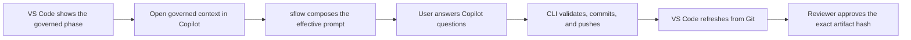

# Native Copilot handoff

Singularity Flow uses the authenticated Copilot surface already available in VS Code or the
terminal. The product does not host a second model session or treat chat history as workflow
state. Native chat is a governed-context handoff, but it is not metered by Singularity Flow.
For qualified metadata-only usage capture, start the launch-owned CLI surface with
`singularity-flow copilot` or VS Code **Continue with Copilot CLI**. Manual `copilot` and
**Open Native Copilot Chat** intentionally remain unmetered.

Run `sflow explain copilot-and-surfaces` for the current boundary between CLI, Copilot, and VS Code. `/sf-home` reads current choices, asks for one explicit selection, follows that guided flow, and refreshes home afterward.

## Operating model


```mermaid
flowchart LR
    V["VS Code shows the governed phase"] --> C["Open governed context in Copilot"]
    C --> P["sflow composes the effective prompt"]
    P --> Q["User answers Copilot questions"]
    Q --> G["CLI validates, commits, and pushes"]
    G --> R["VS Code refreshes from Git"]
    R --> A["Reviewer approves the exact artifact hash"]
```

The extension obtains the effective context from:

```bash
sflow wm show-prompt --phase <PHASE>
```

That context combines the phase contract and artifact template, the selected governed agent,
configured prompts/prompt packs, required repository world-model views,
rule-selected repository files, pinned remote Markdown, approved upstream
artifacts, and current evidence. The extension passes the composed text to
native Copilot Chat. The equivalent `/sf-*` and `/sflow-*` skills work in Copilot CLI.

The Node.js CLI remains authoritative. It validates ordering, inputs, templates, approvals, and
Git publication. A Copilot response alone never advances the workflow.

## Repository lookup after compaction

An explicit `/sf-code` or `/sf-phase` invocation starts with
`singularity-flow phase enter --for-agent --json`, even when Copilot's cwd is a non-Git chat
folder. `/sf-next`, `/sf-inputs`, and `/sf-review-source` have equivalent single-entry lookups.
The CLI resolves the selected workspace/Story and returns the absolute `repositoryPath`;
the agent must not find the checkout by scanning `/Users`, `$HOME`, or parent directories.
Unavailable selection routes to `/sf-session` or `/sf-workspaces`, not wider discovery.

The installed plugin's hooks add a narrow directory-discovery guard during explicit `/sf-*`
or `/sflow-*` turns. A machine-local session marker retains only skill, session ID and timestamps,
never prompts or attachments. It clears on the next ordinary prompt or session end, expires
after 30 minutes, and is invalidated by a pause change. Native Copilot and paused guidance receive
no repository restriction. In an opted-in turn, bound repository searches and exact external
tool-output file reads remain allowed; edit, test and lifecycle commands are not gated by this
guard. It is not a filesystem sandbox, an approval, or a lifecycle-policy bypass.

Install the updated package/plugin and reload the Copilot host to activate changed hooks and
skill instructions. Direct skills alone carry the bootstrap instruction; hook enforcement
requires the plugin to be loaded by the host.

## Evidence and world model

Use `/sf-upload` or `/sflow-upload` to register files, directories, screenshots, exported designs,
or HTTPS references. The command reports the stable ID, hash, provider/path, commit, and push.

For revision feedback, use `/sf-revision-attachments` instead of ordinary Story upload. The
current slice stages selected files against the Story and phase: preview their hashes, types,
sizes, extraction status, and selections, then explicitly confirm registration. Registration
alone does not start a revision or put a file in a model packet. In VS Code,
`@sflow /attachments` can preview 1–5 local `file:` references from the exact active Story
worktree and offers a separate registration confirmation. `@sflow /attachments status` and
`@sflow /attachments remove sha256:<SET>` inspect or exclude a set after review. A file visible in Copilot
chat is not governed evidence unless the host exposes its original bytes or a verifiable local
reference. When it does not, the skill reports
`REV_CHAT_ATTACHMENT_UNAVAILABLE` and offers the local-file path; it never turns a chat summary
into a document. PDF/DOCX/image registration is disabled until approved malware scanning and validated
parsing exist. The full `/sflow-revise` execution loop and opaque Copilot attachment-byte bridge are not active in
this slice. Run `sflow explain revision-feedback-attachments` for the exact intake boundary.

World-model generation is a repository operation and can run without an Epic or Story:

```bash
sflow wm build
sflow wm status
```

The validated manifest and views are published to the configured state branch. VS Code can start the same CLI
operation and display its progress, but it does not own a separate model backend.

Use `/sf-show-prompt` before authoring to see the complete skill and rendered
prompt, including file paths and hashes. See the [glossary](docs/GLOSSARY.md) and
[under-the-hood guide](docs/UNDER-THE-HOOD.md) for the full composition path.
