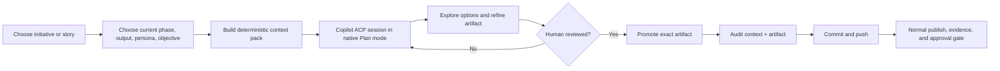

# Copilot Planning Studio

Planning Studio turns the Electron app into a governed front end for GitHub Copilot CLI's native Plan mode. It is designed for business, product, architecture, design, and engineering contributors who need to reason together across different SDLC phases without giving an exploratory chat permission to change source code or advance a gate.

## The operating model



The app is an Agent Client Protocol (ACP) client. Its main process owns one repository-scoped Copilot backend while the desktop is open. The top-bar **Copilot** control starts the locally installed `copilot` executable as an ACP server, explicitly selects the Plan session mode advertised by Copilot, displays readiness, process ID, version, active planning attachment, and a local service log, and stops the process on demand. Planning Studio attaches governed context to that backend, streams conversation and structured plan updates, and keeps follow-up questions in the same planning session.

Releasing or promoting a planning context does not tear down the backend, so the next governed turn avoids another process launch. Stopping the backend is explicit and cancels any attached turn. Starting a planning turn automatically starts the backend if it is stopped.

Backend lifecycle actions are serialized. Concurrent Start requests share the same initialization, Stop during startup cannot later spring back to Ready, and an overlapping or empty follow-up is rejected visibly instead of being reported as accepted. A planning context is released only after its active turn ends or cancellation succeeds. If shutdown cannot complete, the control shows an error and offers **Retry stop**; process, connection, session, and pending-question cleanup still run independently so one cleanup failure cannot skip the remaining steps.

When Copilot needs a decision, Planning Studio renders its ACP form elicitation as an inline **Question from Copilot** card. The card supports text, number, boolean, single-select, and multi-select answers. Answering resumes the same Copilot turn; skipping is explicit. If a Copilot version asks an ordinary prose question instead of using elicitation, Planning Studio detects the question at the end of the turn and offers the same answer flow as a follow-up. Tool activity, diagnostics, reasoning-status events, and lifecycle messages remain available in a collapsed **Copilot logs** console at the bottom, similar to an IDE output panel.

The ACP conversation is transient local state. It is not the workflow database. Singularity Flow remains Git-native.

## What Copilot receives

Planning context is built by the deterministic CLI, not assembled by the renderer:

```text
configurable planning contract
+ selected current-phase contract
+ selected persona prompt
+ repository world-model views
+ rule-selected repository world-model files
+ active remote-agent skill Markdown
+ approved upstream phase artifacts
+ current source requirement and draft
+ exact promotion target
```

For initiatives, the phase contract also includes:

- Required and optional outputs.
- Checklist gates and accepted assurance levels.
- Approval rules.
- Participating repository aliases and boundaries.
- Approved initiative inputs, evidence context, and interface contracts.

Each source is hashed in a private context manifest under:

```text
<git-dir>/singularity-flow/planning/<SESSION-ID>/
  context.md
  manifest.json
```

Building a context pack does not change the branch, commit workflow state, or publish anything. A configurable byte budget prevents an unexpectedly large context from being sent silently; truncation is visible in the UI and manifest.

## Phase intelligence

Planning uses one interaction pattern but changes its reasoning lens by phase:

| Phase family | Copilot planning emphasis |
|---|---|
| Discover & Define | Problem, users, outcomes, value, evidence, assumptions, boundaries, success measures |
| Design & Iterate | Alternative solutions, journeys, prototypes, interfaces, accessibility, trade-offs |
| Product Gate / Pre-Inception | Readiness, sponsorship, policy applicability, decision rights, minimum evidence |
| Inception | Stakeholders, feasibility, architecture direction, risk, data, contracts, decomposition strategy |
| Elaboration / Specification | Executable stories, ACs, NFRs, contracts, dependencies, test strategy, sequencing, estimates |
| Construction / Implementation | Repository execution, integration order, tests, CI/CD, security, operations, recovery |
| Delivery / Conformance | Rollout, rollback, monitoring, validation, acceptance, closure, spec-to-code evidence |

The selected profile still owns the real phase names and contracts. The table is guidance in the editable prompt, not hard-coded lifecycle policy.

## Use it

1. Start or resume an initiative or story and open it in Singularity Flow Desktop.
2. Open **Planning Studio**.
3. Select the current work item, phase output, persona, and planning objective.
4. Optionally enter a Copilot model name; leave it blank to use the Copilot default.
5. Select **Build governed context** and inspect its source hashes, warnings, and complete prompt.
6. Optionally start the repository-scoped backend from the top-bar **Copilot** control and inspect its health. Otherwise select **Start Copilot Plan mode** and the app starts it automatically.
7. Answer any inline Copilot questions about scope, boundaries, ownership, acceptance criteria, or dependencies. Expand **Copilot logs** only when you need detailed diagnostics.
8. Use follow-up turns to challenge assumptions, request alternatives, sharpen acceptance criteria, or refine story decomposition.
9. For a `story-plan` output, inspect the generated Epic IDs, Story Work IDs, repository allocation, dependencies, and blocking status in **Epic decomposition analysis**.
10. Review and edit the complete proposed artifact in the right-hand panel.
11. Confirm the review checkbox and select **Promote, commit & push**.
12. Continue the normal phase lifecycle. Promotion neither submits nor approves.

## Epic and story identities

Initiative decomposition deliberately keeps business grouping, Git state, and Jira state distinct:

| Level | Singularity identity | Git behavior | Jira identity |
|---|---|---|---|
| Epic | `epics[].id` (Epic ID) | Stored in the lead initiative branch | `epics[].jiraKey`, created or attached during materialization |
| Story | `epics[].stories[].id` (Story Work ID) | Branch name, seed filename, and child workflow ID in the owning repository | `stories[].jiraKey`, created under the corresponding Jira epic |

Copilot proposes stable Epic IDs and Story Work IDs. It must not invent Jira keys. After the story-plan phase is approved, **Create Jira & Git stories** previews the full operation and requires the exact Initiative ID. The operation writes returned Jira keys into `breakdown.yml`, creates or safely attaches each Story Work ID branch, commits a `singularity/seeds/<WORK-ID>.yml` seed, pushes every branch, and finally commits and pushes the receipts on the initiative branch.

The Initiative dashboard displays all planned stories before materialization. **Sync story branches** later fetches the child workflows and rolls their current phase, completion percentage, blocking state, staleness, model/tokens, and cost up to each epic.

If Copilot is unavailable, the app explains whether the executable, ACP server, or native Plan mode is missing. Authenticate Copilot CLI normally before opening the Planning Studio.

Backend logs are transient process diagnostics held by Electron's main process. They are not committed, do not include Jira credentials, and disappear when the app exits. Governed planning context and promoted provenance keep their existing Git-backed lifecycle.

## Promotion guarantees

Before writing, promotion revalidates:

- The same repository is still open.
- The branch and HEAD exactly match the context manifest.
- The selected phase is still the active in-progress phase.
- The configured target still belongs to the immutable phase resolution.
- Phase inputs and sequence policy still permit generation.
- YAML targets parse, and executable story plans satisfy repository and dependency-graph validation.

Promotion then:

1. Preserves Singularity Flow managed metadata.
2. Writes only the chosen configured target.
3. Copies the exact prompt context, reviewed artifact, and manifest into committed phase context.
4. Records actor, persona, time, target hash, prompt hash, and source hashes.
5. Updates workflow history.
6. Creates and pushes one planning promotion commit.

A moved HEAD makes the plan stale. The user must rebuild context instead of silently promoting reasoning based on old state.

## Configuration

New repositories receive:

```yaml
planning:
  enabled: true
  promptSource: singularity/prompts/copilot-planning.md
  maxContextBytes: 1048576
```

The planning prompt is ordinary repository Markdown. Edit it from **Prompts & skills** in the Electron app, validate it with the rest of the workflow, and commit it like any other governed configuration. The allowed context range is 16 KiB through 10 MiB.

Existing repositories without `planning` use the same enabled defaults and bundled fallback prompt. Run `singularity-flow init` to materialize the editable repository copy. Set `planning.enabled: false` to disable Planning Studio for a repository.

## Security and privacy boundary

- Renderer sandboxing and context isolation remain enabled.
- Only the narrow preload planning API reaches Electron's main process.
- The main process owns issued context-pack handles; the renderer cannot point Copilot at an arbitrary local file.
- ACP file plans are loaded only when they remain inside the open repository.
- Tool permission requests are rejected by the planning client.
- No source mutation, lifecycle transition, submission, approval, or materialization is delegated to the planning chat.
- Nothing becomes durable until a human promotes the reviewed artifact.

Copilot's provider/model/token fields are shown when ACP supplies exact usage. Singularity Flow does not invent missing token counts or cost.
