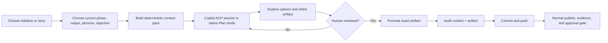

# Copilot Planning Studio

Planning Studio turns the Electron app into a governed front end for GitHub Copilot CLI's native Plan mode. It is designed for business, product, architecture, design, and engineering contributors who need to reason together across different SDLC phases without giving an exploratory chat permission to change source code or advance a gate.

## The operating model



The app is an Agent Client Protocol (ACP) client. It starts the locally installed `copilot` executable as an ACP server, explicitly selects the Plan session mode advertised by Copilot, streams its conversation and structured plan updates, and keeps follow-up questions in the same session.

The ACP conversation is transient local state. It is not the workflow database. Singularity Flow remains Git-native.

## What Copilot receives

Planning context is built by the deterministic CLI, not assembled by the renderer:

```text
configurable planning contract
+ selected current-phase contract
+ selected persona prompt
+ repository world-model views
+ rule-selected repository world-model files
+ active remote-agent skill Markdown
+ approved upstream phase artifacts
+ current source requirement and draft
+ exact promotion target
```

For initiatives, the phase contract also includes:

- Required and optional outputs.
- Checklist gates and accepted assurance levels.
- Approval rules.
- Participating repository aliases and boundaries.
- Approved initiative inputs, evidence context, and interface contracts.

Each source is hashed in a private context manifest under:

```text
<git-dir>/singularity-flow/planning/<SESSION-ID>/
  context.md
  manifest.json
```

Building a context pack does not change the branch, commit workflow state, or publish anything. A configurable byte budget prevents an unexpectedly large context from being sent silently; truncation is visible in the UI and manifest.

## Phase intelligence

Planning uses one interaction pattern but changes its reasoning lens by phase:

| Phase family | Copilot planning emphasis |
|---|---|
| Discover & Define | Problem, users, outcomes, value, evidence, assumptions, boundaries, success measures |
| Design & Iterate | Alternative solutions, journeys, prototypes, interfaces, accessibility, trade-offs |
| Product Gate / Pre-Inception | Readiness, sponsorship, policy applicability, decision rights, minimum evidence |
| Inception | Stakeholders, feasibility, architecture direction, risk, data, contracts, decomposition strategy |
| Elaboration / Specification | Executable stories, ACs, NFRs, contracts, dependencies, test strategy, sequencing, estimates |
| Construction / Implementation | Repository execution, integration order, tests, CI/CD, security, operations, recovery |
| Delivery / Conformance | Rollout, rollback, monitoring, validation, acceptance, closure, spec-to-code evidence |

The selected profile still owns the real phase names and contracts. The table is guidance in the editable prompt, not hard-coded lifecycle policy.

## Use it

1. Start or resume an initiative or story and open it in Singularity Flow Desktop.
2. Open **Planning Studio**.
3. Select the current work item, phase output, persona, and planning objective.
4. Optionally enter a Copilot model name; leave it blank to use the Copilot default.
5. Select **Build governed context** and inspect its source hashes, warnings, and complete prompt.
6. Select **Start Copilot Plan mode**.
7. Use follow-up turns to challenge assumptions, request alternatives, sharpen acceptance criteria, or refine story decomposition.
8. Review and edit the complete proposed artifact in the right-hand panel.
9. Confirm the review checkbox and select **Promote, commit & push**.
10. Continue the normal phase lifecycle. Promotion neither submits nor approves.

If Copilot is unavailable, the app explains whether the executable, ACP server, or native Plan mode is missing. Authenticate Copilot CLI normally before opening the Planning Studio.

## Promotion guarantees

Before writing, promotion revalidates:

- The same repository is still open.
- The branch and HEAD exactly match the context manifest.
- The selected phase is still the active in-progress phase.
- The configured target still belongs to the immutable phase resolution.
- Phase inputs and sequence policy still permit generation.
- YAML targets parse, and executable story plans satisfy repository and dependency-graph validation.

Promotion then:

1. Preserves Singularity Flow managed metadata.
2. Writes only the chosen configured target.
3. Copies the exact prompt context, reviewed artifact, and manifest into committed phase context.
4. Records actor, persona, time, target hash, prompt hash, and source hashes.
5. Updates workflow history.
6. Creates and pushes one planning promotion commit.

A moved HEAD makes the plan stale. The user must rebuild context instead of silently promoting reasoning based on old state.

## Configuration

New repositories receive:

```yaml
planning:
  enabled: true
  promptSource: singularity/prompts/copilot-planning.md
  maxContextBytes: 1048576
```

The planning prompt is ordinary repository Markdown. Edit it from **Prompts & skills** in the Electron app, validate it with the rest of the workflow, and commit it like any other governed configuration. The allowed context range is 16 KiB through 10 MiB.

Existing repositories without `planning` use the same enabled defaults and bundled fallback prompt. Run `singularity-flow init` to materialize the editable repository copy. Set `planning.enabled: false` to disable Planning Studio for a repository.

## Security and privacy boundary

- Renderer sandboxing and context isolation remain enabled.
- Only the narrow preload planning API reaches Electron's main process.
- The main process owns issued context-pack handles; the renderer cannot point Copilot at an arbitrary local file.
- ACP file plans are loaded only when they remain inside the open repository.
- Tool permission requests are rejected by the planning client.
- No source mutation, lifecycle transition, submission, approval, or materialization is delegated to the planning chat.
- Nothing becomes durable until a human promotes the reviewed artifact.

Copilot's provider/model/token fields are shown when ACP supplies exact usage. Singularity Flow does not invent missing token counts or cost.
