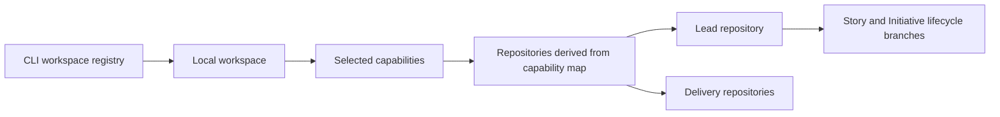

# Project workspaces

A Singularity Flow workspace is a machine-local working directory plus a governed
capability selection. It is not a new Jira level and it is not lifecycle state.
The selected capabilities determine the participating repositories, their Jira
routing, and which repository leads shared Initiative artifacts.

## The model



- The organisation capability map is governed in the lead repository at
  `singularity/capabilities.yml`.
- Repository definitions and policy live in `singularity/portfolio.yml`.
- The workspace stores local paths and selections. It never owns artifacts,
  approvals, or workflow progress.
- Exactly one lead repository anchors shared Initiative state and the optional
  orphan `state` branch.

## Use it in VS Code

Open the Singularity Flow activity-bar icon and expand **Workspaces**.

### Select

Clicking a workspace marks it **working here** and refreshes Lifecycle, Inbox, and
Configuration in the current window. It does not open another VS Code instance.
Opening a repository folder is a separate explicit command.

Expand the selected workspace or open its details page to see:

- local directory and lead repository;
- every materialized repository, origin, default/current branch, and dirty state;
- selected capabilities and their ancestors/descendants;
- application metadata and Jira routes inherited from the capability map;
- world-model presence/staleness and diagnostics;
- clone, fetch, and repair warnings.

### Edit

**Edit workspace** can safely change:

- display name; and
- selected capabilities already available within the workspace's materialized
  repository boundary.

The capability picker lists governed capabilities from the lead repository. It
does not ask users to type arbitrary identifiers. Selecting a grouping capability
can include the delivery descendants beneath it.

An edit cannot silently move a workspace, change a clone URL, or introduce an
unmaterialized repository. Choose **Copy workspace** when the directory or
repository boundary must change; the preview shows every clone before creation.

### Rename, archive, and restore

Renaming changes only the machine-local display name. Archiving is also local and
reversible, but it is guarded: Singularity Flow fetches every materialized
repository and refuses the archive while any Story is not `complete` or
`cancelled`. A repository that cannot be refreshed or inspected is a blocker, not
evidence that the workspace is idle.

The **Workspaces** page lists the blocking Story IDs, repositories, phases, and
statuses. Successfully archived workspaces move under **Archived**. Their
directories, branches, generated artifacts, approvals, and Git history remain on
disk and can be inspected or restored at any time.

### Capability portfolio dashboard

The Inbox opens with a capability-level portfolio summary. It shows root
capabilities, delivery capabilities, repositories, Jira routes, open Stories and
Initiatives, pending approvals, diagnostics, and world-model health. Capability
configuration lives under **Configuration**, not as a second workspace tree.

## Create a capability-based workspace

The preferred flow starts with the lead repository that owns
`singularity/capabilities.yml`:

```bash
sflow workspace capabilities <LEAD-REPOSITORY-URL>

sflow workspace create --local \
  --id payments-modernization \
  --name "Payments modernization" \
  --base "$HOME/Singularity Workspaces" \
  --organisation <LEAD-REPOSITORY-URL> \
  --capability payments \
  --lead-capability payments-api \
  --confirm payments-modernization
```

The CLI derives repository URLs and default branches from the governed capability
and portfolio files, clones them below `repos/`, records a resumable journal, and
initializes the optional state branch in the lead repository when configured.

For a repository with no capability map yet, explicitly supplied repositories
remain supported:

```bash
sflow workspace create --local \
  --id rule-demo \
  --name "Rule demo" \
  --base "$HOME/Singularity Workspaces" \
  --lead rule-engine \
  --repository rule-engine=https://git.example.com/team/rule-engine.git \
  --default-branch rule-engine=main \
  --confirm rule-demo
```

A Jira anchor is optional. For an existing higher-level Jira item, use
`workspace create --jira <KEY>` with the repository arguments documented by
`sflow help workspaces`. For work with no tracker, always use `--local --id`.

## Explore impact before creating work

A workspace can answer “what would this change touch?” before the team has a Jira
key, Work ID, or lifecycle branch:

```bash
sflow workspace impact analyze /path/to/workspace \
  --title "Passkey authentication" \
  --description "Assess repository, API, security, migration, and test impact."
sflow workspace impact list /path/to/workspace
sflow workspace impact show /path/to/workspace <ANALYSIS-ID>
```

The analysis is advisory and local. Copilot runs against disposable detached
copies pinned to the recorded repository commits, plus staged workspace documents
and committed world-model evidence. Reports live under `cache/copilot/impact/` and
become stale when any recorded repository HEAD or saved analysis artifact changes.
They do not create or switch branches and do not modify a Story workflow. In
Copilot CLI, `/sf-workspace-impact` guides the same preview, confirmation, analysis,
and optional promotion.

To carry a useful result into governance, stage it as an intake source:

```bash
sflow workspace impact promote /path/to/workspace <ANALYSIS-ID>
```

This copies the summary to `documents/inbox/`; starting work and selecting that
document are still explicit governed actions.

## Local layout

```text
<workspace-base>/
└── payments-modernization/
    ├── workspace.json
    ├── repos/
    │   ├── platform/
    │   ├── mobile/
    │   └── api/
    ├── documents/
    │   ├── inbox/
    │   ├── imports/
    │   └── exports/
    ├── cache/
    └── logs/
        └── workspace-materialization.json
```

`workspace.json` contains no credentials, approvals, lifecycle transitions, or
authoritative evidence. Jira and storage secrets entered in VS Code remain in
`SecretStorage`; headless users provide the corresponding environment variables.

## Common commands

```bash
sflow workspace list
sflow workspace current
sflow workspace use payments-modernization
sflow workspace status /path/to/payments-modernization
sflow workspace sync /path/to/payments-modernization
sflow workspace repair /path/to/payments-modernization
sflow workspace rename /path/to/payments-modernization \
  --name "Payments delivery" --confirm payments-modernization
sflow workspace archive-status /path/to/payments-modernization --fetch
sflow workspace duplicate /path/to/payments-modernization \
  --id payments-spike --name "Payments spike"
sflow workspace archive /path/to/payments-modernization \
  --confirm payments-modernization
sflow workspace restore /path/to/payments-modernization
sflow workspace forget /path/to/payments-modernization
```

`workspace use` changes only the machine-local active selection. It does not check
out a branch or modify Git. When the selected repository already resolves to a
governed Story, the Story ID appears in the context banner automatically.

The registry defaults to `~/.singularity-flow/workspaces.json`; active selection
defaults to `~/.singularity-flow/active-workspace.json`. Corporate launchers may
override them with `SINGULARITY_FLOW_WORKSPACE_REGISTRY`,
`SINGULARITY_FLOW_WORKSPACE_ROOT`, and
`SINGULARITY_FLOW_ACTIVE_WORKSPACE`.

## Documents and recovery

Files staged at workspace level are explicitly `staged-not-governed`. Import them
into an active Story or Initiative to hash, register, commit, and push them through
the normal lifecycle.

Workspace operations are designed to be recoverable:

- clones are isolated even when two workspaces use the same repository;
- creation and repair never overwrite unrelated directories;
- interrupted clones are journaled and can resume;
- sync skips dirty clones and does not change their branch;
- archive requires every repository to be inspectable and every Story to be
  complete or cancelled;
- archive and forget never delete repository contents; and
- shared work can be reconstructed from lifecycle branches even if the local
  workspace is lost.

See [VS Code guide](docs/VS-CODE.md), [Capability ledger](CAPABILITY-LEDGER.md), and
[State authority](docs/STATE-AUTHORITY.md) for the related boundaries.
