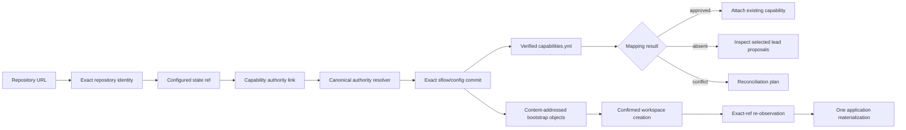

# Capability authority discovery and workspace performance plan

**Plan ID:** `CAD-WSP-PLAN-v1`

**Status:** core implementation complete; controlled office/platform rollout evidence remains

**Parent tracks:** Fast Onboarding and Safe Git (`FOS`) and Developer Experience Performance
(`DXP`)

**Code baseline reviewed:** `main@98ea750c988e1f55706e92d177b7842dc310f410`

**Implementation checkpoints:** `d1f8b387` (reviewed plan), `db2d5f1c` (portable authority and
cross-process bootstrap foundation), plus the current delivery checkpoint

**Last reviewed:** 2026-09-09

## Delivery status

The ordinary capability journey now starts with the exact Git URL, follows a subject-bound link
from the delivery repository's state branch, verifies the selected lead's current approved
`sflow/config` map, and does not scan the laptop's lead cache or enumerate proposal refs unless the
user explicitly asks. Activation publishes these links, while `capability fsck` diagnoses missing
or stale portability without making a change.

Workspace preflight retains a bounded private Git catalog across the separate confirmation
process. Confirmation revalidates the exact authority ref, reuses those objects, clones the
application once, and clears the private catalog on completion or abandonment. The VS Code form is
URL-first, recommends a blobless Smart clone for new mappings, explains the authority/state/cache
choices, offers explicit compatibility search, and exposes a credential-free terminal
continuation after a remote failure.

Independent approved authorities are classified as a blocking conflict. `capability reconcile`
first returns an exact confirmation-bound plan and, after confirmation, changes only the chosen
delivery repository's routing link. It never deletes or rewrites the competing approved map.

The remaining work is release evidence rather than hidden product behavior: run the controlled
office proxy/certificate, Windows, macOS, Linux, minimum/current VS Code, protected-state-branch,
and high-latency Git matrix in M6. Portable link absence remains a diagnosed legacy state until
that rollout is approved.

## Executive decision

Treat a laptop's registered lead-repository list as a cache, never as the source of organisation
authority. Once a capability mapping is activated, publish a small, credential-free authority link
to the mapped repository's configured state branch. A new laptop that receives only the delivery
repository URL can then discover the one canonical lead, verify the current approved map at an
exact Git commit, and attach the existing capability without recreating it.

The same change should remove the current remote fan-out from the ordinary path:

1. inspect the repository supplied by the user;
2. follow its verified authority link, when present;
3. read one approved capability map at an exact commit;
4. stop as soon as the exact repository mapping is proven;
5. inspect proposal refs only when the user is about to create or review a proposal.

Workspace preflight and confirmed creation must share the same remote Git objects and exact-ref
receipt across their separate CLI processes. Resume performs a cheap exact-ref observation, not a
second catalog clone. Application materialization remains a separate clone and keeps existing
partial-clone safety rules.

## Why this plan exists

The current code is correct about not trusting an arbitrary local cache, but its safe fallback is
too expensive and is not portable enough.

### Reproduced baseline

On the reviewed machine:

- six lead repositories were registered in `~/.singularity-flow/leads.json`;
- inspecting the RuleEngine repository with its explicit lead took about 4.44 seconds;
- inspecting the same URL without a lead scanned all six registered leads, took about 8.94
  seconds, and reported an ambiguity;
- full capability `fsck` against each of two relevant leads took about 91–93 seconds;
- the RuleEngine delivery repository was claimed by two different approved maps;
- the focused local FOS benchmark remained fast, proving that the local warm cache is not the
  source of the office-visible delay.

These timings are diagnostic observations on one machine, not release budgets or universal
performance claims.

### Current implementation gaps

| Gap | Current behavior | User-visible consequence |
|---|---|---|
| Lead discovery is machine-local | `src/lead-repositories.mjs` stores the known leads only in the user's home directory | A new laptop cannot infer a separate organisation lead from the delivery repository URL |
| Inspection fans out | `inspectCapabilityRepository` reads every registered lead when no explicit lead is supplied | More historical workspaces make mapping progressively slower |
| Approved maps and proposals are coupled | Each inspected lead can clone the approved configuration and enumerate/fetch proposal refs | A simple “is this already onboarded?” question pays review-workflow cost |
| Duplicate claims lack canonical identity | Two approved maps containing the same repository are treated as independent matches | The UI reports ambiguity instead of restoring the known capability |
| Workspace receipt is process-local | `validateWorkspaceCapabilityRegistration` accepts only an in-memory branded receipt | VS Code preflight and the separate confirmed CLI invocation can transfer the same catalog twice |
| Clone selection is not optimized for the common case | The capability form currently initializes new entries with full clone mode | Large repositories transfer more history than an ordinary workspace checkout requires |
| Progress is too coarse | Remote probes, proposal enumeration, catalog reads, and cloning are not presented as distinct stages | A slow office Git operation looks hung and gives no useful terminal continuation command |

### Invariants that may not be weakened

- A URL, branch name, local registration, cache record, state projection, or Git author is not by
  itself authority.
- The current `sflow/config` commit and capability-map bytes must be verified before a mapping is
  accepted or a workspace is created.
- Remote URLs stored by SFlow must be credential-free and diagnostics must never reveal proxy,
  credential-helper, certificate, or token data.
- No cache may authorize a mutation after the observed remote ref changes.
- A delivery repository may contain several capabilities under one canonical authority. Multiple
  independent authorities claiming the same delivery repository remain a conflict until reviewed.
- Installation and configuration refresh may preview and diagnose legacy repositories, but may not
  silently rewrite their state branches.
- No optimization may disable TLS, hooks protections, exact-SHA checks, bounded cancellation, or
  the existing pending-publication recovery path.
- Capability and workspace creation remain model-free, AST-free, and world-model-free.

## Target user journey

### New laptop, capability already onboarded

1. The user chooses **Map a capability** and enters the Git URL first.
2. SFlow normalizes the credential-free repository identity and reads the configured state ref.
3. It finds a versioned capability-authority link and displays the organisation/lead it will read.
4. SFlow observes the current lead `sflow/config` ref, loads the capability catalog at that exact
   commit, and verifies that the exact delivery repository is mapped.
5. The form changes to **Existing capability found** and offers **Use in this workspace**. It does
   not ask the user to recreate the capability or create a proposal.
6. Confirmed workspace creation reuses the verified catalog objects, re-observes the exact ref, and
   clones/materializes the application once.

### New capability

1. Repository inspection proves that no approved mapping exists under the selected canonical
   authority.
2. Only then does SFlow inspect pending proposal refs for that authority.
3. If no equivalent proposal exists, the user enters the capability details and reviews one exact
   proposal plan.
4. Activation publishes the approved map and the delivery-repository authority link as one
   recoverable operation. A partial push is visible and resumable; it is never presented as a fully
   portable activation.

### Existing duplicate claims

SFlow classifies the result before asking the user to act:

- **Equivalent mirror:** same canonical authority identity and same approved map digest. Collapse
  the copies into one result.
- **Stale mirror:** same canonical authority but an older observed catalog. Use the current
  authority and offer a state-projection refresh.
- **Independent conflict:** different canonical authorities claim the repository. Block automatic
  attachment and produce a confirmation-bound reconciliation plan.
- **Pending duplicate proposal:** the approved map has no match, but the selected authority already
  has an equivalent proposal. Open that proposal instead of creating another.

## Architecture



### 1. Versioned capability-authority link

Add a migration-registry family such as `capability-authority-link`. Its durable writer must stamp
`currentSchemaVersion(family)`.

Publish the canonical JSON document under the repository's configured state branch, at a path that
the state publisher owns and preserves, for example:

`singularity/capability-authority.json`

The first schema should contain only bounded, credential-free facts:

```json
{
  "schemaVersion": 1,
  "authority": {
    "id": "sha256:<canonical-remote-and-branch-digest>",
    "remote": "https://git.example/organisation/lead.git",
    "branch": "sflow/config",
    "catalogPath": "singularity/capabilities.yml"
  },
  "subject": {
    "repositoryIdentity": "sha256:<credential-free-exact-remote-digest>",
    "capabilityIds": ["payments-api"]
  }
}
```

Design constraints:

- keep arrays sorted and bytes canonical so an unchanged mapping causes no state commit;
- never store credentials, local paths, user identity, access tokens, proxy values, or machine IDs;
- derive `authority.id` from the exact canonical remote identity plus branch, not a display name;
- bind the subject to the delivery repository so a copied pointer cannot claim another repo;
- validate the link as a routing hint, then prove the claim against the current approved map;
- do not pin a mutable catalog commit in the long-lived link. Resolve and pin the current commit in
  the operation receipt instead, avoiding a fan-out update for unrelated catalog edits;
- preserve unknown-newer documents and fail with an upgrade/remediation plan rather than rewriting
  them.

For a self-hosted authority, the lead and delivery remote are the same. The resolver should detect
that case without a second repository scan.

### 2. Canonical authority resolver

Introduce one resolver consumed by CLI inspection, capability mapping, workspace creation,
Configuration Center, `fsck`, and configuration refresh. The resolver performs these stages in
order:

1. normalize and fingerprint the exact user-supplied repository URL;
2. inspect the repository's configured state ref for the authority link;
3. if present, validate the link, observe only that lead, and verify its current approved map;
4. if absent, test the supplied repository as a self-hosted authority;
5. if an explicit `--lead` was supplied, inspect only that lead;
6. otherwise return **authority unknown** with **Choose a known authority** and **Search registered
   authorities** actions.

The ordinary path must not automatically scan every machine-local lead. The legacy scan remains an
explicit compatibility action and uses the existing bounded pool.

Resolver output must distinguish:

- source of discovery: `state-link`, `self-hosted`, `explicit-lead`, or `registered-search`;
- exact observed repository and authority refs;
- verified mapping and capability IDs;
- equivalent mirrors, stale mirrors, independent conflicts, and pending proposals;
- Git request/spawn counts, stage timings, and a stable failure/remediation code.

Machine-local `leads.json` becomes a recency cache and UI convenience only. A resolver result may
refresh it after successful verification, but absence from that file cannot make an approved
capability unavailable.

### 3. Approved-map fast path

Split repository inspection into two reads:

- **Discovery read:** resolve the current approved `sflow/config` commit and inspect only the
  catalog blobs required to answer whether the repository is already mapped.
- **Proposal read:** enumerate bounded review refs only after the approved map has no match and the
  caller is entering proposal creation/review.

Use the existing Git supervisor, `GitRemoteSession`, typed Git query registry, exact-object service,
deadlines, cancellation, and mutation barriers. Do not add raw Git spawning or cache arbitrary
commands.

The discovery fast path should avoid a worktree clone when the server supports an exact commit/blob
fetch. If policy or server capability requires a shallow checkout, keep that fallback bounded and
record the actual strategy. Authentication, TLS, proxy, timeout, and cancellation failures never
fall back to an unrelated second clone.

### 4. Cross-process workspace bootstrap receipt

Replace the live-object-only handoff between VS Code preflight and confirmed CLI creation with a
content-addressed, process-independent receipt backed by verified Git objects.

Store it in the existing machine-private SFlow bootstrap area, not in the application repository,
home-level prompt logs, or workspace configuration. The receipt contains:

- schema version and opaque bootstrap ID;
- normalized authority fingerprint and branch;
- exact observed config commit and required tree/blob OIDs;
- canonical SHA-256 of the capability catalog and relevant portfolio/configuration bytes;
- exact repository-to-capability binding digest;
- workspace plan digest, requested clone policy, and bounded expiry;
- no raw credentials, source content, identity, or arbitrary command output.

The object store, not caller-provided JSON, is replayed on resume:

1. run `git fsck`/object-shape validation on the bounded private object set;
2. recompute required Git OIDs and SHA-256 digests;
3. verify the objects reach the recorded commit and expected catalog paths;
4. perform one exact remote-ref observation immediately before mutation;
5. reuse the objects only if the observed ref still equals the receipt commit;
6. invalidate and rebuild preflight when the ref moved, the receipt expired, or any byte differs.

This preserves the current anti-forgery property without a signing key: the remote ref supplies the
fresh trust anchor and Git object hashes make replacement detectable. A JSON copy with invented
digests remains insufficient.

### 5. Activation and state projection transaction

For newly activated mappings, publication comprises two named outcomes:

1. approved catalog commit advanced on the lead `sflow/config` branch;
2. capability-authority link advanced on every mapped delivery repository's configured state
   branch.

Use exact expected refs and the existing journal/pending-publication mechanism. If the catalog push
succeeds but a state-link push is rejected by branch rules, retain the exact commit/ref receipt and
report `active-portability-pending`. `sync` or a dedicated reconciliation action retries only the
missing exact publication; it must not advance an arbitrary current `HEAD`.

During compatibility rollout, existing active capabilities remain usable when the link is absent.
The UI and `fsck` report them as **portable discovery not established**. Once migration evidence is
complete, new activation policy may require state-link publication before reporting the capability
as portable across machines.

### 6. Duplicate-map reconciliation

Add a read-only diagnosis and a separately confirmed repair plan. The plan must include the exact
observed commits, mapping digests, subject repository, canonical lead chosen by the user, and every
write/ref it would perform.

Allowed repair operations are intentionally narrow:

- publish/refresh the missing authority link;
- detach a stale machine-local lead registration;
- retire or redirect a stale mirror through its normal configuration proposal flow;
- attach the workspace to the chosen current authority;
- open an already pending proposal.

Never automatically delete a capability, rewrite an independent authority's map, force-push a
branch, or decide which conflicting organisation owns a repository.

### 7. Clone strategy

Keep approved per-capability clone policy authoritative. For a newly authored delivery capability,
change the UI recommendation to **Smart (recommended)**:

- reuse an existing verified checkout when it matches the exact remote and requested revision;
- otherwise request blobless clone when the server and policy support it;
- use sparse checkout only with explicitly reviewed roots;
- fall back to full only for an explicit server filter-rejection class and only when policy permits;
- never retry authentication, TLS, proxy, cancellation, or timeout errors as a full clone.

Existing capability policies must not be silently rewritten. Preview shows the requested and actual
clone mode, whether history/blobs are deferred, the fallback rule, and the exact repository count.

### 8. VS Code experience

The capability form and workspace creation surface should expose one coherent journey:

- Git URL is the first field and starts a cancellable, debounced inspection after explicit user
  action or field completion;
- first visible feedback appears before remote work starts;
- progress names the stage: **Checking repository**, **Finding its authority**, **Reading approved
  map**, **Checking proposals**, **Preparing workspace**, or **Cloning application**;
- elapsed time and bounded repository counts are visible without exposing credentials;
- an existing match replaces authoring fields with **Use existing capability** and a link to the
  canonical lead/map revision;
- an independent conflict presents the exact authorities and a **Create reconciliation plan**
  action;
- proposal enumeration is labeled and deferred;
- timeout/refusal messages include a copyable terminal command containing no secret;
- cancellation terminates Git descendants and leaves no proposal, workspace, or stage directory;
- installation/version mismatch is shown when the installed VSIX lacks authority-link support.

Add information icons for authority, approved map, state branch, clone mode, fallback, and local
lead cache. Their text must explain consequence and ownership, not internal implementation jargon.

## Public interfaces

```text
singularity-flow capability inspect-repository <URL> [--lead <URL>] [--search-known] --json
singularity-flow capability reconcile <URL> --canonical-lead <URL> --json
singularity-flow capability reconcile <URL> --canonical-lead <URL> --confirm-plan <PLAN-ID> --json
singularity-flow capability fsck [--repository <URL>] [--portable-discovery] --json
singularity-flow workspace prepare <REMOTE> --id <WORKSPACE-ID> --base <DIRECTORY> --json
singularity-flow workspace bootstrap resume <BOOTSTRAP-ID> --confirm <WORKSPACE-ID> --json
```

JSON additions should be additive and versioned:

- `authorityDiscovery.source`
- `authorityDiscovery.portable`
- `authorityDiscovery.authorityId`
- `authorityDiscovery.observedCommit`
- `authorityDiscovery.mapSha256`
- `authorityDiscovery.conflicts[]`
- `gitOperationSummary.requests`, `spawns`, `stages[]`, and `elapsedMs`
- `bootstrapReceipt.id`, `observedCommit`, `expiresAt`, and `status`

Human output must retain the current actionable recovery text. Stable error classes should include:

- `CAPABILITY_AUTHORITY_UNKNOWN`
- `CAPABILITY_AUTHORITY_LINK_INVALID`
- `CAPABILITY_AUTHORITY_LINK_STALE`
- `CAPABILITY_AUTHORITY_CONFLICT`
- `CAPABILITY_PORTABILITY_PENDING`
- `WORKSPACE_BOOTSTRAP_RECEIPT_STALE`
- `WORKSPACE_BOOTSTRAP_RECEIPT_INVALID`

Every refusal returns a bounded remediation plan or an exact next read-only command. A refusal does
not execute its proposed mutation.

## Milestone delivery plan

### M0 — evidence, contracts, and regression fixtures

**Estimate:** 2–3 engineering days

Deliverables:

- register the authority-link, resolver-result, bootstrap-receipt, reconciliation-plan, and timing
  schema families without adding a durable writer;
- add deterministic fixtures for self-hosted, separate-lead, missing-link, stale-link, duplicate,
  moved-remote, and branch-protected cases;
- add request/spawn/stage counters to the existing content-free Git timing boundary;
- capture a reference semantic projection for existing `inspect-repository`, workspace preflight,
  confirmed creation, proposal listing, and `fsck`;
- add an office-run evidence manifest without recording repository URLs or credentials;
- prove current errors/cancellation never leak credentialed remotes.

Exit gate:

- every existing verdict is represented in the reference corpus;
- no new durable bytes exist;
- baseline request/spawn counts are reproducible with a deterministic fake remote.

### M1 — canonical identity and authority-link reader

**Estimate:** 3–5 engineering days

Deliverables:

- implement canonical credential-free remote identity using the existing URL-security rules;
- implement the migration-backed authority-link parser and validator;
- add exact state-ref/object reads through the bounded Git supervisor;
- implement the shared resolver in observe/shadow mode;
- compare legacy lead-scan and pointer resolution without changing user outcomes;
- surface pointer status in `capability fsck` and workspace diagnostics.

Exit gate:

- valid, absent, malformed, escaped, copied-to-another-repo, stale, and unknown-newer links are
  classified deterministically;
- resolver never follows a credentialed or policy-disallowed remote;
- shadow mismatches block enabling the new path.

### M2 — authority-link writer, activation recovery, and legacy migration

**Estimate:** 4–6 engineering days

Deliverables:

- publish canonical links through the state projection transaction for new activations;
- retain exact pending-publication receipts when any state push fails;
- make retry idempotent and exact-commit-bound;
- add preview/confirm reconciliation for existing mappings;
- add registered-workspace inventory that reports missing, stale, and conflicting links without
  mutating them;
- add Configuration Center actions for **Preview portability repair** and **Apply reviewed repair**.

Exit gate:

- a newly activated separate-lead capability is discoverable from a fresh machine fixture using
  only the delivery URL;
- mid-publication interruption resumes the exact missing ref and creates no duplicate proposal;
- protected/ref-rejected state branches produce actionable pending status;
- legacy repositories remain usable until explicitly migrated.

### M3 — approved-map fast path and conflict reconciliation

**Estimate:** 3–5 engineering days

Deliverables:

- make pointer/explicit-lead resolution the ordinary inspection path;
- separate approved catalog lookup from proposal enumeration;
- deduplicate equivalent mirrors and classify stale/independent conflicts;
- make registered-lead search explicit and cancellable;
- reuse exact objects within one operation-scoped Git session;
- emit stage-level progress and counters in CLI and VS Code.

Exit gate:

- an existing mapped repository does not enumerate proposal refs;
- the number of unrelated locally registered leads does not change ordinary-path Git requests;
- four delayed explicit searches respect the existing worker bound;
- independent conflicting authorities never auto-resolve.

### M4 — secure cross-process workspace handoff

**Estimate:** 4–6 engineering days

Deliverables:

- add the bounded machine-private Git object store and migration-backed receipt;
- have VS Code preflight create a receipt and pass only its opaque ID plus plan ID to confirmation;
- make confirmed CLI creation validate objects and re-observe the exact authority ref;
- invalidate expired, moved-ref, corrupt, foreign-repository, or plan-mismatched receipts;
- add quota, safe clear, abandoned-stage cleanup, and concurrent-reader/writer tests.

Exit gate:

- preflight plus confirmed creation performs one capability-catalog transfer and one last-moment
  exact-ref observation;
- copying or editing receipt JSON cannot authorize creation;
- a ref move causes a clean stale-plan response before application materialization;
- npm and VSIX-contained engines work without source-tree access.

### M5 — clone policy and complete VS Code journey

**Estimate:** 3–5 engineering days

Deliverables:

- add **Smart (recommended)** for newly authored capabilities without rewriting existing policies;
- preserve one-attempt failure classification and exact partial-clone fallback rules;
- implement URL-first discovery, existing-capability restore, conflict UI, progress stages,
  cancellation, information icons, and terminal continuation;
- show actual clone strategy and recovery receipts in workspace outcome details;
- add minimum/current VS Code host journeys and accessibility labels.

Exit gate:

- a new laptop can attach an existing capability from Git URL to ready workspace through one UI
  journey;
- cancel/timeout leaves no proposal or workspace and no Git descendant;
- keyboard and screen-reader users can inspect every option and outcome;
- extension activation stays within the existing DXP budgets.

### M6 — controlled rollout and release evidence

**Estimate:** 3–5 engineering days plus external office/platform execution

Deliverables:

- ship pointer resolution in observe mode, then pointer-preferred mode after semantic comparison;
- retain explicit registered-search as legacy recovery;
- execute controlled local-network, office-network, macOS, Linux, Windows, minimum VS Code, and
  current VS Code lanes;
- collect exact package/VSIX receipts and independent authority/security review;
- document rollback and support playbooks;
- only after evidence, consider requiring portable link publication for newly activated mappings.

Exit gate:

- signed/reviewed release evidence covers the supported topology and runtime matrix;
- no semantic mismatch, credential leak, duplicate proposal, arbitrary-ref recovery, or unbounded
  remote fan-out remains;
- rollout can be disabled without making existing mappings unreadable.

## Test matrix

### Correctness and portability

- same repository and lead;
- separate lead and delivery repository;
- multiple capabilities in one delivery repository under one lead;
- repository moved to a new credential-free URL;
- mixed HTTPS/SSH spelling under existing exact-identity rules;
- state branch absent, inaccessible, stale, or protected;
- authority link absent, malformed, copied, tampered, unknown-newer, or pointing outside policy;
- approved map changed between preview and confirmation;
- equivalent mirror, stale mirror, independent conflict, and pending duplicate proposal;
- local lead cache empty, stale, corrupted, or containing hundreds of unrelated entries;
- new machine with no SFlow home state;
- two simultaneous activation/reconciliation attempts;
- push accepted locally but rejected by server hook or branch policy;
- interruption before/after catalog push and before/after state-link push.

### Performance and liveness

- fake remotes with 1, 10, 100, and 1,000 registered local leads;
- repositories with 1k, 10k, and 100k refs/files using existing deterministic fixtures;
- office proxy and credential-helper latency;
- server supports, rejects, or silently ignores partial clone filters;
- cancellation during state observation, catalog transfer, proposal listing, and application clone;
- helper descendant holds stdout/stderr after parent exit;
- VS Code preflight followed by confirm in another process;
- repeated warm use, expired receipt, moved ref, and concurrent receipt cleanup.

### Security and privacy

- credentialed HTTPS, SSH command, unsafe protocol, traversal, symlink, and alternate-object inputs;
- hostile repository-local Git config, hooks, replacements, and environment variables;
- pointer redirects to an unapproved host;
- forged receipt fields with valid-looking hashes;
- catalog blob does not reach recorded commit;
- diagnostics, telemetry, plans, state documents, and UI contain no secret/local path;
- mutation requires the exact reviewed plan and re-observed authority ref.

## Quantitative acceptance budgets

Wall-clock network time depends on the organisation provider, so release claims must name the
runner and network. The invariant budgets are operation counts and bounded concurrency:

- first UI feedback before remote Git begins and within 200 ms on the accepted host fixture;
- ordinary existing-capability discovery inspects one delivery state ref and one canonical lead;
- zero unrelated lead probes on the ordinary path;
- zero proposal-ref enumeration after an approved exact mapping is found;
- preflight plus confirmed creation transfers the approved catalog once and performs exactly one
  last-moment ref re-observation;
- exactly one application materialization attempt unless an explicitly classified filter rejection
  permits one reviewed fallback;
- no more than the configured Git worker bound active concurrently;
- cancellation/timeout settles within the existing supervisor deadline plus grace and leaves zero
  descendants;
- no model, AST, world-model, source scan, or lifecycle process during discovery/workspace creation.

Controlled release reports should additionally establish p50/p95 for each named stage and compare
the same semantic projection against the reference path. Budgets may not be raised merely to make a
candidate pass.

## Rollout, migration, and rollback

### Rollout

1. Release schema readers and shadow resolver with no writer.
2. Review semantic and security mismatches.
3. Enable link publication for newly confirmed activations.
4. Offer previewed legacy reconciliation per workspace/lead.
5. Enable pointer-preferred reads while retaining explicit legacy search.
6. Enable secure cross-process bootstrap reuse.
7. Change only the new-capability UI recommendation to Smart after clone evidence passes.

### Backward compatibility

- no link means legacy, not corrupt;
- older engines ignore the additive state document;
- existing `--lead` and map/review/activation commands retain their semantics;
- existing clone policies remain byte-for-byte unchanged;
- legacy local registrations remain usable through explicit search;
- old bootstrap receipts stay non-reusable rather than being upgraded into authority.

### Rollback

- disable pointer-preferred routing and return to explicit lead/registered search;
- stop publishing new links without deleting existing state history;
- invalidate all bootstrap receipts and perform fresh verified preflight;
- retain exact pending publications for operator recovery;
- never remove approved map commits or force-reset delivery state branches as rollback.

## Risks and mitigations

| Risk | Mitigation |
|---|---|
| A state link is mistaken for authority | Treat it only as routing; re-observe and verify the approved map at an exact lead commit |
| Pointer publication adds cross-repository failure modes | Use exact-ref transactions, pending receipts, idempotent sync, and explicit portability status |
| A malicious pointer pivots to an arbitrary remote | Credential-free URL validation, provider/host policy, subject binding, and user-visible lead before mutation |
| Legitimate repository has multiple capability IDs | Permit a sorted set under one canonical authority |
| Two independent organisations claim one repo | Fail as an independent conflict and require a reviewed reconciliation plan |
| Catalog changes between preflight and confirm | Re-observe the exact ref and return stale plan before cloning/mutation |
| Persistent receipt becomes a new authority cache | Replay Git objects and bind them to the freshly observed remote commit; never trust receipt JSON alone |
| Partial clone causes a second full transfer | Reuse the existing closed fallback classifier and retry only explicit filter rejection |
| Link refresh fans out after unrelated map edits | Long-lived link identifies authority, not every current catalog commit |
| Migration surprises existing users | Observe first, preview every legacy write, preserve missing-link compatibility |

## Definition of done

This plan is complete only when all of the following are true:

- a clean new-laptop fixture with only an already-onboarded delivery URL finds the canonical
  capability and creates a workspace without manual authority reconstruction;
- the canonical approved `singularity/capabilities.yml` is reused, not copied into a divergent new
  authority or recreated by a proposal;
- unrelated local lead count has no effect on ordinary discovery request count;
- approved lookup, proposal review, activation, state projection, and application clone are
  separately timed and cancellable;
- VS Code preflight and confirmed creation share one verified catalog transfer across processes;
- duplicates are classified and equivalent mirrors are collapsed without auto-resolving independent
  ownership conflicts;
- all new durable documents use the migration registry current schema version;
- package, VSIX, CLI, minimum/current VS Code, macOS, Linux, Windows, and office-network evidence is
  retained and independently reviewed;
- all existing capability, workspace, configuration-refresh, exact-SHA, push-recovery, and security
  suites remain green;
- operator and help documentation explain discovery, portability status, conflicts, recovery, and
  the terminal continuation path.

## Solo-developer estimate and sequencing

The code-local work is approximately **19–30 engineering days** for one developer if delivered as
six independently reviewable slices. External office-network/platform evidence is additional and
depends on access to the named machines and providers.

Recommended sequence:

1. M0–M1 first: they improve diagnosis and prove the resolver without changing authority writes.
2. M2 next: it establishes portable discovery for new and explicitly migrated capabilities.
3. M3 after real duplicate fixtures: it removes the largest inspection fan-out.
4. M4 only after the exact-object receipt threat model passes review.
5. M5 after backend semantics are stable, avoiding a UI that masks unresolved authority rules.
6. M6 is a release gate, not a documentation exercise or simulated test outcome.

No milestone should wait for all later work. Each must land with its own migration reader, bounded
tests, help topic, failure taxonomy, and rollback switch.
