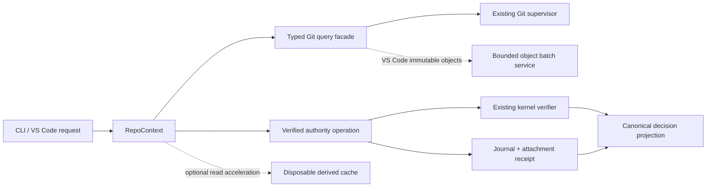

# Fast Onboarding and Safe Git Performance implementation plan

**Plan ID:** `FOS-PLAN-v1`

**Status:** M0–M5 code-local implementation plus local evidence, authority-race, transaction-
recovery, sealed-input and cache-integrity slices are complete; physical release evidence and
external M5 adapter certification remain pending; every optional feature still defaults to off

**Specification:** `SPEC-FOS-Fast-Onboarding-and-Safe-Git-Performance-v1.md`, version
`1.0.0-draft.1`, SHA-256
`e3e41038e753c5a9de0ca001aec6e280ae6e208c39cc62d57f377174b1658403`

**Code baseline reviewed:** `main@076f1edf22a18519e943a6b8580130f8a5a57e3b`

**Last reviewed:** 2026-09-09

## Implementation status — 2026-09-08

This repository now contains the safe executable slice across every milestone. “Implemented” here
means the deterministic local contract and its fail-closed tests exist; it does not claim that
unavailable enterprise authority or platform evidence was simulated.

| Milestone | Implemented now | Remaining release evidence or authority |
|---|---|---|
| M0 | Specific Story-start refusal restored; first-feedback/completion timing, benchmark and semantic-projection contracts, schema registrations, trace inventory, deterministic fixture hashing, and exact-commit evidence registration added | Retain reviewed controlled-runner reports for each required lane; one local runner does not certify network or other platforms |
| M1 | Closed typed Git query registry; lazy immutable repository context; in-flight coalescing, mutable epochs, counters, mutation barrier, epoch-labelled observational status, and an explicit content-free shadow comparison for `workspace current` repository status | Collect cross-platform shadow evidence, then migrate additional legacy read-heavy callers one bounded projection at a time; unknown Git remains uncached |
| M2 | `onboard`, explicit route selection, exact configuration fold/pin, bounded authority-move retry, durable recoverable journal/receipt, idempotence, refresh, credential/rebind refusal, explicit package-approved local-only bootstrap, trusted-provider remote bootstrap boundary, bounded digest-bound offline snapshots and finite pinned-policy reuse, exact leased remote publication with interruption reconciliation, publication-time authorization revalidation, per-capability decisions, non-sticky observations, concurrent World-Model view preservation, Story-start pin consumption, no discovery/AST/WM/model start callback, CLI/help/VS Code surfaces | Live organizational remote-bootstrap certification remains dependent on a separately installed trusted policy/kernel provider; no packaged preset grants corporate authority |
| M3 | Bounded derived cache with full parser/configuration/membership/sparse/ignore/path dependency identity, safe clear, quota/entry limits, shared binary-safe exact-OID object service, non-sticky negative reads, sealed worktree/index input bytes, Git-speed inspection/apply/rollback receipt, VS Code actions | macOS/Linux/Windows process and controlled performance lanes before any default enablement |
| M4 | Independent-off feature contracts for reusable defaults, interpretation, provenance prefill, error guidance, bounded local evidence ingestion, and crash-safe Story-switch recovery | Product-surface rollout remains opt-in and must consume approved repository policy |
| M5 | Strict pre-authorization, approval request/outbox, replay/staleness/separation checks, advisory/enforced PR adoption contracts, and an exact-implementation-bound adapter certification boundary now exist; authenticated group membership, notification receipts, branch protection and imported CI evidence must pass only through a process-branded verified adapter set | Supply and independently review real identity, notification, trusted server-gate and workflow-import implementations plus physical certification evidence; M5 remains disabled even when all prerequisite records verify |

Operator commands, recovery semantics, VS Code actions, and the feature matrix are documented in
[Fast onboarding and safe Git performance](FAST-ONBOARDING-AND-GIT-PERFORMANCE.md).

The checked-in trace stays explicit about evidence not yet collected. The local benchmark now
compares cached and uncached projections, and the executable evidence inventory records exact test
name paths and body digests while refusing to call missing rows complete. Passing local mocks never
changes an external prerequisite to “complete,” and no unfinished optional feature is enabled.

The current static inventory represents 49 of 50 acceptance IDs with exact-title witnesses.
One remains unrepresented until its complete observable conditions on a named physical runner
are measured and retained:

`FOS:AC-035`.

A first immutable local slice is retained at
`benchmarks/fos/evidence/darwin-arm64-ashok-m4-local-5430fd35a351.json`. On the named Apple M4,
Node 22.14.0, Git 2.54.0, APFS/battery runner, the 10k dirty-reference warm p95 was 3.68 ms with
zero warm Git requests and spawns; existing-local-authority onboarding p95 was 306.63 ms and its
first-feedback p95 was 190.3 ms. All registered local budgets passed. AC-035 remains deliberately
partial because controlled network, office, VS Code-host, Linux, and Windows lanes are still named
as unmeasured; this local report authorizes no cross-platform or marketing claim.

Partial and deliberately deferred tests are reported separately as
`FOS:PARTIAL-AC-NNN`/`FOS:DEFERRED-AC-NNN`; they never count toward that 49.

## Outcome

Deliver fast attachment of an existing repository and faster ordinary SFlow reads without changing
the authority, evidence, policy or lifecycle decision produced by the reference path.

The work has two independent release tracks:

- **Track A — performance and attachment:** typed Git queries, command-scoped reuse, verified
  authority attachment, start-path pruning, derived caches and optional Git accelerators. Its
  semantic output must match the uncached reference path.
- **Track B — optional experience and policy features:** defaults, pre-authorization, approval
  routing, templates, PR-check adoption, evidence ingestion and Story switching. Each feature is
  separately enabled and may not be presented as a performance-only change.

M0 through M2 form the smallest useful release. Bootstrap can remain explicitly unsupported in
that release. M3 is optional acceleration. M4 and M5 do not block Track A.

## Non-goals

- Do not clone application repositories as part of `onboard`.
- Do not create or weaken organization policy implicitly.
- Do not replace the governance kernel, migration registry, evidence verifier or Git supervisor.
- Do not treat a branch name, URL, cache entry, local ownership or Git author as authority.
- Do not make onboarding or Story start run source scans, AST extraction, world-model work or a
  model request.
- Do not promise universal one-second completion or a fixed spawn-reduction percentage before the
  benchmark proves it on a named runner.

## Current-code validation

The specification is directionally compatible with the codebase, but it cannot be implemented as
the older source plan's broad memoization shortcut. The following foundations should be reused.

| Area | Existing foundation | Remaining FOS gap |
|---|---|---|
| Git process boundary | `src/git-execution.mjs` supplies deadlines, cancellation, process-tree cleanup, normalized failures and enterprise-safe environment handling | Introduce typed query descriptors above it; do not cache arbitrary runner calls |
| Remote reads | `GitRemoteSession` reuses scoped observations and invalidates them after mutation | Bind reuse to typed dependencies, repository identity and explicit mutable epochs |
| Command-local reads | `src/read-scope.mjs` provides lazy invocation-scoped reuse | Replace caller-selected string keys with typed, immutable observations and mutation barriers |
| Timing | `src/dx-command-timing.mjs` records privacy-safe timing/counters | Add first-feedback, completion, request, spawn, cache and discovery counters required by FOS |
| Benchmarks | `docs/DX-PERFORMANCE.md` and the `scripts/dx-benchmark*.mjs` family cover CLI, topology, host, memory and bundle cases | Add a versioned FOS manifest, fixture generator, raw record contract and semantic comparator |
| Workspace recovery | `src/workspace-bootstrap.mjs` and `src/workspace.mjs` have journals and recoverable publication | Add a distinct attachment operation/receipt and exact authority pin; do not reuse bootstrap semantics accidentally |
| Story recovery | `src/story-start-journal.mjs` preserves interrupted starts | Remove forbidden heavy/background dependencies and consume a verified attachment pin |
| VS Code reads | Repository-specific snapshots, invalidation and lazy panels already exist | Add an owned, bounded `cat-file --batch` service only after M1 semantics are proven |
| Story isolation | Managed Story worktrees and Story selection are implemented | Complete crash-safe UI/buffer restoration only in optional Track B8 |
| AST/WM caches | Product-specific caches already exist | They do not satisfy the generic FOS derived-cache trust, quota and cleanup contract |
| Refusals | Stable recovery/remediation plans exist on product surfaces | Extend the error catalog and generated fixes for the new FOS failure classes |

### Baseline defect to resolve before optimization

The focused baseline currently has one semantic regression:

- `test/story-start-recovery.test.mjs` expects a pre-existing ungoverned local Story branch to be
  refused because it has neither governed state nor an approved seed.
- The early `STORY_BASE_REQUIRED` path in `src/cli.mjs` now masks that more accurate refusal.

M0 must restore the specific refusal before recording the reference projection. A faster refusal
with a different governance meaning is not a valid performance improvement.

### Required product decision: AST warming at Story start

`src/story-start.mjs` currently schedules optional AST cache warming after publication, and the
default configuration exposes background warming. FOS:CON-004 and FOS:REQ-016 prohibit even an
asynchronous AST or world-model launch from onboarding and Story start.

The planned resolution is:

1. Story start records success without launching AST, world-model or model-backed work.
2. The existing AST setting controls an explicit **Warm AST now** post-start action in CLI and
   VS Code.
3. A workspace may offer that action immediately after start, but may not execute it before the
   user invokes it.
4. AST availability remains optional and never changes the Story-start verdict.

This is a reviewed behavior correction, not a hidden optimization. If product policy rejects it,
M2 remains blocked until the specification is amended explicitly.

## Target architecture

The boundaries are deliberate:

- `RepoContext` owns one invocation's lazy observations and epoch, not authorization.
- The typed Git facade declares exact arguments, parser, repository identity, dependencies and
  effects; the existing supervisor remains responsible for execution and cancellation.
- Verified authority operations call the existing kernel and transactional stores.
- Derived caches and the object service can reduce cost but cannot establish authority, waive
  evidence or survive as the only proof at a mutation boundary.

## Delivery milestones

### M0 — establish the executable reference

**Estimate:** 3–5 engineering days

**Deliverables**

- Check in a resolved FOS trace manifest mapping every enabled requirement and acceptance case to
  an exact module, test name path and report identity.
- Fix the Story-start refusal ordering regression and preserve its existing recovery guidance.
- Add versioned benchmark manifest and deterministic fixture descriptions for small, medium,
  multi-worktree, office-network and fault cases.
- Extend timing to distinguish first feedback, local completion, network completion, Git service
  time, requests and process spawns.
- Add a canonical semantic-projection comparator for reference, optimized, `--no-cache` and shadow
  executions.
- Register proposed descriptor, operation, receipt, cache and telemetry schema identities in the
  migration registry before any writer exists.
- Record the AST-at-start decision above as a reviewed compatibility decision.

**Primary touchpoints**

- `src/cli.mjs`
- `src/dx-command-timing.mjs`
- `src/schema-migrations.mjs`
- `scripts/dx-benchmark.mjs` and related benchmark helpers
- `test/story-start-recovery.test.mjs`
- new `test/fos/trace-manifest.test.mjs` and `test/fos/semantic-equivalence.test.mjs`

**Exit gate**

- The focused Git/onboarding/start suites and the full existing conformance suite are green.
- Each reference operation has a canonical decision/state projection.
- No new command, cache, mutation or product default is enabled.

### M1 — typed Git queries and lazy repository context

**Estimate:** 6–9 engineering days

**Deliverables**

- Add `src/git-query.mjs` with a closed registry of query descriptors. Each descriptor declares
  exact argv construction, parser/schema, repository identity, input bytes, relevant environment,
  dependency class, timeout, network behavior and possible effects.
- Add `src/repo-context.mjs` with lazy immutable observations, in-flight coalescing, defensive
  copies, mutable epochs and a pre-mutation barrier.
- Resolve worktree Git directory, common Git directory, object format, bare/unborn/detached state
  and stable local worktree/store identifiers through Git-supported interfaces.
- Migrate high-count read-only paths first: `status`, `snapshot`, `workspace current`, capability
  inspection and Story-start preflight.
- Advance/invalidate the epoch before every registered mutation and on success, refusal, timeout,
  cancellation or uncertain failure.
- Leave unknown Git commands uncached. Never infer read safety from a caller label or first argv
  token.

**Acceptance focus:** FOS:AC-019–AC-025 and the Track A projection portion of FOS:AC-037.

**Exit gate**

- Cached and uncached canonical projections match.
- Identical reads coalesce within an epoch; unrequested observations cause zero Git reads.
- External edits, index/ref changes, watcher overflow and failed mutations cannot repopulate a new
  epoch with stale observations.
- Binary and hostile path fixtures remain byte-correct and shell-free.

**Rollout:** facade active only for explicitly registered migrated queries; command reuse remains
`off` for all other operations. `workspace current --git-shadow` is the first migration probe: it
executes the typed repository-status projection after the established reader, reports content-free
equivalence counts, returns only the established result, and is never enabled by default. Candidate
failure cannot change selection, readiness, Story detection, or command exit status.

### M2 — verified fast attachment and a bounded Story start

**Estimate:** 8–12 engineering days

**Deliverables**

- Add the public `sflow onboard <local-path>` command and compatibility alias through the existing
  command registry.
- Add an authority attachment descriptor containing repository/worktree identity, authority
  locator/ref, full commit OID/object format, verified fold digest, schema/reader contract, trust
  binding, dependency-closure pins, freshness observation and operation/receipt IDs.
- Select authority in this order: recorded authority, explicit selection, then a single eligible
  configured remote. Ambiguity requires input; `origin` receives no implicit authority.
- Observe only the exact authority ref. If objects are absent, fetch only that ref into an
  operation-owned temporary namespace and validate tip/fold consistency.
- Add durable operation identity before the first non-disposable effect, revision/CAS checks,
  atomic registration and an attachment receipt.
- Add `sflow onboard --resume <operation-id>` and reconcile uncertain remote outcomes by exact
  operation/candidate identity.
- Add `sflow authority refresh <local-path>` using the same verified transaction boundary.
- Make Story start consume the verified pin and prohibit organization discovery, full scans, AST,
  world-model composition and model requests, including background callbacks.
- Return draft/needs-context or a precise preparation action when mandatory context is absent; do
  not silently weaken a phase gate.

**Primary touchpoints**

- new `src/onboard.mjs` and schemas
- `src/command-registry.mjs`, `src/cli.mjs`
- existing workspace/authority/kernel/transaction stores
- `src/story-start.mjs`, `src/story-start-journal.mjs`
- VS Code onboarding and Story-start commands

**Acceptance focus:** FOS:AC-001–AC-018, AC-033–AC-037 and compatibility AC-050.

**Exit gate**

- Existing local and remote-tracking-only authorities attach idempotently without a local
  `sflow/config` branch, clone, proposal, scan or model request.
- Auth failure, timeout, TLS failure, malformed output and non-advertisement remain distinct.
- Credential-bearing URLs and untrusted rewrites/helpers are refused without persistence or leak.
- Crash/fault injection at every journal, ref, registration and receipt boundary recovers to one
  logical result.
- Story-start integration trace proves all forbidden dependency call counts are zero.
- Bootstrap flags fail as `UNSUPPORTED` unless the separately authorized bootstrap slice is ready.

### M3 — optional acceleration

**Estimate:** 8–12 engineering days

**Deliverables**

- Add a versioned disposable derived-cache contract under Git-reported common/private directories,
  with complete semantic dependency keys, producer identity/version, a 256 MiB repository-domain
  default quota and 32 MiB entry limit.
- Add `sflow cache clear --derived --repo <path>` that validates its target and can never remove
  pins, journals, receipts, evidence or recovery buffers.
- Add a lazy VS Code object service with at most one `git cat-file --batch` child per compatible
  common object store, bounded requests/bytes, exact full-OID inputs, length-based parsing, idle
  disposal and process-crash recovery.
- Add `sflow doctor --git-speed` inspection plus explicit per-repository apply for compatible
  fsmonitor/untracked-cache settings, preserving custom configuration and conditionally rolling
  back only the value SFlow wrote.
- Permit `GIT_OPTIONAL_LOCKS=0` only on reviewed registered queries whose result is unchanged.

**Acceptance focus:** FOS:AC-026–AC-032, AC-034–AC-037 and AC-050.

**Exit gate**

- Forged, corrupt, stale, over-limit and unknown-version caches become misses/refusals as specified
  and never positive authority.
- Multi-worktree cache isolation and shared immutable-object behavior are correct.
- Object-service fragmentation, missing objects, EOF, crash, cancellation and disposal tests pass
  on macOS, Linux and Windows.
- Every accelerator is individually gated and remains disabled where compatibility evidence is
  missing.

### M4 — optional friction reduction

**Estimate:** 10–15 engineering days for B1/B4/B6; B7/B8 estimated after prerequisites

Order the work by risk:

1. **B1 reusable defaults:** retain source, policy epoch, expiry and non-authoritative status.
2. **B4 pre-filled templates:** preserve field-level provenance and `needs_input` explicitly.
3. **B6 error explanations:** stable codes, truthful outcome, registered commands and redacted
   debug diagnostics on CLI, gateway and VS Code.
4. **B7 evidence drop/paste:** only after evidence size/type/scope/consent boundaries are complete.
5. **B8 Story switching:** only after durable buffer/worktree checkpoints survive cancellation,
   restart, disk failure and cache clearing.

**Acceptance focus:** FOS:AC-038–AC-039, AC-042, AC-044–AC-049 and AC-050.

Every item has an independent feature flag and can ship or roll back without changing Track A.

### M5 — governed automation and adoption

**Estimate:** 3–6 engineering weeks plus external authority/provider work

- **B2 pre-authorization:** only an existing approved rule may classify a sealed candidate as
  pre-authorized; silence is never approval.
- **B3 approval routing:** use verified principals/groups and durable outbox semantics; messaging
  delivery cannot grant authority.
- **B5 PR-check adoption:** separate advisory and enforced modes. Enforced mode requires a trusted
  server-side gate/branch protection integration bound to exact source and artifact commits.

**Acceptance focus:** FOS:AC-040–AC-043 and AC-050.

This milestone cannot be declared complete from local mocks alone. Deterministic adapter tests are
required locally and live adapter certification is separate release evidence.

The code-local certification boundary binds each external certification to the exact adapter ID,
version and implementation digest loaded in the current process. It requires the complete
adapter-specific adversarial scenario set, a current policy and trust root, a validity interval,
an independent reviewer, and verification by a trusted attestation verifier. The resulting adapter
set is branded by object identity: booleans, copied JSON and serialized readiness output cannot
unlock M5. Certification does not itself approve a change, deliver a kernel grant, or enable M5.

Approval acceptance uses the certified identity adapter to authenticate the actual person and
resolve membership in a requested group; it never records a group ID as the human principal.
Notification success must bind the exact request ID and digest. Enforced PR evidence additionally
requires a certified server-gate observation that preserves existing checks and a certified
workflow-import result bound to provider, repository, workflow/trust identities, run attempt,
tested commit, artifact, environment and passing non-skipped test identities.

## Requirement-to-milestone trace

| Scope | Requirements | Principal acceptance cases | Milestone |
|---|---|---|---|
| Identity and descriptor | FOS:REQ-001–003 | AC-003–004, AC-006, AC-019, AC-030–031 | M0–M2 |
| Attachment and recovery | FOS:REQ-004–012 | AC-001–013 | M2 |
| Authorization | FOS:REQ-013–015 | AC-012–015, AC-040–041 | M2; M5 for new behavior |
| Start and context | FOS:REQ-016–019 | AC-016–018, AC-028 | M2 |
| Typed Git and snapshots | FOS:REQ-020–025 | AC-020–025, AC-037 | M1 |
| Derived cache | FOS:REQ-026–029 | AC-025–029, AC-050 | M3 |
| Object service/accelerators | FOS:REQ-030–033 | AC-024, AC-031–032, AC-034 | M3 |
| Diagnostics/performance | FOS:REQ-034–038 | AC-033–037, AC-044 | M0–M3 |
| Optional UX/policy | FOS:REQ-039–047 | AC-038–049 | M4–M5 |
| Failures, migration, rollout | FOS:REQ-048–051 | AC-005, AC-009, AC-030, AC-033, AC-037, AC-044, AC-050 | all |
| Executable trace/release | FOS:REQ-052–053 | AC-001–050 | all |

The implementation trace manifest must replace these ranges with exact test identities before a
milestone is marked complete.

## Test and fault matrix

Each enabled acceptance case uses the exact stable title `FOS:AC-NNN`, a test-body digest and a
hash-bound passing report for the implementation commit. Skip, todo, cancellation or name-only
coverage is not a pass.

Minimum lanes:

| Lane | Required coverage |
|---|---|
| Deterministic unit | descriptor/parser schemas, canonicalization, epochs, cache keys, CLI grammar, redaction |
| Integration | real Git repositories, linked worktrees, bare/unborn/detached states, binary/Unicode paths, exact refs |
| Concurrency/fault | ref movement, duplicate operation, kill at every durable boundary, disk full, permissions, child EOF/crash, watcher overflow |
| Semantic equivalence | reference vs optimized vs `--no-cache` vs shadow; compare verdict, reasons, evidence gaps, authority/input digests, next actions and authoritative effects |
| Packaging | npm and VSIX execution without source-tree access; every lazy dependency included |
| Platforms | Node 20/22 on supported macOS, Linux and Windows; real VS Code minimum/current hosts; office proxy/credential-helper lane |
| Performance | cold/warm small/medium/large/topology fixtures with first-feedback, completion, request/spawn counts, memory and raw records |

Suspected infrastructure timing anomalies may be rerun once; both records are retained. Budgets are
never automatically regenerated or raised by the code under test.

## Rollout and rollback

Independent controls are required for command reuse, persistent derived cache, object batch
service, each Git accelerator, each Track B feature and any bootstrap support.

Rollout order per feature:

1. **off:** reference path only;
2. **shadow:** optimized path executes without contributing authority; projection mismatches are
   recorded using privacy-safe classifications;
3. **canary:** explicitly selected repositories/users;
4. **on:** only after milestone evidence and package/platform gates pass.

Rollback turns the optimization off. It must not revert policy, delete receipts, pins, journals,
evidence or pending work, and safe commands must continue uncached.

## Proposed implementation change sequence

Keep reviews small enough to prove semantic equivalence at each boundary:

1. `FOS-M0`: trace manifest, benchmark contract, refusal-order repair and AST decision.
2. `FOS-M1A`: typed query registry and repository identity.
3. `FOS-M1B`: lazy context, mutation barrier and high-count caller migration.
4. `FOS-M2A`: descriptor schemas, verified read-only attachment and idempotency.
5. `FOS-M2B`: recovery/refresh, Story-start pin use and forbidden-dependency trace.
6. `FOS-M3A`: derived cache and safe cleanup.
7. `FOS-M3B`: VS Code object service.
8. `FOS-M3C`: Git-speed doctor and explicit accelerators.
9. Separate changes for each M4/M5 feature; never combine a policy change with a Track A speed
   comparison.

Each change records its reference/optimized projections, raw benchmark IDs, migration fixtures,
feature state and rollback result.

## Estimates and dependencies

| Delivery boundary | Estimate | External dependency |
|---|---:|---|
| M0–M2 minimum existing-authority release | 3–5 engineer-weeks | office-network and supported-platform evidence |
| M0–M3 complete Track A | 5–8 engineer-weeks | Windows/Linux/macOS hosts and real VS Code host matrix |
| M4 selected UX slices | 2–4 engineer-weeks | evidence/buffer recovery prerequisites vary |
| M5 governed adoption | 3–6 engineer-weeks plus integration lead time | trusted identity, notification and server-side enforcement providers |

These are planning ranges, not commitments. Re-estimate after M0 records actual request/spawn
counts and integration gaps. External live evidence cannot be replaced by another local unit test.

## Definition of done

FOS is complete only when:

- every enabled normative requirement is bound to an executed, non-skipped acceptance witness;
- Track A canonical governance projections match the reference path under normal and adversarial
  cases;
- transactions, recovery, cache isolation and process lifecycle pass on every supported platform;
- published performance claims name the exact commit, runner, fixture, feature state and raw record;
- npm and VSIX packages work without source-tree access;
- optimization-off rollback preserves policy, evidence, receipts and recoverable work;
- user help clearly distinguishes local, remote-observed, pinned/offline, advisory,
  pre-authorized and pending states; and
- no feature is described as complete while its external authority or live platform evidence is
  still missing.
