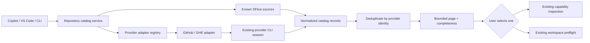

# Singularity Flow Repository Discovery and Selection

**Specification ID:** `RDS-v1`

**Status:** Implemented code-local baseline; physical office-network/provider evidence remains an external release gate

**Version:** `1.1.0-implemented.2`

**Code baseline:** implementation commit recorded in Git history

**Date:** 2026-09-10

Implementation note: the revised 1.1 contract is implemented by `src/repositories/`, the
machine-scoped `repositories` command, `/sf-repositories`, and the VS Code **Choose repository…**
flow. The provider path uses fixed stdin GraphQL through `gh`, opaque expiring selections, and
selected-node revalidation. The local path is strict and performs no Git/provider/model work.
Platform claims still require the separately identified physical Windows, enterprise-host,
proxy/certificate, large-account, SSO, cancellation, and release-evidence runs; their absence does
not disable URL paste or local-known discovery.

**Related work:** Fast Onboarding and Safe Git (`FOS`), Capability Authority Discovery
(`CAD-WSP-PLAN-v1`), Progressive Capability Disclosure (`PCD`), and intent-based SFlow help

## 1. Executive decision

Add a deterministic, read-only repository catalog that lets a contributor find repositories from
Copilot and VS Code before a workspace or capability exists.

The first release provides:

- `/sf-repositories [QUERY]` in Copilot;
- a native **Choose repository** picker in **Map a capability** and **Create workspace**;
- `singularity-flow repositories providers|list|search|status|cache` CLI commands;
- SFlow-known repositories without a network request;
- an explicitly invoked authenticated provider catalog, beginning with GitHub SaaS and GitHub
  Enterprise through the installed `gh` session;
- bounded pagination and search instead of cloning or probing every returned repository;
- onboarding status for facts SFlow already knows, followed by exact inspection only after the user
  selects a repository;
- credential-free handoff into the existing capability-authority and workspace bootstrap flows.

The feature is model-free, AST-free, world-model-free, and mutation-free. Listing a repository does
not onboard it, grant access, prove capability authority, create a workspace, or clone anything.

## 2. Problem

The current product exposes three different bounded inventories:

- `workspace list` reports repositories inside machine-local SFlow workspaces;
- `capability leads` reports the machine-local convenience cache of capability-map authorities;
- `capability organisation <LEAD>` reports repositories declared by one approved capability map.

Those commands cannot answer “show every repository my provider account can access.” Git remotes do
not expose a user-wide repository enumeration protocol. GitHub, GitLab, Bitbucket, and Azure DevOps
provide that inventory through different authenticated APIs or CLIs.

As a result, users currently copy a clone URL from another application before using the URL-first
SFlow flow. This is safe but interrupts onboarding, especially on a new office laptop.

The unsafe shortcut would be to let Copilot search local directories, scrape credential stores, or
run an unbounded provider request. RDS instead introduces a closed provider adapter boundary with
explicit user invocation, bounded results, and no credential material in SFlow records or prompts.

## 3. Scope and terminology

### 3.1 Repository scopes

RDS distinguishes these scopes in every interface:

| Scope | Meaning | Network |
|---|---|---|
| `known` | Credential-free remotes already referenced by saved workspaces, approved capability maps already loaded on this laptop, or registered lead authorities | No |
| `provider` | Repositories returned by one explicitly selected authenticated provider account and host | Yes |
| `all` | Stable union of `known` plus every explicitly enabled provider account/host, subject to pagination and hard limits | Yes |

“All” never means scanning the filesystem, local network, shell history, browser state, arbitrary Git
hosts, or accounts the user did not select.

### 3.2 Repository states

The catalog uses a closed vocabulary:

- `known-mapped`: already proven in a currently loaded approved capability map;
- `known-workspace`: present in a saved workspace but mapping authority was not recomputed;
- `known-lead`: a registered capability-map authority;
- `provider-only`: returned by the provider but not otherwise known locally;
- `inspection-required`: more remote work is required to determine onboarding status;
- `unavailable`: the provider or known source could not be read;
- `conflict`: exact local facts disagree; no source is silently preferred.

Provider membership is not an onboarding verdict. A `provider-only` repository remains
`inspection-required` until the user selects it and the existing
`capability inspect-repository` resolver verifies its state link or selected authority.

### 3.3 Provider adapter

A provider adapter is a reviewed executable implementation that lists repositories for one host and
account without handling raw credentials itself. V1 includes GitHub SaaS and GitHub Enterprise using
the installed `gh` authentication session. The contract is provider-neutral so separately reviewed
GitLab, Bitbucket, and Azure DevOps adapters can be added later without changing catalog semantics.

## 4. Goals

1. Let a contributor discover repositories in Copilot without opening a workspace.
2. Let the same catalog drive native VS Code repository selection.
3. Reuse the provider's existing authenticated session without copying a token into SFlow.
4. Keep first results fast by showing local known repositories before provider completion.
5. Support thousands of repositories with search, pagination, cancellation, and partial outcomes.
6. Pass only an exact credential-free clone URL into existing SFlow onboarding flows.
7. Make provider, account, host, completeness, freshness, and permission facts explicit.
8. Preserve identical repository identity and onboarding decisions across CLI, Copilot, and VS Code.

## 5. Non-goals

- Do not clone, fetch, open, initialize, map, attach, or mutate a repository while listing it.
- Do not discover repositories by searching `$HOME`, parent directories, recent-file lists, shell
  history, browser tabs, IDE history, or operating-system indexes.
- Do not store access tokens, cookies, credential-helper responses, authorization headers, provider
  CLI output, or credential-bearing URLs.
- Do not infer that similarly named SSH and HTTPS remotes are the same repository without a
  provider-issued repository identity.
- Do not treat provider `admin`, `maintain`, or `push` permission as SFlow governance authority.
- Do not make provider discovery required for URL paste, existing workspace use, Story start,
  capability inspection, or offline operation.
- Do not invoke a language model to rewrite a query, rank results, explain access, or select a
  repository.
- Do not promise a complete cross-provider inventory when an adapter, page, account, or host is
  unavailable.

## 6. Safety and authority invariants

1. **Explicit network action.** The initial picker may show `known` results locally. Provider access
   begins only after the user chooses a provider/host or explicitly asks for provider/all scope.
2. **No credential transfer.** Authentication remains inside the installed provider CLI or approved
   credential boundary. Secrets never appear in argv, SFlow environment projections, prompts,
   logs, errors, telemetry, repository files, or catalog cache records.
3. **Credential-free output.** Every clone URL is passed through existing SFlow remote validation
   before display, caching, comparison, or handoff.
4. **Read-only provider boundary.** Adapter operations are limited to identity/status and repository
   listing/search. Provider mutation endpoints are not registered.
5. **No authority by listing.** Provider results cannot authorize capability membership, workspace
   creation, Story work, approvals, or state publication.
6. **Selection before inspection.** RDS does not run capability inspection against every result.
   Exact state-link and approved-map reads begin only for the selected repository.
7. **Bounded work.** Every provider request has a deadline, cancellation, page-size limit, total
   result limit, and output-size ceiling. Partial results remain explicitly partial.
8. **Exact account scope.** Results name the adapter, host, content-free account identity, and
   requested scope. Accounts and hosts are never merged implicitly.
9. **No local discovery fallback.** Provider failure does not trigger filesystem search or remote
   fan-out. URL paste and local known results remain available.
10. **No model boundary.** All RDS operations are registered as `never` model operations and have a
    runtime tripwire proving that no model gateway can be invoked.

## 7. User experience

### 7.1 Copilot

Install one model-free skill:

```text
/sf-repositories
/sf-repositories payments
/sf-repositories --provider github --host code.company.example payments
```

The skill performs this deterministic journey:

1. Run `singularity-flow repositories providers --json`.
2. With no provider request, run `repositories list --scope known --limit 25 --json`.
3. When the user explicitly asks for provider or all repositories, select one returned provider
   account when there is exactly one; otherwise ask the user to choose the account and host.
4. Run one bounded `repositories list` or `repositories search` request.
5. Render repository name, owner/path, host, visibility when disclosed, permission when disclosed,
   SFlow-known state, freshness, and completeness.
6. Offer **Next page**, **Copy clone URL**, **Inspect onboarding**, **Map capability**, and
   **Create workspace** as user-reviewed follow-ups.
7. Action follow-ups prefill the existing `/sf-*` route. They do not submit it or perform a
   mutation automatically.

If private repository names will be rendered into Copilot, the response must state that the user
explicitly requested provider results and show the number of private/internal records. A future
organization policy may require a confirmation before private names are placed in chat. Native
VS Code selection remains available when chat disclosure is disallowed.

The skill output contract must preserve provider refusals, partial-page status, and next commands.
It may not fabricate a sign-in flow, silently choose a host, or replace missing results with local
filesystem search.

### 7.2 VS Code

Add a shared **Choose repository** component to:

- **Configuration → Capabilities → Map a capability**;
- **Workspaces → Create workspace**;
- the empty-workspace onboarding page.

The component has two tabs:

1. **Known to SFlow** — immediate local result, searchable without network access.
2. **Git provider** — explicit provider/host picker, account status, search field, page controls,
   refresh, and cancellation.

Required UI behavior:

- keep **Paste clone URL** visible and usable at all times;
- show first local feedback before provider work begins;
- debounce search text but require explicit provider activation;
- never issue one onboarding inspection per search result;
- label incomplete and cached results visibly;
- show an information icon explaining provider access, local cache, permissions, and onboarding
  status;
- show safe sign-in/remediation commands when the provider is unavailable;
- show elapsed time and request/page counts without logging repository names;
- after selection, close the catalog and use the existing URL-first inspection flow;
- cancellation terminates the adapter process tree and leaves no mapping, proposal, workspace, or
  repository checkout.

### 7.3 CLI

Proposed public commands:

```text
singularity-flow repositories providers [--json]
singularity-flow repositories list \
  [--scope known|provider|all] [--provider ID] [--host HOST] \
  [--account ACCOUNT-ID] [--limit N] [--cursor CURSOR] [--refresh] [--json]
singularity-flow repositories search <QUERY> \
  [--scope known|provider|all] [--provider ID] [--host HOST] \
  [--account ACCOUNT-ID] [--limit N] [--cursor CURSOR] [--refresh] [--json]
singularity-flow repositories status [--provider ID] [--host HOST] [--json]
singularity-flow repositories cache status|clear [--provider ID] [--host HOST] [--json]
```

Defaults:

- `list` defaults to `--scope known --limit 25`;
- provider page size defaults to 50 and cannot exceed 100;
- one invocation cannot emit more than 500 repositories or 2 MiB of structured output;
- `--cursor` continues one exact provider/account/query snapshot and cannot be reused for another;
- `--refresh` bypasses eligible metadata cache but does not widen the selected scope;
- human output never truncates silently and prints the exact next-page command;
- JSON output always distinguishes `complete`, `partial`, `cached`, and `unavailable`.

There is deliberately no `repositories clone` command in RDS.

## 8. Architecture



### 8.1 Repository catalog service

One environment-independent service is shared by CLI, Copilot, and VS Code. It accepts an exact
query object and returns the same versioned projection on every surface.

The service:

- loads local known repositories without resolving an application repository or Story;
- calls only a registered provider adapter for provider scope;
- normalizes provider records into one closed schema;
- deduplicates local aliases only when a provider-issued repository identity or existing exact
  SFlow remote identity proves equivalence;
- joins SFlow-known status without a network probe per result;
- returns one opaque continuation cursor plus explicit completeness;
- reports timings and counts separately from repository content.

### 8.2 Provider adapter contract

An adapter implements only:

```text
status(request) -> ProviderStatus
list(request)   -> RepositoryPage
search(request) -> RepositoryPage
cancel(id)      -> settled process-tree termination
```

The request contains provider ID, host, content-free account selector, query, page size, cursor, and
deadline. It contains no access token.

The normalized result contains only reviewed fields:

- immutable provider repository ID;
- provider ID and host;
- owner/path and display name;
- credential-free HTTPS and/or SSH clone URL returned by the provider;
- default branch, archived flag, visibility, and permission when the provider disclosed them;
- web URL only when it is credential-free and uses the selected host;
- provider update timestamp when available;
- opaque provider cursor held behind an SFlow cursor envelope.

Unknown provider fields are dropped. Text fields are bounded and stripped of unsafe control
characters. Provider descriptions, topics, README content, source files, issue data, and arbitrary
metadata are not collected.

### 8.3 GitHub and GitHub Enterprise adapter

V1 uses the installed `gh` executable in non-interactive mode because it already owns authentication
and enterprise-host selection. SFlow must:

- resolve and version-check the executable before the first request;
- ask `gh` for account/host status without printing authentication details;
- select one exact host and account before listing;
- use only reviewed read endpoints for the authenticated user's repositories;
- request only the allowlisted normalized fields;
- parse stdout inside the bounded provider process boundary;
- classify authentication, TLS, proxy, certificate, rate-limit, timeout, cancellation, malformed
  output, executable-missing, and host-mismatch failures;
- never run `gh auth login`, `gh auth token`, or a provider mutation automatically.

When sign-in is required, return a copyable `gh auth login --hostname <HOST>` remediation command.
The user runs it outside SFlow and then explicitly refreshes. The command contains no credential.

Additional providers require a separate adapter conformance review and cannot reuse GitHub parsing
heuristics.

## 9. Data contracts

Register migration families before any durable writer:

- `repository-catalog-cursor`;
- `repository-catalog-cache-entry`;
- `repository-catalog-epoch`;
- `repository-catalog-selection`;
- `repository-discovery-audit`.

Provider status, catalog pages, and selection preparations are read-only transport envelopes with
closed public JSON Schemas; they are not durable families and therefore do not use a migration
registry version. This amendment keeps the repository-wide durable-writer invariant exact rather
than registering fictional storage that no writer owns.

Every durable writer stamps `currentSchemaVersion(family)`.

### 9.1 Repository catalog record

```json
{
  "schemaVersion": 1,
  "kind": "repository-catalog-page",
  "request": {
    "scope": "provider",
    "provider": "github",
    "host": "code.company.example",
    "accountId": "sha256:<content-free-account-binding>",
    "querySha256": "sha256:<normalized-query>",
    "limit": 50
  },
  "repositories": [
    {
      "providerRepositoryId": "sha256:<provider-host-and-id>",
      "ownerPath": "payments/payments-api",
      "displayName": "payments-api",
      "cloneUrls": {
        "https": "https://code.company.example/payments/payments-api.git",
        "ssh": "git@code.company.example:payments/payments-api.git"
      },
      "visibility": "internal",
      "permission": "write",
      "defaultBranch": "main",
      "archived": false,
      "sflowState": "inspection-required"
    }
  ],
  "completeness": "partial",
  "nextCursor": "rdsc_<opaque-id>",
  "cached": false
}
```

The example demonstrates shape only. Real cache/audit records must not store raw account login,
email, provider token, query text, local paths, or arbitrary provider response bytes.

### 9.2 Cursor

An RDS cursor is an opaque identifier for a machine-private envelope containing:

- provider, host, account-binding digest, normalized-query digest, and requested scope;
- provider continuation value;
- issued/expires timestamps and page/result counters;
- adapter version and request-schema digest.

The cursor expires after 15 minutes by default, is bounded to 100 active entries, and is deleted
after terminal completion or safe clear. A copied, edited, expired, cross-account, cross-host, or
cross-query cursor is refused; it never widens or restarts a listing silently.

### 9.3 Machine-private cache

Provider discovery can run before a workspace exists, so its optional metadata cache belongs in the
machine-private SFlow application-data directory. It does not belong in a repository, workspace,
state branch, prompt audit, or capability map.

The cache stores only normalized repository metadata and digests. Requirements:

- default TTL 15 minutes; organization policy may reduce or disable it;
- maximum 10,000 entries and 10 MiB total;
- least-recently-used eviction inside the RDS namespace only;
- atomic writes, inter-process locking, schema migration, symlink refusal, and `0600`/user-only
  permissions where the platform supports them;
- account, host, adapter version, visibility policy, and query-independent provider revision in the
  cache identity;
- `repositories cache clear` removes only RDS derived metadata and cursors;
- cache absence or corruption is a safe miss, never an authorization failure;
- offline cache results are explicitly `cached` and never claim current provider membership.

## 10. Joining SFlow status

The local join is intentionally conservative:

1. Read the machine-local workspace registry and lead convenience cache through their existing
   bounded services.
2. Read only already-available approved capability catalogs; do not contact every authority.
3. Match exact validated remotes or provider repository identities when available.
4. If one exact record is found, report its local state.
5. If records conflict, report `conflict` with source categories and require the existing diagnostic.
6. Otherwise report `inspection-required`.

Selecting a record invokes the existing URL-first flow:

```text
repository selection
  -> capability inspect-repository <credential-free URL>
  -> verified state link / approved map
  -> attach existing | review conflict | describe new capability
  -> optional workspace bootstrap
```

RDS must not batch this inspection across a provider result page.

## 11. Observability and privacy

Content-free metrics may record:

- surface: CLI, Copilot, or VS Code;
- scope, provider ID, and host fingerprint;
- cache outcome;
- page/result counts and completeness;
- request count, provider process count, latency, cancellation, and stable failure code;
- selected action category.

Metrics must not record repository names, owner paths, clone/web URLs, query text, provider account
login, private-repository count by name, descriptions, source content, credentials, or command
output. No RDS metrics leave the laptop under this specification.

Prompt auditing may record the `/sf-repositories` command category and bounded token/transport
metadata under existing policy. It must not add provider results to raw prompt capture unless the
user separately enabled content capture and the host policy permits private repository disclosure.

## 12. Failure and recovery contract

Every failure returns a stable code and a non-executing remediation:

| Code | Meaning | Safe next action |
|---|---|---|
| `REPOSITORY_PROVIDER_NOT_SELECTED` | More than one account/host is available | Choose one returned account and host |
| `REPOSITORY_PROVIDER_UNAVAILABLE` | Provider CLI or adapter is not installed | Install/enable the approved adapter or paste a URL |
| `REPOSITORY_PROVIDER_AUTH_REQUIRED` | Selected provider session is not authenticated | Run the returned provider sign-in command, then refresh |
| `REPOSITORY_PROVIDER_HOST_REFUSED` | Host is not enabled or differs from the selected account | Select an approved host; never redirect automatically |
| `REPOSITORY_PROVIDER_NETWORK_FAILED` | Proxy, TLS, certificate, DNS, or connectivity failure | Run provider/SFlow network doctor; local known results remain usable |
| `REPOSITORY_PROVIDER_RATE_LIMITED` | Provider refused more reads | Preserve partial results and retry after the returned safe time |
| `REPOSITORY_PROVIDER_TIMEOUT` | Bounded request deadline expired | Copy the exact safe terminal continuation or narrow the query |
| `REPOSITORY_PROVIDER_OUTPUT_INVALID` | Adapter output violated the schema | Upgrade/repair the adapter; do not cache or partially trust the page |
| `REPOSITORY_CATALOG_CURSOR_STALE` | Cursor expired or no longer matches the request/account | Start a fresh read-only search |
| `REPOSITORY_CATALOG_PARTIAL` | One or more pages/accounts failed | Show completed sources and failed sources; never label the union complete |
| `REPOSITORY_REMOTE_UNSAFE` | A returned clone URL contains credentials or violates remote policy | Refuse that record and report the provider/record digest only |

Provider failure never blocks existing URL paste, local workspace use, or Story work. A remediation
button may copy or prefill a command; it never signs in, changes provider configuration, or retries
indefinitely.

## 13. Functional requirements

- **RDS:REQ-001** — One shared catalog service produces identical normalized records for CLI,
  Copilot, and VS Code.
- **RDS:REQ-002** — `/sf-repositories` runs without a workspace, repository, Story, AST, world model,
  or model gateway.
- **RDS:REQ-003** — Default listing reads only local `known` sources and performs zero network/Git
  requests.
- **RDS:REQ-004** — Provider enumeration requires an explicit provider scope and exact account/host.
- **RDS:REQ-005** — V1 GitHub/GHE discovery reuses the installed `gh` authentication session without
  retrieving or persisting its token.
- **RDS:REQ-006** — Results are paginated, cancellable, output-bounded, and completeness-labelled.
- **RDS:REQ-007** — Every returned remote passes the existing credential-free remote validator.
- **RDS:REQ-008** — Local and provider records deduplicate only with exact remote or provider-issued
  identity evidence.
- **RDS:REQ-009** — SFlow status joining performs no per-result remote inspection.
- **RDS:REQ-010** — Selecting one repository enters existing capability inspection or workspace
  preflight without changing their authority semantics.
- **RDS:REQ-011** — No listing, search, status, cache read, or selection grants governance authority
  or performs a mutation.
- **RDS:REQ-012** — Cache and cursor records are private, bounded, migratable, safely clearable, and
  contain no raw secrets or query text.
- **RDS:REQ-013** — CLI, Copilot, and VS Code preserve partial results and exact remediation codes.
- **RDS:REQ-014** — Provider operations use the existing process supervisor for deadlines,
  cancellation, descendant cleanup, and bounded output.
- **RDS:REQ-015** — Content-free timing metrics cannot reconstruct repository or user identity.
- **RDS:REQ-016** — URL paste remains available when every provider operation is disabled or fails.
- **RDS:REQ-017** — Private/internal result disclosure is explicit and organization-policy aware.
- **RDS:REQ-018** — Additional provider adapters must pass the same conformance suite before they are
  selectable.
- **RDS:REQ-019** — Packaged npm and VSIX runtimes work without source-tree access.
- **RDS:REQ-020** — Every public operation is classified `never` for model use and read-only for
  mutation auditing.

## 14. Acceptance criteria

- **RDS:AC-001** — With no workspace and no provider enabled, `/sf-repositories` returns the bounded
  SFlow-known list or an explicit empty result without searching the filesystem.
- **RDS:AC-002** — Default known listing causes zero Git/provider requests and zero model calls.
- **RDS:AC-003** — One authenticated GitHub SaaS account returns the first page with exact host,
  account binding, normalized fields, and a continuation cursor.
- **RDS:AC-004** — One authenticated GHE account cannot leak results into or authenticate a request
  for another host.
- **RDS:AC-005** — Multiple accounts require an explicit choice; no first account is inferred.
- **RDS:AC-006** — A 10,000-repository fixture remains responsive, bounded, searchable, cancellable,
  and never triggers 10,000 onboarding probes.
- **RDS:AC-007** — Selecting one mapped repository performs the existing portable authority lookup
  and offers attachment without creating a proposal.
- **RDS:AC-008** — Selecting one new repository runs proposal inspection only after approved-map
  absence is proven under the selected authority.
- **RDS:AC-009** — Credential-bearing and hostile provider URLs are refused before display, cache,
  logs, or handoff; diagnostics contain only safe correlation evidence.
- **RDS:AC-010** — Authentication, TLS, proxy, certificate, rate-limit, timeout, malformed-output,
  and cancellation failures produce their exact stable classifications.
- **RDS:AC-011** — Provider failure leaves local known results and paste-URL onboarding operational.
- **RDS:AC-012** — Cancelling Copilot or VS Code provider discovery terminates the complete provider
  process tree within the existing grace deadline.
- **RDS:AC-013** — An expired, copied, edited, cross-host, cross-account, or cross-query cursor is
  refused without widening or restarting the request.
- **RDS:AC-014** — Cache corruption is a safe miss; safe clear preserves workspaces, capabilities,
  provider authentication, prompts, and every repository.
- **RDS:AC-015** — Copilot, CLI, and VS Code return identical repository IDs, URLs, SFlow states,
  completeness, and error codes for the same sealed input.
- **RDS:AC-016** — Tests prove repository names, owner paths, clone URLs, account login, and query text
  are absent from content-free metrics.
- **RDS:AC-017** — A private-repository listing is never initiated by automatic activation or an
  ordinary SFlow help question.
- **RDS:AC-018** — npm and VSIX isolation tests load the adapter/catalog runtime and preserve the
  never-model boundary.
- **RDS:AC-019** — Minimum/current VS Code host tests prove pagination, keyboard navigation,
  screen-reader labels, cancellation, selection, and safe URL fallback.
- **RDS:AC-020** — Controlled office evidence proves GHE proxy/certificate/helper behavior without
  recording repository identities or credentials.

## 15. Delivery roadmap

### M0 — contracts and local-known catalog

**Estimate:** 2–3 engineering days

- Register schemas, command vocabulary, operation policy, failure codes, and semantic projection.
- Implement `repositories providers|list|search|status` for `known` scope only.
- Join existing workspace, approved-map, and lead-cache facts without network calls.
- Add fake provider fixtures and secret/reflection tests before an adapter exists.
- Add `/sf-repositories` in known-only mode with `disable-model-invocation: true`.

**Exit:** identical local results across CLI/Copilot; zero Git/provider/model calls.

### M1 — GitHub/GHE provider adapter

**Estimate:** 3–5 engineering days

- Add reviewed `gh` status/list/search adapter with exact host/account binding.
- Add bounded pagination, cursor envelopes, cancellation, process cleanup, and failure taxonomy.
- Normalize only allowlisted repository fields and validate every URL.
- Add machine-private cache, quota, expiry, corruption recovery, and safe clear.

**Exit:** deterministic fake adapter suite passes every failure and 10k-result scenario; no token can
enter output or persistence.

### M2 — Copilot journey

**Estimate:** 2–3 engineering days

- Add provider/account selection, search, next-page, completeness, and disclosure text.
- Add prefilled **Inspect onboarding**, **Map capability**, and **Create workspace** actions.
- Ensure buttons never submit or execute a mutation.
- Add intent-help routing for “list/find/show my repositories.”

**Exit:** Copilot can find and select a repository without a workspace or model call, while private
results appear only after explicit provider invocation.

### M3 — VS Code repository picker

**Estimate:** 3–5 engineering days

- Build the shared Known/Git-provider picker and integrate it with capability mapping and workspace
  creation.
- Add progressive results, pagination, refresh, cancellation, information icons, and safe recovery.
- Fence late async results by request, account, host, query, and panel revision.
- Preserve Paste URL as the always-available fallback.

**Exit:** selecting a provider result enters the existing URL-first flow once; cancellation creates
no repository, proposal, mapping, or workspace.

### M4 — packaging, conformance, and additional-provider SPI

**Estimate:** 2–4 engineering days

- Add npm/VSIX isolation, upgrade, migration, and install/reinstall tests.
- Publish an adapter conformance kit for GitLab, Bitbucket, and Azure DevOps implementations.
- Keep uninstalled/unreviewed adapters unavailable rather than heuristically compatible.
- Add help, operator, privacy, and organization-policy documentation.

**Exit:** packaged GitHub/GHE behavior matches source-tree behavior and the SPI cannot widen fields,
hosts, authentication, or mutations.

### M5 — controlled rollout evidence

**Estimate:** 3–5 engineering days plus provider access

- Execute GitHub SaaS and office GHE lanes on macOS, Linux, and Windows.
- Test office proxy, CA, SSO, multiple accounts, rate limiting, revoked access, archived repositories,
  large organizations, and CLI upgrades.
- Run minimum/current VS Code and Copilot-host journeys.
- Retain privacy-safe signed evidence and independent security/authority review.
- Roll out known-only first, then explicit provider discovery; never make it mandatory.

**Exit:** every supported host/platform cell has reviewed evidence, rollback works, and unsupported
providers remain an explicit paste-URL path.

## 16. Test plan

### Deterministic unit and integration tests

- empty, one, and multiple provider accounts;
- GitHub SaaS and GHE exact-host isolation;
- public, private, internal, archived, forked, and read-only repositories;
- exact HTTPS/SSH identity and unsafe/credentialed remote refusal;
- 1, 50, 100, 500, and 10,000 result fixtures;
- local-known union, provider deduplication, conflicts, and inspection-required status;
- page completion, partial pages, repeated cursors, expiry, cache hit/miss, quota, and safe clear;
- authentication, TLS, proxy, certificate, DNS, rate limit, timeout, cancellation, invalid JSON,
  oversized output, non-zero exit, and descendant process survival;
- late-result fencing after account/host/query/panel change;
- zero model, AST, world-model, clone, fetch, and per-result capability inspection counts;
- metrics and diagnostics secret/content exclusion;
- package and VSIX execution without repository source.

### Controlled evidence

- named physical macOS, Linux, and Windows runners;
- GitHub SaaS and organization-approved GHE;
- office proxy/CA/SSO/GCM or provider CLI credential path;
- cold and warm provider/cache runs;
- large organization with pagination and search;
- Copilot skill and minimum/current VS Code UI;
- revoked/expired credentials and provider CLI upgrade;
- interruption and rollback.

CI fakes prove semantics and liveness, not enterprise authentication or network performance. Those
remain explicitly unavailable until physical evidence is retained and independently reviewed.

## 17. Quantitative budgets

- Local known results produce first feedback within 200 ms on the accepted host fixture.
- Default `/sf-repositories` performs zero network/Git requests.
- Provider discovery starts at most one provider process/request stream per selected account.
- No more than four provider accounts execute concurrently in explicit `all` scope.
- Default page size is 50; maximum page size is 100; maximum emitted records are 500.
- Structured output is limited to 2 MiB and normalized text fields to reviewed per-field ceilings.
- Cache is limited to 10,000 entries and 10 MiB with a default 15-minute TTL.
- Cancellation settles within the existing process-supervisor deadline plus grace and leaves zero
  provider descendants.
- Selection performs at most one capability-authority inspection for the chosen repository.
- Model, AST, world-model, clone, and source-scan invocation counts remain zero.

Wall-clock provider completion is reported by named environment and is never made a universal
marketing promise.

## 18. Risks and mitigations

| Risk | Mitigation |
|---|---|
| Private repository names enter chat unexpectedly | Provider scope is explicit; disclosure is labelled; policy may require confirmation or native-only results |
| Provider token leaks through CLI output or environment | Never request token output; sanitize child environment/logging; allowlist fields; adversarial reflection tests |
| “All” causes slow or rate-limited enumeration | Local-first UX, search, pagination, hard totals, cancellation, partial results, cache |
| Provider membership is mistaken for SFlow authority | Closed `provider-only`/`inspection-required` states and selected-only existing authority resolver |
| Two remote spellings are incorrectly merged | Provider immutable ID or exact validated SFlow identity required |
| Office GHE differs from GitHub SaaS | Exact host/account binding and physical office evidence before support claim |
| Provider CLI changes output or behavior | Versioned adapter contract, schema parser, capability negotiation, fail-closed diagnostics |
| Cached access outlives revoked permission | Short TTL, explicit cached label, refresh on selection where needed, cache never authorizes work |
| Copilot executes an action from a result | Follow-ups prefill only; all mutations retain existing confirmation and governance gates |
| Unsupported provider becomes a blocker | Paste URL and SFlow-known scopes remain permanent, provider-independent fallbacks |

## 19. Rollout and rollback

Rollout order:

1. ship schemas and `known` scope;
2. add `/sf-repositories` known-only;
3. ship GitHub/GHE adapter disabled except by explicit provider action;
4. add the native VS Code provider picker;
5. collect controlled platform and office evidence;
6. enable additional providers only after adapter conformance review.

Rollback disables provider adapters and deletes only derived RDS cache/cursors. It preserves saved
workspaces, capability maps, state branches, provider authentication, repository checkouts, and all
Git history. `known` results and Paste clone URL continue to work.

## 20. Definition of done

RDS-v1 is complete only when:

- every requirement and acceptance ID maps to an exact implementation and test;
- CLI, Copilot, and VS Code share one normalized catalog service;
- GitHub SaaS/GHE provider enumeration is bounded, cancellable, and credential-safe;
- selection enters existing capability/workspace flows without weakening authority;
- package and VSIX isolation pass;
- controlled platform/office evidence and independent review exist;
- help and operator documentation state what “all,” “known,” provider access, caching, privacy, and
  onboarding status mean;
- provider discovery can be disabled without breaking any existing SFlow journey.
