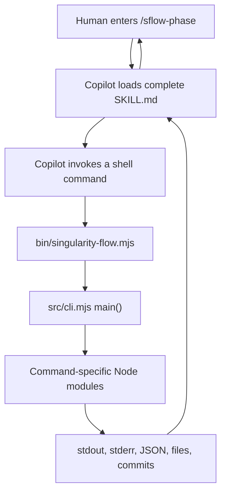
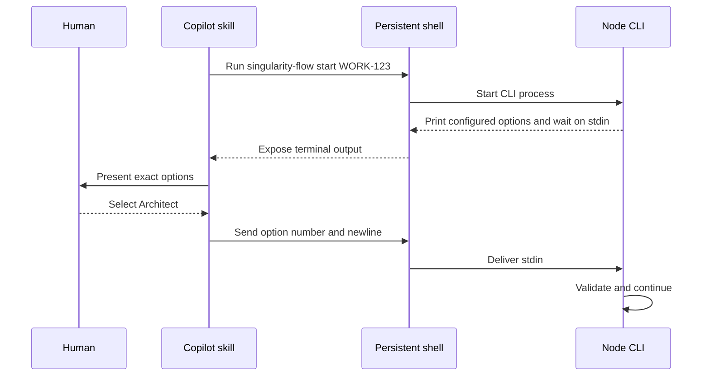
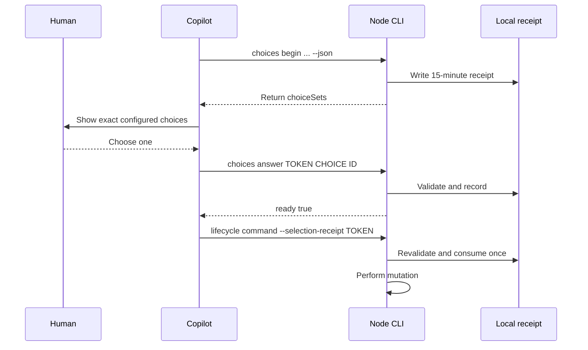
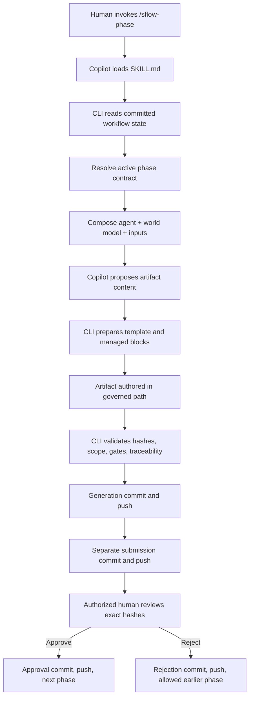

# Singularity Flow under the hood

This document explains how GitHub Copilot, the Singularity Flow Node.js CLI,
repository configuration, prompts, the world model, Git, Jira, and the VS Code
extension fit together.

The shortest accurate description is:

> Copilot proposes content. The Node.js runtime assembles governed context and
> controls lifecycle transitions. Git carries the shared state. Humans make
> governed choices and approval decisions.

## 1. The vocabulary

The prompt-related names describe different responsibilities:

| Name | Mental model | Responsibility | Typical location |
|---|---|---|---|
| Workflow | Rulebook | Phases, ordering, inputs, outputs, gates, checks, approvals, publication | `singularity/workflow.yml` |
| Skill | Playbook or action button | Tells Copilot which CLI commands and behavioral rules to follow | `plugin/skills/sflow-*/SKILL.md` |
| Governed agent | Software execution contract | Gives Copilot phase-specific purpose, instructions, tools, and world-model views | `.github/agents/*.agent.md` |
| Prompt | Effective instructions | The exact phase-specific text Copilot receives | Composed and recorded under work-item context |
| World model | Repository map | Generated, hash-recorded facts about the codebase | `singularity/world-model/` |
| Remote agent dependency | Optional external handbook | Hash-pinned remote Markdown guidance, templates, or generated context declared by an agent | `singularity/agents.lock.yml` plus machine-local cache |
| Artifact template | Blank form | Required structure and managed fields for an output | `singularity/templates/` |
| Artifact | Filled form | Generated, committed, reviewable phase output | `singularity/work-items/<ID>/artifacts/` |
| Approval authority | Real reviewer rule | Determines which Git/GitHub identities may decide | Workflow or portfolio authority configuration |

The most important distinction is:

```text
governed agent != real person != approval authority
```

Anyone may explicitly activate the architect agent. That does not authorize that person
to approve architecture. Approval authority is recalculated from configured
human identity data.

### Workflow

The workflow decides what must happen:

```yaml
phases:
  design:
    template: feature/design.md
    worldModelViews: [architecture, security]
    inputs: [requirements]
    approval:
      minimum: 1
      authorities: [architecture-reviewers]
```

It does not generate prose. It declares the contract that generated prose must
satisfy.

### Skill

A skill is Markdown loaded by Copilot after a command such as:

```text
/sflow-phase design
```

The complete skill tells Copilot:

- which deterministic command to run;
- which repository information to inspect;
- how to collect explicit human choices;
- what it may author;
- when it must stop;
- what result to show.

The skill does not implement Git publication or approvals. It calls the CLI,
which owns those mutations.

### governed agent

The configuration key is `agents`, and each entry resolves to a repository-owned
Agent Markdown file:

```markdown
---
name: Architect
phases: [design, implementation-spec]
worldModelViews: [architecture, security]
---

Make boundaries, contracts, trade-offs, security, operability, migration, and
rollback explicit.
```

The active agent is local to the checkout:

```text
.git/singularity-flow/session.json
```

It is recorded with the next lifecycle action but selecting it alone does not
change committed workflow state.

See the canonical [glossary](GLOSSARY.md) for prompt packs, skills, capabilities,
workspaces, human identity, and state planes.

### Prompt

The effective prompt is assembled for one phase and generation:

```text
phase contract and artifact template
+ selected governed-agent prompt
+ mandatory repository world-model views
+ additional agent-added views
+ relevant domain and task files
+ active agent Markdown
+ approved upstream artifacts
+ current task and evidence
```

Use `/sflow-show-prompt` to inspect both the complete skill instructions and the
complete governed prompt without replacing either with a summary.

### World model

The world model is repository-owned evidence:

Semantic world-model generation deliberately crosses a trust boundary. Its configured runner is executed as a local command with the current user's operating-system permissions. The detached analysis worktree isolates the Git checkout and the validator rejects unexpected generated output, but neither mechanism is an OS sandbox: the runner can still access the user's environment, filesystem, processes, and network. Repositories must treat runner configuration as executable code and review it accordingly; `wm light` avoids semantic runner execution entirely.

```text
singularity/world-model/
├── manifest.json
├── core/
├── views/
│   ├── architecture.md
│   ├── development.md
│   ├── testing.md
│   └── security.md
├── domains/
├── tasks/
└── evidence/
```

It answers questions such as:

- which components, APIs, schemas, and dependencies exist;
- how data moves;
- where security boundaries sit;
- which source and test files are relevant;
- how the repository is built, tested, deployed, and observed.

The workflow selects mandatory views. A governed agent may add views but cannot
remove a mandatory one. World-model Markdown is evidence, not executable code
or approval authority.

### agent

A agent is optional, external Markdown context. A repository pack is
declared at:

```text
.github/agents/<pack-id>.agent.md
```

It may contain exact dependency tables:

```markdown
## Remote skills

| ID | URL | Phases | Optional | Max bytes |
|---|---|---|---|---|
| security-review | https://example.com/security.md | design | false | 65536 |

## Remote artifact templates

| ID | URL | Phases | Optional | Max bytes |
|---|---|---|---|---|
| design-template | https://example.com/design.md | design | false | 65536 |

## Remote generated artifacts

| ID | URL template | Phase | Target | Optional | Max bytes |
|---|---|---|---|---|---|
| threat-model | https://example.com/{workId}/threat.md | design | threat-model.md | true | 65536 |
```

Only URLs in those tables are processed. Ordinary prose links remain inert.
Trusted hashes are committed in `singularity/agents.lock.yml`; verified bytes
are cached under `.git/singularity-flow/`. agents are context, not global
slash commands, people, governed agents, or approval authorities.

The cache is only a transport optimization. Generation copies every selected
remote skill into committed work-item context and writes an
`agents-<phase>-gen<N>.json` audit record. An explicitly referenced remote
artifact template is copied into `context/agent-templates/` when the work item
is created, and its hash is pinned in the immutable workflow resolution. Thus a
new lock can affect future work, but it cannot silently change an active work
item or an already published generation.

## 2. What installation creates

The npm package declares these main executable mappings:

```json
{
  "bin": {
    "singularity-flow": "bin/singularity-flow.mjs",
    "sflow": "bin/singularity-flow.mjs",
    "sflow-next": "bin/sflow-next.mjs",
    "sflow-agent": "bin/sflow-agent.mjs"
  }
}
```

After a global installation, npm creates an executable link on `PATH` pointing
to the packaged launcher. The launcher begins with:

```javascript
#!/usr/bin/env node
```

The operating system therefore runs it through Node.js.

The Copilot plugin is separate from that shell link. Plugin installation makes
the `SKILL.md` files discoverable as `/sflow-*` commands. It does not replace
the Node CLI; the skills invoke the globally installed CLI.

Inspect an installation with:

```bash
which singularity-flow
readlink "$(which singularity-flow)"
singularity-flow --version
copilot plugin list
copilot plugins list --kind skill
```

## 3. The Node.js entry point

Running:

```bash
singularity-flow phase publish design
```

enters:

```text
bin/singularity-flow.mjs
  -> imports main from src/cli.mjs
  -> main(process.argv.slice(2))
  -> parseArgs()
  -> canonical command registry
  -> dispatch("phase")
  -> phaseCommand()
  -> workflow, state, validation, Git, and publication modules
```

The launcher is intentionally small:

```javascript
import { main } from '../src/cli.mjs';

main(process.argv.slice(2)).catch((error) => {
  console.error(`Singularity Flow error: ${error.message}`);
  process.exitCode = 1;
});
```

`src/command-registry.mjs` defines canonical command names and aliases.
`src/cli.mjs` parses arguments, records command outcomes, validates the handler
registry, and dispatches to the appropriate module.

Examples:

```text
singularity-flow wm compose
  -> src/cli.mjs
  -> src/worldmodel.mjs

singularity-flow agents sync
  -> src/cli.mjs
  -> src/agents.mjs

singularity-flow phase publish
  -> src/cli.mjs
  -> src/state.mjs
  -> src/git.mjs

singularity-flow initiative approve
  -> src/cli.mjs
  -> src/initiative-state.mjs
  -> initiative evidence and approval modules
```

Short executables prepend a command and call the same `main()`:

```text
sflow-next -> main(["next", ...arguments])
sflow-agent -> main(["agent", ...arguments])
```

There is one command engine, not separate implementations for every alias.

## 4. How a Copilot skill invokes Node

Copilot does not import the JavaScript module directly.



For example, the phase skill may invoke:

```bash
singularity-flow wm compose --phase design --task "Design invoice export"
singularity-flow prepare design
singularity-flow phase publish design
```

The Markdown skill is an instruction contract. The shell commands it names
cause JavaScript to execute. Markdown from a skill, world model, template,
artifact, or agent is never evaluated as JavaScript.

## 5. How Node questions reach Copilot

Node cannot directly open a Copilot picker or call back into the model. It
communicates through the shell tool. Singularity Flow supports two finite-choice
paths.

### 5.1 Persistent interactive terminal

In an interactive terminal, Node uses `node:readline/promises`:

```javascript
const io = readline.createInterface({ input, output });
const answer = await io.question('Enter 1-4: ');
```

The sequence is:



The skill must not infer the answer. It maps the human's exact selection back
to the option printed by Node.

### 5.2 One-time selection receipt

Some Copilot shell tools cannot write to a running process. The receipt bridge
turns the interaction into short, noninteractive commands.

Start the receipt:

```bash
singularity-flow choices begin start WORK-123 --json
```

Node returns a token and YAML-derived choice sets:

```json
{
  "token": "6bd9f526-0000-4000-8000-000000000000",
  "choiceSets": [
    {
      "id": "workflow-template",
      "label": "Workflow template",
      "options": [
        { "id": "feature", "label": "Feature" },
        { "id": "bugfix", "label": "Bug fix" }
      ]
    },
    {
      "id": "agent",
      "label": "governed agent",
      "options": [
        { "id": "developer", "label": "Developer" },
        { "id": "architect", "label": "Architect" }
      ]
    }
  ],
  "ready": false
}
```

The skill presents each `choiceSets` group through Copilot's human-question
facility. After the human chooses, the skill records only that exact ID:

```bash
singularity-flow choices answer \
  6bd9f526-0000-4000-8000-000000000000 \
  agent \
  architect \
  --json
```

When every answer exists, the receipt reports `ready: true`. The skill then
runs:

```bash
singularity-flow start WORK-123 \
  --selection-receipt 6bd9f526-0000-4000-8000-000000000000
```

The receipt lives at:

```text
.git/singularity-flow/choices/<token>.json
```

It is:

- valid for at most 15 minutes;
- mode `0600` inside a private local directory;
- bound to the Work ID and action;
- bound to the repository HEAD;
- bound to the Copilot session when available;
- revalidated against current configured options;
- consumed once.

An expired, incomplete, replayed, different-session, changed-HEAD, or
no-longer-configured choice fails before lifecycle mutation.



### 5.3 Exact confirmations and soft gates

Approvals and sensitive trust decisions may require an exact value rather than
a yes/no guess. Approval receipts bind the answer to the submitted phase,
generation, and artifact hashes.

A soft sequence warning requires the human to type `continue`. Copilot must
display the warning and cannot type that confirmation on the human's behalf.
If the environment cannot collect it safely, nothing changes.

### 5.4 Free-form questions

Questions such as:

> Must the existing API remain backward compatible?

normally come from Copilot reasoning over the governed prompt. They are not
`readline` questions from Node:

```text
Node composes and records the governed prompt
  -> Copilot receives the prompt
  -> Copilot finds an ambiguity
  -> Copilot asks in normal conversation
  -> the human answers
  -> the answer is incorporated into the proposed artifact
```

In short:

| Question | Defined by | Presented by | Validated by |
|---|---|---|---|
| Workflow selection | Node from YAML | Copilot or terminal | Node |
| Phase-agent activation | Phase contract | Node automatically | Node |
| Exact lifecycle confirmation | Node governance | Copilot or terminal | Node |
| Soft-gate exception | Node sequence policy | Terminal/Copilot relay | Node |
| Open analysis question | Copilot reasoning | Copilot | Human review and later artifact gates |

## 6. Prompt composition in detail

For a Story phase, the skill requests the world-model composer:

```bash
singularity-flow wm compose \
  --phase design \
  --task "Design invoice export"
```

The composer resolves:

1. The immutable work type and active phase.
2. The phase contract and artifact template.
3. The phase-default governed agent, or an explicit audited override.
4. Mandatory phase world-model views.
5. Additional agent world-model views.
6. Task/rule-selected repository model files.
7. Locked remote skills applicable to the phase and agent.
8. Approved upstream phase inputs.
9. Configured evidence and task text.

The result is rendered as one prompt and its provenance is recorded. Depending
on workflow generation, records include:

```text
singularity/work-items/<WORK-ID>/context/
├── <phase>-gen<N>.json
├── prompts/<phase>-gen<N>.md
├── inputs-<phase>-gen<N>.json
└── agents-<phase>-gen<N>.json
```

The records capture source paths, SHA-256 values, injected sizes, truncation,
world-model commit and manifest, active agent, agent resources, approved
input hashes, and the complete rendered-prompt hash.

With grounding or inputs set to `enforce`, publication fails when required
context is missing, stale, tampered, composed for another agent, or built against
another source tree.

## 7. End-to-end phase execution



The lifecycle is deliberately separated:

```text
compose -> prepare -> author -> publish -> submit -> approve/reject
```

Copilot can author proposed content. It cannot grant itself approval authority
or silently skip a deterministic transition.

## 8. State and trust boundaries

### Committed, shared state

```text
singularity/
├── workflow.yml
├── portfolio.yml
├── capabilities.yml
├── agents/
├── prompts/
├── templates/
├── world-model/
├── work-items/
├── initiatives/
└── agents.lock.yml
```

This state is reviewed and transferred through Git branches.

### Machine-local state

```text
.git/singularity-flow/
├── session.json
├── choices/
├── logs/
├── ledger-outbox/
└── verified agent cache
```

This includes session convenience, short-lived receipts, logs, retry caches, and
downloaded bytes. It is never the only durable source for a lifecycle decision.

### External systems

- Jira supplies optional issue identity, hierarchy, assignment, and observed status.
- GitHub supplies optional authenticated login, pull requests, and check evidence.
- The operating-system credential store protects Jira and storage credentials.
- Remote agents supply only explicitly trusted public HTTPS Markdown.

Git remains authoritative for approved artifacts, workflow lineage, and decision
records.

## 9. Important implementation files

| File | Purpose |
|---|---|
| `package.json` | Executable mappings, scripts, package contents |
| `bin/singularity-flow.mjs` | Main Node launcher |
| `src/cli.mjs` | Argument parsing, command logging, dispatch |
| `src/command-registry.mjs` | Canonical commands and aliases |
| `src/config.mjs` | Workflow loading, normalization, validation |
| `src/session.mjs` | Local governed-agent session |
| `src/choices.mjs` | One-time Copilot selection receipts |
| `src/worldmodel.mjs` | World-model building and prompt composition |
| `src/grounding.mjs` | World-model manifest and file integrity |
| `src/agents.mjs` | Agent Markdown parsing, locking, caching, and injection |
| `src/inputs.mjs` | Approved upstream artifact injection |
| `src/state.mjs` | Story workflow state and publication |
| `src/initiative-state.mjs` | Epic/initiative state and publication |
| `src/approval-authority.mjs` | Human authorization resolution |
| `src/governance.mjs` | Deterministic final integrity checks |
| `src/git.mjs` | Safe Git operations |
| `src/ledger.mjs` | Optional append-only capability ledger |
| `src/capabilities.mjs` | Capability hierarchy and policy fold |
| `plugin/skills/*/SKILL.md` | Copilot-facing playbooks |

## 10. Debugging the chain

Confirm which executable is running:

```bash
which singularity-flow
readlink "$(which singularity-flow)"
singularity-flow --version
```

Confirm Copilot has the expected plugin and skills:

```bash
copilot plugin list
copilot plugins list --kind skill
```

Inspect deterministic state:

```bash
singularity-flow status
singularity-flow nextsteps
singularity-flow doctor
singularity-flow logs
```

Inspect the exact AI context:

```text
/sflow-show-prompt
```

```bash
singularity-flow wm show-prompt \
  --phase design \
  --work-id WORK-123 \
  --skill sflow-phase
```

Inspect agent trust:

```bash
singularity-flow agents list
singularity-flow agents status
```

Inspect a pending selection receipt:

```bash
singularity-flow choices status <TOKEN> --json
```

Enable a stack trace for a failing CLI command:

```bash
SINGULARITY_FLOW_DEBUG=1 singularity-flow <command>
```

Run final deterministic verification:

```bash
singularity-flow gate --terminal
```

## 11. The design rule to remember

The components stay understandable when their roles are kept separate:

```text
Workflow controls process.
Skill controls Copilot's procedure.
governed agent controls perspective.
Prompt carries the effective instructions.
World model supplies repository facts.
agent supplies optional external guidance.
Template controls output shape.
Artifact carries the proposed result.
Node validates and publishes transitions.
Real human identity controls approval authority.
Git carries the shared history.
```

That separation is what prevents a prompt, agent, remote Markdown file, or AI
response from granting itself authority or silently moving the SDLC forward.
