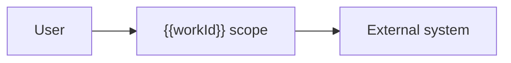

# High-level Solution Specification — {{workId}}

The approved bridge between Epic requirements, planned Stories, and the final
spec-to-code review. It consumes the requirements specification, traceability
matrix, Story plan, impact map, and dependency map, and it is what the closing
Product Owner validation compares the delivered code against.

Keep identifiers stable across regenerations. This document specifies solution
*shape* — component boundaries, contracts, and constraints — not implementation
detail, which belongs in each Story's own specification.

## Outcome and scope

- Outcome this solution delivers:
- Scope boundary (what this specification does and does not cover):
- Solution approach in one paragraph:

## Requirement coverage

Every requirement must be traceable to at least one Story and one design
decision. An uncovered requirement means the plan is incomplete.

| Requirement | Acceptance criteria | Planned Stories | Design decision | Verification |
| --- | --- | --- | --- | --- |
| REQ-001 | AC-001 | STORY-001 | ADR-001 | Test |

## Solution shape

### Context

The systems and actors this solution interacts with, and the boundary of what is
being built. Equivalent to a C4 context view.

### Components and repository boundaries

One row per component that changes or is created. The repository column must
agree with the impact map.

| Component | Repository | Responsibility | Change type | Owning Story |
| --- | --- | --- | --- | --- |
| | | | Create / Modify / Integrate | |

### Interfaces, APIs, events, and data

| Interface | Type | Producer | Consumers | Contract | Version | Compatibility |
| --- | --- | --- | --- | --- | --- | --- |
| | REST / GraphQL / Event / Batch | | | | | Backward compatible / Breaking |

### Data model and migration

- New or changed entities:
- Migration approach and reversibility:
- Backfill requirements and duration:
- Data classification and retention impact:

### Security, privacy, accessibility, and compliance

| Concern | Requirement | Control | Verification | Owner |
| --- | --- | --- | --- | --- |
| Authentication | | | | |
| Authorization | | | | |
| Data protection | | | | |
| Accessibility | | | | |
| Regulatory | | | | |

Record the threats considered and rejected as well as those mitigated — a threat
model with no discarded options has not been performed.

### Observability and operational readiness

| Signal | What it answers | Threshold | Alert destination |
| --- | --- | --- | --- |
| | | | |

- Logging, metrics, and tracing to be added:
- Runbook or on-call changes required:
- Feature flag and rollout strategy:
- Rollback plan and its tested trigger:

## Non-functional budgets

Allocate the Epic's non-functional requirements to components, so each Story
inherits a concrete target rather than a general aspiration.

| NFR | Attribute | Epic-level target | Allocated to | Component budget |
| --- | --- | --- | --- | --- |
| NFR-001 | | | | |

## Architecture decision records

One ADR per architecturally significant decision — anything expensive to reverse.
State the options genuinely considered; an ADR with one option is a rationalization.

### ADR-001 — <decision title>

- Status: Proposed / Accepted / Superseded
- Context:
- Options considered:
  1. Option A — trade-offs:
  2. Option B — trade-offs:
- Decision:
- Consequences (including what becomes harder):
- Requirements affected:
- Supersedes / superseded by:

## Story implementation contracts

For every planned Story, the expected behaviour, owned components, interfaces,
tests, and evidence the Product Owner validation will require.

### STORY-001

- Requirements:
- Acceptance criteria:
- Repository:
- Expected components/files:
- API, schema, or UI contract:
- Non-functional budget inherited:
- Test and evidence expectations:
- Definition of done for this Story:

## Dependencies and delivery sequence

Summarize the sequence from the dependency map and state what must be true at
each integration point. Do not restate the full table.

## Approved assumptions and deviations

| ID | Assumption or deviation | From what | Rationale | Approved by | Date |
| --- | --- | --- | --- | --- | --- |
| DEV-001 | | | | | |

## Spec-to-code validation instructions

The exact evidence the final Product Owner review must compare against this
specification. Be specific enough that a reviewer who was not involved in the
Epic can perform the comparison.

| Check | Evidence required | Source of truth | Pass condition |
| --- | --- | --- | --- |
| | Source file / Test result / Screenshot / CI check | | |

List approved deviations that the reviewer should expect to find, so they are not
reported as defects.
